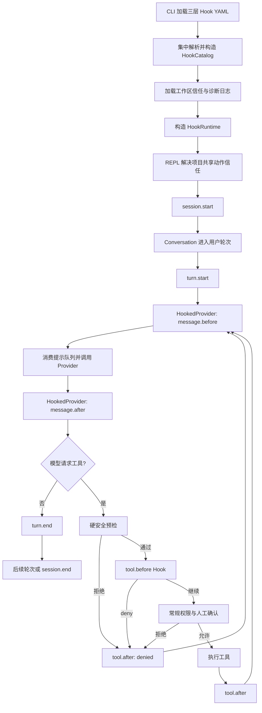

# Hook 自动化系统 Plan

## 架构概览

本阶段新增独立的 `mewcode.hooks` 子系统，由严格配置目录、条件编译器、事件信封工厂、动作执行器、工作区信任仓库、诊断日志和单一运行时编排器组成。所有生命周期接入点只负责构造类型化事件并调用同一个运行时，不自行解释 YAML、匹配条件、管理 `once` 或执行动作。

配置在 CLI 组装阶段一次性加载。三个文件先分别解析，再合并为不可变 `HookCatalog`；只有全部配置、条件和动作通过校验后才构造运行时。项目共享配置中的 shell/HTTP 动作会使运行时进入“需要工作区信任决定”状态，REPL 在触发 `session.start` 前完成一次信任交互。

消息事件通过 `HookedProvider` 装饰所有 Profile 的真实 Provider，而不是散落在 Agent Loop 中。这样主 Agent、独立 Skill、上下文摘要和记忆更新发起的每次 Provider 请求都会统一触发 `message.before/after`，提示词队列也能在真正的 Provider 边界上只消费一次。

工具链把当前一次完成的权限判断拆成两段：硬预检先完成危险命令和工作区边界判断，随后运行 `tool.before`，最后才应用普通权限规则、模式和人工确认。工具完成、失败、权限拒绝、Hook 拒绝或取消后都通过同一收尾函数触发 `tool.after`。



## YAML 配置契约

根节点只允许 `hooks`。执行控制放在 `action` 内，使规则顶层始终保持 `event`、可选 `if`、`action` 三要素：

```yaml
hooks:
  - event: tool.before
    if:
      all:
        - field: tool.name
          match: exact
          value: run_command
        - field: tool.arguments.command
          match: regex
          value: "^git\\s+push(?:\\s|$)"
          negate: false
    action:
      type: command
      command: "python .mewcode/check_push.py"
      timeout_seconds: 10
      once: false
      background: false

  - event: turn.end
    action:
      type: http
      url: "https://hooks.example.test/mewcode"
      method: POST
      headers:
        Authorization: "Bearer local-secret"
      timeout_seconds: 15
      once: false
      background: true

  - event: session.start
    action:
      type: prompt
      content: "Prefer the repository's formatter for generated source files."
      once: true

  - event: turn.end
    action:
      type: agent
      task: "Summarize the completed turn."
      once: false
```

严格字段集合如下：

| 位置 | 必填字段 | 可选字段 | 约束 |
|---|---|---|---|
| 根节点 | `hooks` | 无 | `hooks` 必须为列表 |
| 规则 | `event`、`action` | `if` | 不接受名称、优先级或其他顶层控制 |
| 条件组 | `all` 或 `any` | 无 | 二选一且列表非空，不允许嵌套 |
| 条件子句 | `field`、`match`、`value` | `negate` | `match` 为 `exact/glob/regex`，`negate` 缺省为 `false` |
| command | `type`、`command` | `timeout_seconds`、`once`、`background` | `type=command`；命令非空；超时 1–600 秒，缺省 60 秒 |
| prompt | `type`、`content` | `once` | `type=prompt`；禁止后台和超时 |
| http | `type`、`url` | `method`、`headers`、`timeout_seconds`、`once`、`background` | 仅 HTTP(S)；方法缺省 POST，可选 POST/PUT/PATCH/DELETE；超时 1–120 秒，缺省 30 秒 |
| agent | `type`、`task` | `once` | `type=agent`；本阶段禁止后台、超时、模型或工具字段 |

布尔控制必须是真正的 YAML 布尔值，不能接受 `"true"` 等字符串。`once` 和 `background` 均缺省为 `false`。任何 `tool.before + background`、`prompt + background`、动作专属字段串用或未知字段都在启动阶段失败。

## 核心数据结构

### HookEvent

```python
class HookEvent(StrEnum):
    SESSION_START = "session.start"
    SESSION_END = "session.end"
    TURN_START = "turn.start"
    TURN_END = "turn.end"
    MESSAGE_BEFORE = "message.before"
    MESSAGE_AFTER = "message.after"
    TOOL_BEFORE = "tool.before"
    TOOL_AFTER = "tool.after"
    COMPACT_BEFORE = "system.compact.before"
    COMPACT_AFTER = "system.compact.after"
    SYSTEM_ERROR = "system.error"
```

### HookRuleKey 与来源

```python
class HookSource(StrEnum):
    USER = "user"
    PROJECT = "project"
    PROJECT_LOCAL = "project_local"

@dataclass(frozen=True)
class HookRuleKey:
    source: HookSource
    path: Path
    index: int
```

`HookRuleKey` 是本进程内 `once`、诊断和稳定排序的身份。身份只来自规范化来源文件与文件内索引，不生成持久随机 ID。

### 条件模型

```python
class HookMatchKind(StrEnum):
    EXACT = "exact"
    GLOB = "glob"
    REGEX = "regex"

class HookLogic(StrEnum):
    ALL = "all"
    ANY = "any"

HookScalar = str | int | float | bool

@dataclass(frozen=True)
class HookConditionClause:
    field: str
    match: HookMatchKind
    value: HookScalar
    negate: bool = False
    compiled: object | None = field(default=None, repr=False)

@dataclass(frozen=True)
class HookCondition:
    logic: HookLogic
    clauses: tuple[HookConditionClause, ...]
```

`exact` 保留 JSON 标量类型，字符串、有限数字和布尔不互相强制转换；Python 实现中必须显式区分 `bool` 与 `int`。`glob` 与 `regex` 只接受字符串期望值和字符串事件值。对象、数组或 null 只能继续通过点路径定位，不能整体进行隐式字符串化或作为条件值。

### 动作模型

```python
@dataclass(frozen=True)
class HookExecutionControl:
    once: bool = False
    background: bool = False

@dataclass(frozen=True)
class CommandHookAction:
    command: str
    timeout_seconds: int = 60
    control: HookExecutionControl = HookExecutionControl()

@dataclass(frozen=True)
class PromptHookAction:
    content: str
    control: HookExecutionControl = HookExecutionControl()

@dataclass(frozen=True)
class HttpHookAction:
    url: str
    method: str = "POST"
    headers: Mapping[str, str] = field(default_factory=dict)
    timeout_seconds: int = 30
    control: HookExecutionControl = HookExecutionControl()

@dataclass(frozen=True)
class AgentHookAction:
    task: str
    control: HookExecutionControl = HookExecutionControl()

HookAction = CommandHookAction | PromptHookAction | HttpHookAction | AgentHookAction
```

配置解析后使用不可变映射保存 headers，避免运行时修改原始规则。

### HookRule 与 HookCatalog

```python
@dataclass(frozen=True)
class HookRule:
    key: HookRuleKey
    event: HookEvent
    condition: HookCondition | None
    action: HookAction

@dataclass(frozen=True)
class HookCatalog:
    rules: tuple[HookRule, ...]
    by_event: Mapping[HookEvent, tuple[HookRule, ...]]
    requires_project_trust: bool
```

`rules` 严格保持三层追加顺序。`by_event` 在加载成功时一次构造并冻结，运行时不重新排序。

### 事件上下文与外部信封

```python
@dataclass(frozen=True)
class HookEventContext:
    event: HookEvent
    occurred_at: datetime
    values: Mapping[str, object]
    match_kinds: Mapping[str, MatchSubjectKind] = field(default_factory=dict)

@dataclass(frozen=True)
class SerializedHookEnvelope:
    value: Mapping[str, object]
    encoded: bytes
    truncated_fields: tuple[str, ...]
```

`values` 是内部完整、只读、规范化事件树，供条件匹配使用；`SerializedHookEnvelope` 是经过体积预算后的外部副本。序列化器递归限制字符串、数组和对象，所有删减字段都加入顶层 `truncated_fields`，并再次检查最终 JSON 字节数。

公共字段：

```text
schema_version
event
occurred_at
workspace.root
session.id
session.resumed
turn.id / turn.mode / turn.input_summary / turn.status
message.id / message.component / message.profile / message.run_id /
message.iteration / message.message_count / message.tool_count /
message.max_output_tokens / message.status / message.finish_reason /
message.response_summary / message.error
tool.call_id / tool.name / tool.arguments / tool.target.kind /
tool.target.value / tool.status / tool.ok / tool.result_summary / tool.error
compaction.mode / compaction.status / compaction.changed /
compaction.message_count_before / compaction.message_count_after / compaction.error
error.id / error.component / error.kind / error.message
```

事件工厂按事件声明允许字段，不把空的无关分支塞入信封。`message` 只记录数量、模式、工具数量、输出上限和有界响应摘要，不复制 `PromptPackage`、完整历史或 Provider 内部部分。`tool.arguments` 保留原始结构供内部条件使用，外发时才按预算截断。

### 结果、决策与诊断

```python
class HookOutcomeKind(StrEnum):
    SUCCESS = "success"
    FAILURE = "failure"
    SKIPPED = "skipped"
    NOT_MATCHED = "not_matched"
    DENIED = "denied"
    CANCELLED = "cancelled"

@dataclass(frozen=True)
class HookDecision:
    deny: bool
    reason: str | None = None

@dataclass(frozen=True)
class HookActionOutcome:
    kind: HookOutcomeKind
    decision: HookDecision | None = None
    summary: str = ""
    duration_ms: int = 0

@dataclass(frozen=True)
class HookDispatchResult:
    decision: HookDecision | None = None

@dataclass(frozen=True)
class HookDiagnostic:
    occurred_at: datetime
    event: HookEvent
    rule: HookRuleKey
    action_type: str
    background: bool
    outcome: HookOutcomeKind
    duration_ms: int
    summary: str
```

动作原始输出、headers 和事件信封不保存在诊断模型中。`deny` 是成功解析出的业务结果；协议错误使用 `FAILURE`。

## 核心接口

### HookConfigLoader

```python
class HookConfigLoader:
    def load(self, paths: HookPaths) -> HookCatalog: ...
    def load_file(self, path: Path, source: HookSource) -> tuple[HookRule, ...]: ...
```

加载器先使用 `yaml.safe_load`，再进行严格结构检查、事件字段注册表检查、动作组合检查、限制检查和 regex 预编译。三个文件全部成功后才创建 `HookCatalog`。错误统一包装为 `HookConfigError(path, rule_index, field_path, message)`。

### WorkspaceTrustStore

```python
class WorkspaceTrustStore:
    def decision(self, workspace: Path) -> bool | None: ...
    def persist(self, workspace: Path, trusted: bool) -> None: ...
```

规范化身份使用 `resolve()` 后的平台规范路径进行大小写归一，再计算 SHA-256；信任文件只保存 schema 版本、身份摘要、可读路径和布尔决定。写入使用专用锁、同目录临时文件、完整重读校验和原子替换。读取或写入失败一律按未信任处理；用户选择信任但持久化失败时，本进程也不启用项目共享 shell/HTTP。

### HookConditionMatcher

```python
class HookConditionMatcher:
    def matches(self, condition: HookCondition | None, event: HookEventContext) -> bool: ...
```

字段解析只遍历映射和数组索引，不读取对象属性或调用用户代码。缺失或类型不符返回基础 `False`，再应用 `negate`。glob 使用抽出的共享匹配器；普通字段采用文本模式，`tool.target.value` 使用硬预检产生的权限目标种类。regex 使用支持单次匹配超时的引擎并调用完整匹配；运行时超时按条件错误和不匹配记录，不抛给主流程。

### HookActionExecutor

```python
class HookActionExecutor:
    async def execute(
        self,
        rule: HookRule,
        envelope: SerializedHookEnvelope,
        *,
        expects_decision: bool,
    ) -> HookActionOutcome: ...

    async def close(self) -> None: ...
```

执行器按动作 dataclass 分派：

- command 调用共享的有界 shell 运行器，传入 JSON stdin、工作区 cwd、超时和移除所有 Profile API Key 环境变量后的环境。运行前再次应用现有危险命令检查。
- HTTP 使用单个注入的 `httpx.AsyncClient`，禁止自动重定向，逐块限制响应体；只记录状态码、耗时和脱敏目标。
- prompt 不启动外部执行，返回要排入运行时的内容。
- agent 返回 `SKIPPED`，不调用 Provider。

只有 `expects_decision=True` 时，command stdout 或 HTTP 成功响应体才按工具决策协议解析：空字节表示继续；非空内容必须是严格 UTF-8 JSON 对象。`allow` 不产生可短路决策，`deny` 产生带有界原因的 `HookDecision`。stderr 永远只是有界内部诊断，不能与 stdout 拼接后解析。

### HookRuntime

```python
class HookRuntime:
    @property
    def trust_required(self) -> bool: ...

    def resolve_project_trust(self, trusted: bool) -> tuple[HookDiagnostic, ...]: ...

    async def dispatch(self, event: HookEventContext) -> HookDispatchResult: ...

    def consume_prompt_context(self) -> tuple[str, ...]: ...

    def bind_scope(
        self,
        *,
        turn_id: str | None = None,
        run_id: str | None = None,
        mode: str | None = None,
        component: str | None = None,
        iteration: int | None = None,
    ) -> AbstractContextManager[None]: ...

    async def system_error(self, component: str, error: BaseException) -> None: ...

    async def close(self) -> tuple[HookDiagnostic, ...]: ...
```

运行时职责：

1. 根据事件从冻结索引读取规则。
2. 用单个异步调度锁保证一次事件内的同步顺序、提示队列和 `once` 集合一致。
3. 记录 `NOT_MATCHED`；匹配后先检查项目共享动作信任，再在动作尝试前原子消费 `once`。
4. prompt 直接按规则顺序进入队列；command/HTTP 同步等待或登记后台任务；agent 记录跳过。
5. 普通失败记录后继续；仅合法 `tool.before` 的首次 `deny` 结束本次分派。
6. 所有公共入口最外层捕获普通异常；诊断失败也被吞掉，不向调用方暴露 Hook 异常。调用方主动取消产生的 `asyncio.CancelledError` 必须在终止当前 Hook 动作并记录 `CANCELLED` 后继续向上传播，不能被误当作 Hook 失败吞掉。
7. `close()` 禁止新后台任务，丢弃提示队列，在固定清理窗口内等待任务，随后取消 HTTP 并终止命令进程，最后关闭 HTTP client 和诊断 sink。

作用域使用 `contextvars`，子任务默认继承当前会话/轮次信息；AgentRun 叠加自己的 run/iteration，ContextManager 和记忆组件叠加 component。运行时本身不依赖 Conversation、Agent、Provider、Context 或权限模块，避免循环依赖。

### HookedProvider

```python
class HookedProvider:
    def __init__(
        self,
        provider: LLMProvider,
        runtime: HookRuntime,
        profile_name: str,
    ) -> None: ...

    async def stream_reply(self, request: ModelRequest) -> AsyncIterator[ProviderEvent]: ...
    def assistant_messages(self, response: ModelResponse, group_id: str | None = None) -> list[ChatMessage]: ...
    def tool_result_messages(self, executions, group_id: str | None = None) -> list[ChatMessage]: ...
```

`stream_reply()` 的顺序固定为：

1. 创建 message ID 和不含完整 prompt/history 的 before 事件。
2. `await runtime.dispatch(message.before)`。
3. 原子取出当前提示队列，把内容作为单一 `## Hook Context` 追加到 `PromptPackage.dynamic_system`，使用 `dataclasses.replace` 生成本次请求副本。
4. 调用被装饰 Provider，原样透传事件，只在本地累计有界文本摘要、usage presence 和 finish reason。
5. 正常完成、Provider 异常或取消时各触发一次 `message.after`；异常继续按原类型抛给既有调用方。
6. Provider 异常同时通过 `system_error()` 上报一次；Hook 失败永远不走该路径。

`assistant_messages()` 和 `tool_result_messages()` 原样委托。CLI 为每个 Profile 缓存一个 `HookedProvider`，并把它提供给主 Agent、独立 Skill、ContextManager 和 MemoryUpdater，防止重复装饰或漏掉内部请求。

### PermissionController 两阶段接口

```python
@dataclass(frozen=True)
class PermissionPreflight:
    call: ValidatedToolCall
    target: PermissionTarget

class PermissionController:
    def preflight(
        self, call: ValidatedToolCall
    ) -> PermissionPreflight | PermissionDecision: ...

    def evaluate_preflight(self, prepared: PermissionPreflight) -> PermissionDecision: ...

    def evaluate(self, call: ValidatedToolCall) -> PermissionDecision: ...
```

`preflight()` 复用 `PermissionTargetBuilder`，只完成工具权限声明校验、命令危险检查、路径/路径 glob 规范化和工作区边界检查。返回的拒绝只能来自 BLACKLIST、SANDBOX 或 CONFIG_ERROR。`evaluate_preflight()` 才匹配 YAML 规则、权限模式与会话规则。现有 `evaluate()` 保留为兼容包装，顺序调用两段，避免外围调用和测试一次性破坏。

### ToolScheduler Hook 接口

`ToolScheduler` 和 `ToolSchedule` 注入 `HookRuntime`。每个调用使用以下窄辅助方法：

```python
async def _prepare_call(index, validated) -> PreparedCall | ToolExecution: ...
async def _finalize_execution(execution, *, status) -> ToolExecution: ...
```

`_prepare_call()` 执行硬预检、构造带原始参数与规范化权限目标的 `tool.before`、处理 Hook deny，再进入普通权限。现有 `AgentControlTool` 保留系统控制工具的权限豁免，但仍经过参数校验、硬预检和 `tool.before`，因此 Hook 可以追加拒绝而不会改变既有 `load_skill` 交互。

`_finalize_execution()` 对成功、工具失败、未知工具、参数错误、硬拒绝、Hook 拒绝、权限拒绝和取消统一构造 `tool.after`，等待同步 Hook 后再产出既有 `AgentToolResult`。Hook 拒绝使用新的 `_hook_denied_result()`，metadata 包含 `hook_denied`、规则来源和有界原因，不伪装成权限规则。

只读批次仍在预处理后并发执行；前置 Hook 和权限挑战按请求原顺序准备。并发工具完成时分别进入统一收尾，运行时调度锁保护 Hook 顺序和 `once` 状态，不改变结果最终按调用索引写回 Provider 的现有语义。

## 模块设计

### 共享 glob 匹配

**位置：** `mewcode.matching`

**职责：**

- 从权限模块提取 token 化、转义校验和完整 glob 编译。
- 提供 TEXT 与 PATH 两种匹配语义；TEXT 的 `*` 可跨 `/`，PATH 的 `*` 不跨 `/`、`**` 可跨目录。
- 权限规则继续使用原有 `PermissionTargetKind` 映射，Hook 普通字段使用 TEXT，规范化权限目标使用对应目标种类。

**依赖：** 仅标准库；不能反向依赖 permissions 或 hooks。

### Hook 配置与模型

**位置：** `mewcode.hooks.models`、`mewcode.hooks.config`

**职责：**

- 定义全部不可变领域模型、限制常量和异常。
- 解析三层严格 YAML，验证字段注册表、动作组合和资源限制。
- 编译 glob/regex 并冻结按事件索引。

**依赖：** PyYAML、`regex`、共享匹配模块。

### 工作区信任

**位置：** `mewcode.hooks.trust`

**职责：**

- 规范化工作区身份并读取用户级信任决定。
- 使用文件锁和原子替换持久化同意或拒绝。
- 在存储损坏、竞争或写入失败时返回安全的未信任状态和有界诊断。

**依赖：** `mewcode.locking`、标准库文件 API。

### 事件与条件

**位置：** `mewcode.hooks.events`、`mewcode.hooks.conditions`

**职责：**

- 为 11 个事件提供命名工厂和公开字段注册表。
- 构造内部只读事件树，生成有截断清单的外部 JSON 信封。
- 解析点路径并执行 exact/glob/regex/negate 与 all/any。

**依赖：** Hook 模型、共享匹配模块；不依赖 Agent、Provider 或 Conversation。

### 有界进程运行

**位置：** `mewcode.processes`

**职责：**

- 提供带 stdin、cwd、环境、超时、stdout/stderr 上限的 shell 子进程运行。
- Windows 使用新进程组和进程树终止，POSIX 使用新会话及 TERM→KILL 升级。
- 在输出超限、超时或取消时关闭管道并回收整个可识别进程树。

**依赖：** asyncio、os、signal、subprocess。

现有 `RunCommandTool` 改用同一低层运行器，保持当前用户可见结果、30/120 秒限制和危险命令检查不变；Hook 使用自己的 60/600 秒配置边界。Skill 的无 shell进程协议保持独立，只复用必要的终止帮助函数，不改变 argv/JSON 协议。

### 动作执行与诊断

**位置：** `mewcode.hooks.actions`、`mewcode.hooks.diagnostics`

**职责：**

- 执行 command/HTTP，处理 prompt/agent，并统一解析工具决策。
- 移除已知 Profile API Key 环境变量；HTTP 禁止重定向并限制响应。
- 将每条规则结果写为有界 JSONL，不保存原始事件或凭据。
- 默认日志为 `~/.mewcode/logs/hooks.jsonl`，达到 1 MiB 后轮转，最多保留当前文件及 3 份历史。

**依赖：** httpx、共享进程运行器、Hook 模型。

### Hook 运行时

**位置：** `mewcode.hooks.runtime`

**职责：**

- 规则匹配、信任过滤、`once`、同步/后台调度、提示队列和 deny 短路。
- 保存会话基本信息和 ContextVar 作用域。
- 跟踪最大 32 个后台任务并执行 5 秒关闭清理。
- 把所有异常收敛为诊断，提供无规则快速路径。

**依赖：** Hook 条件、动作、诊断、信任；不依赖业务生命周期模块。

### Provider 集成

**位置：** `mewcode.hooks.provider`

**职责：**

- 装饰任意 `LLMProvider`，触发 message 前后事件。
- 在 Provider 边界消费提示队列并追加动态系统区。
- 委托消息转换接口并保持 usage 装饰器现有行为。

**依赖：** providers 公共模型、HookRuntime。

### 生命周期集成

**位置：** `mewcode.conversation`、`mewcode.agent.runner`、`mewcode.agent.scheduler`、`mewcode.context.manager`、`mewcode.repl`、`mewcode.cli`

**职责：**

- Conversation 为真实用户发起的 Agent/Skill 运行建立 turn ID、作用域和成对事件；本地无模型命令不触发。
- AgentRun 在当前 turn 下叠加 run ID、mode 和 iteration，供 Provider、工具与压缩事件使用；预期取消不报 system.error，意外异常和持久化失败报一次。
- ContextManager 在真正开始自动或手动历史压缩时触发 compact.before，并在成功、无需压缩、失败或取消时恰好触发一次 compact.after。
- Repl 在 session.start 前解决信任，启动和关闭 Conversation，并把非 Hook 消费边界错误上报 system.error。
- CLI 按正确顺序构造 Hook 配置、信任、日志、运行时、所有 HookedProvider 和生命周期依赖，并在提前失败路径安全关闭已创建资源。

## 模块交互

### 启动与信任

```text
CLI
  -> HookConfigLoader.load(三层路径)
  -> WorkspaceTrustStore.decision(workspace)
  -> HookDiagnosticLogger + HookActionExecutor + HookRuntime
  -> 为每个 Profile 构造并缓存 HookedProvider
  -> 构造 ContextManager / ToolScheduler / AgentRunner / Conversation / Repl
  -> Repl 检查 runtime.trust_required
       -> TerminalSession.prompt_hook_trust(...)
       -> TrustStore.persist(true|false)
       -> runtime.resolve_project_trust(...)
  -> Conversation.start()
       -> runtime.dispatch(session.start)
```

用户拒绝或信任写入失败不会终止会话；项目共享 shell/HTTP 被标记为 `SKIPPED`，提示词和 agent 占位仍按规则执行。配置结构错误发生在运行时创建之前，直接由 CLI 返回 1。

### 模型请求与提示队列

```text
任意组件 -> HookedProvider.stream_reply(request)
  -> runtime.dispatch(message.before)
       -> 先前事件 prompt + message.before prompt 进入队列
  -> runtime.consume_prompt_context()
  -> append "## Hook Context" to dynamic_system
  -> inner_provider.stream_reply(request_copy)
  -> 正常 / 失败 / 取消
  -> runtime.dispatch(message.after(status, bounded summary))
  -> 如为 Provider 错误：runtime.system_error(provider, error)
```

提示在 `consume_prompt_context()` 时即视为已消费；即使 Provider 随后失败也不会自动重放。内部上下文摘要和记忆更新同样经过装饰器，因此会按真实“下一次 Provider 请求”消费队列。

### 工具调用

```text
ToolSchedule
  -> registry.validate_call(request)
  -> permission_controller.preflight(validated)
       -> hard deny: build ToolExecution -> tool.after
       -> target: continue
  -> runtime.dispatch(tool.before(raw args + normalized target))
       -> first deny: _hook_denied_result -> tool.after
       -> continue
  -> control tool exemption OR evaluate_preflight(target)
       -> ASK -> existing PermissionChallenge
       -> DENY -> existing permission result -> tool.after
       -> ALLOW -> execute tool/control operation
  -> _finalize_execution()
       -> runtime.dispatch(tool.after)
       -> yield AgentToolResult
```

未知工具和参数校验错误没有可安全执行的 `tool.before`，但仍以 `failure` 触发 `tool.after`。硬安全拒绝不会把参数交给 shell/HTTP Hook。合法 Hook deny 不产生 `AgentPermissionDecision`，但通过工具结果 metadata 和诊断明确标识来源。

### 上下文压缩

```text
ContextManager 判断真正需要自动压缩，或收到手动 compact
  -> runtime.dispatch(system.compact.before)
  -> HistoryCompactor 调用 HookedProvider
       -> message.before / message.after
       -> compact.before 的提示在此请求消费
  -> 得到 success / no-op / failure / cancelled
  -> runtime.dispatch(system.compact.after)
  -> 返回原 ContextOperation 状态与结果
```

自动请求未达到压缩阈值、熔断器已打开且未实际尝试时不触发 compact 前后事件。工具结果落盘压缩不调用 Provider，也不属于 `system.compact.*` 的历史压缩事件。

### 轮次与会话关闭

```text
Conversation user entry
  -> await pending maintenance
  -> bind turn scope + turn.start
  -> Agent / model-backed Skill
  -> turn.end(success|failure|cancelled)
  -> 退出 turn scope
  -> 安排轮次后的 MemoryUpdater

Conversation.close
  -> cancel active run/context operation
  -> await MemoryUpdater pending request
  -> session.end
  -> close session/skill/context resources
  -> HookRuntime.close
       -> discard pending prompt
       -> bounded drain/cancel background actions
       -> close HTTP + diagnostic sink
```

这样不会在 `session.end` 之后再由记忆更新发起新的 Provider 消息事件。`turn.end` 提示若紧接着存在记忆更新，会按“下一次真实 Provider 请求”进入记忆更新；没有后续请求时在 session 关闭时丢弃。

## 资源限制

| 资源 | 限制 | 超限行为 |
|---|---:|---|
| 每文件规则数 | 256 | 启动配置错误 |
| 合并规则总数 | 512 | 启动配置错误 |
| 每规则条件数 | 32 | 启动配置错误 |
| 字段路径/匹配值 | 256 / 4096 字符 | 启动配置错误 |
| regex 长度/单次时间 | 1024 字符 / 50 ms | 配置错误 / 运行时不匹配诊断 |
| 单 prompt / 每次消费总量 | 32 KiB / 64 KiB | 配置错误 / 后续 prompt 动作失败 |
| 外部 JSON 信封 | 1 MiB | 递归截断并列出字段；仍无法编码则动作失败 |
| command stdout/stderr | 各 64 KiB | 终止进程并记录输出超限 |
| command 超时 | 缺省 60 秒，最大 600 秒 | 终止进程树并失败放行 |
| HTTP 响应 | 64 KiB | 取消读取并失败放行 |
| HTTP 超时 | 缺省 30 秒，最大 120 秒 | 取消请求并失败放行 |
| deny reason / 普通摘要 | 2 KiB / 4 KiB | 截断并标记 |
| 后台任务 | 32 | 新任务登记失败；`once` 仍已消费 |
| 后台关闭窗口 | 5 秒 | HTTP 取消，命令进程树终止 |
| Hook JSONL 日志 | 1 MiB × 当前及 3 份历史 | 自动轮转；轮转失败不影响 Agent |

限制常量集中在 `hooks.models`，测试可通过构造参数下调耗时和容量，但产品默认值只有一处来源。

## 文件组织

```text
MewCode/
├── src/mewcode/
│   ├── hooks/
│   │   ├── __init__.py              # 公共模型、加载器和运行时导出
│   │   ├── models.py                # 枚举、dataclass、限制和异常
│   │   ├── config.py                # 三层严格 YAML 加载与编译
│   │   ├── trust.py                 # 工作区身份、锁和原子信任存储
│   │   ├── events.py                # 11 个事件工厂、字段注册与信封截断
│   │   ├── conditions.py            # 点路径、all/any、exact/glob/regex/negate
│   │   ├── actions.py               # command/http/prompt/agent 与决策协议
│   │   ├── diagnostics.py           # 有界、脱敏、轮转 JSONL 日志
│   │   ├── runtime.py               # 顺序、once、后台、提示队列和关闭
│   │   └── provider.py              # HookedProvider
│   ├── matching.py                  # 从权限模块抽出的通用完整 glob 匹配
│   ├── processes.py                 # 有界 shell 与跨平台进程树终止
│   ├── permissions/
│   │   ├── controller.py            # 拆分 preflight/evaluate_preflight
│   │   └── rules.py                 # 改用共享 matching，权限语义不变
│   ├── tools/command_tool.py         # 复用有界进程运行器，保持外部行为
│   ├── agent/runner.py               # run/iteration scope 与系统错误边界
│   ├── agent/scheduler.py            # tool.before/after 与两段权限链
│   ├── context/manager.py            # compact.before/after
│   ├── conversation.py               # session/turn 生命周期和关闭顺序
│   ├── terminal.py                   # 工作区信任提示协议
│   ├── repl.py                       # 启动信任、session start 和错误上报
│   └── cli.py                        # 配置、运行时、Provider 装饰和注入
├── tests/
│   ├── test_hook_config.py           # 三层、严格字段、动作组合和原子错误
│   ├── test_hook_trust.py            # 身份、持久化、锁、失败关闭
│   ├── test_hook_conditions.py       # 路径、逻辑、四种匹配语义
│   ├── test_hook_events.py           # 字段注册、状态、截断和隐私
│   ├── test_hook_actions.py          # 进程、HTTP、提示、agent 和决策协议
│   ├── test_hook_runtime.py           # 顺序、once、后台、短路、关闭和日志
│   ├── test_hook_provider.py          # 每次 Provider 事件和提示消费
│   ├── test_hook_integration.py       # 会话到工具的端到端 Hook 链
│   ├── test_permission_controller.py  # 两阶段权限及兼容 evaluate
│   ├── test_permission_rules.py       # 提取 glob 后的完整回归
│   ├── test_tool_scheduler.py         # 硬门禁/Hook/权限/工具顺序与并发
│   ├── test_agent_runner.py           # scope、错误与消息回归
│   ├── test_context_integration.py    # compact 前后与内部 Provider 消息
│   ├── test_conversation.py           # turn/session 成对和 Skill 边界
│   └── test_repl.py                   # 信任交互、启动、关闭和终端降噪
├── examples/hooks.yaml                # 四类动作与条件示例
├── .gitignore                         # 允许共享 hooks.yaml，继续忽略 local
├── pyproject.toml                     # 增加带匹配超时的 regex 依赖
└── README.md                          # 配置、事件、信任、协议、限制与示例
```

## Spec 覆盖映射

| Spec | 设计归属 |
|---|---|
| F1–F7 | HookPaths、HookConfigLoader、HookCatalog、CLI 原子组装 |
| F8–F12 | WorkspaceTrustStore、REPL 信任交互、运行时来源过滤、硬安全不变式 |
| F13–F20 | HookEvent、事件工厂、Conversation、HookedProvider、ToolScheduler、ContextManager、system_error 边界 |
| F21–F25 | HookEventContext、字段注册表、SerializedHookEnvelope、stdin/HTTP JSON |
| F26–F31 | HookConditionMatcher、共享 matching、超时 regex、权限回归 |
| F32–F39 | 四个动作 dataclass、HookActionExecutor、prompt 队列、agent 占位 |
| F40–F45 | 决策协议、PermissionPreflight、ToolScheduler 首次 deny 短路与工具结果 |
| F46–F51 | HookRuntime once 集合、调度锁、后台任务表和 close |
| F52–F55 | 运行时最外层隔离、HookDiagnosticLogger、system_error 非递归边界 |
| N1–N3 | 冻结目录、固定顺序、原子加载、统一异常收敛 |
| N4–N6 | 两段权限链、信任门禁、最小事件信封、环境和日志脱敏 |
| N7–N9 | 资源限制表、调度锁、诊断状态和终端降噪 |
| N10–N13 | 空目录快速路径、跨平台进程层、fake 注入、单一运行时解释器 |

## 技术决策

| 决策点 | 选择 | 理由 |
|---|---|---|
| 消息事件接入 | 装饰所有真实 Provider | 不漏掉上下文摘要、记忆更新和独立 Skill；提示恰好在请求边界消费 |
| 提示注入位置 | 追加单一动态 `Hook Context` 区 | 不改历史，不污染稳定缓存前缀，顺序可测 |
| 事件模型 | 内部完整树 + 外部预算信封 | 条件可检查完整参数，同时对进程/网络输出保持有界和显式截断 |
| glob 复用 | 抽出低层 matching 模块 | Hook 与权限共享转义和完整匹配，不让 regex/negate 进入权限配置 |
| regex 引擎 | 使用支持匹配超时的 `regex` 依赖 | 仅限制长度无法阻止灾难性回溯；单次超时满足资源有界要求 |
| 权限顺序 | preflight → Hook → policy | 保留黑名单/沙箱不可绕过，避免用户先批准后被 Hook 拒绝 |
| 系统控制工具 | 保留现有权限豁免但加入 Hook | 满足兼容性，同时让所有有效工具调用可被附加策略观察和拒绝 |
| 多规则执行 | 单运行时锁下顺序执行 | `once`、提示顺序和首次拒绝在并发工具批次中确定 |
| 后台语义 | 启动后立即返回，运行时集中跟踪 | 不阻塞主流程，也能在关闭时终止失管任务 |
| once 消费 | 匹配后、动作尝试前原子写入集合 | 失败不刷屏，并发不重复；无需首期持久化 |
| command 启动 | shell + JSON stdin，禁止参数插值 | 满足 shell 自动化，同时避免工具参数进入命令解析层 |
| command 安全 | 工作区信任 + 危险命令检查 + 凭据环境清除 | 受信任不等于取消硬安全或允许继承模型 API Key |
| HTTP | 共享 AsyncClient、禁重定向、逐块限流 | 连接可复用，目标跳转和响应体行为可控 |
| 工具决策 | 仅同步 command/HTTP 的严格 JSON | 保持四种动作不增加 reject 类型，并区分显式拒绝与 Hook 失败 |
| 信任身份 | 规范路径摘要、用户级原子存储 | 仓库内容不能自授信，移动或不同路径不会意外继承 |
| 信任写失败 | fail closed | 没有可靠持久状态时不运行项目共享外部副作用 |
| 诊断 | 脱敏轮转 JSONL，终端只显示关键状态 | 满足“只记日志”和可追踪性，不淹没 Agent 输出 |
| system.error | 只在既有非 Hook 错误边界显式上报 | 避免任意异常重复报告和 Hook 递归 |
| 配置更新 | 启动快照 | 与 Spec 首期边界一致，避免运行中原子换代和 once 身份迁移 |

## 实施约束

- 所有生命周期调用方必须通过 `HookRuntime` 或 `HookedProvider`，不能直接实例化动作执行器。
- Hook 包不得导入 REPL、Conversation、AgentRun、ContextManager 或具体 Provider；依赖方向只允许业务模块指向 Hook 公共接口。
- 配置校验完成前不得构造 HTTP client、日志后台任务或进程执行对象。
- `HookRuntime.dispatch()`、`system_error()`、诊断写入和后台完成回调不得向业务调用方抛出普通异常；只有调用方主动取消可以在完成 Hook 清理后继续传播 `asyncio.CancelledError`。
- 工具 Hook 不得修改 `ValidatedToolCall`、`PermissionPreflight`、`ToolResult` 或 Provider 历史；拒绝通过新结果对象表达。
- 空 HookCatalog 必须走常数时间快速路径，不创建日志文件、不提示信任、不改变终端输出。
- 测试默认使用临时 HookPaths、fake 信任仓库、fake 时钟、fake 动作执行器和 `httpx.MockTransport`；只有进程专项测试启动无害短命令。
- 现有 Python 缓存文件、用户会话、记忆、权限本地文件和其他工作区脏改动不属于本阶段修改范围。
