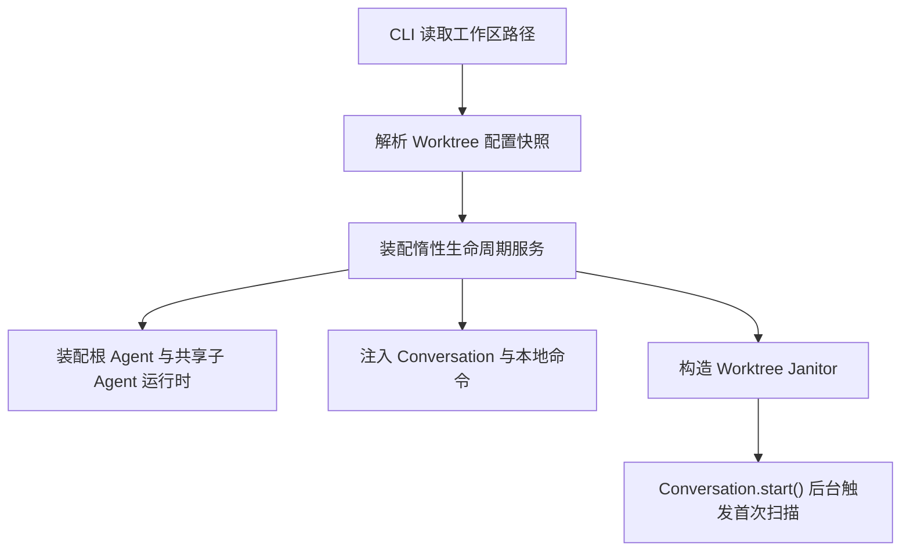
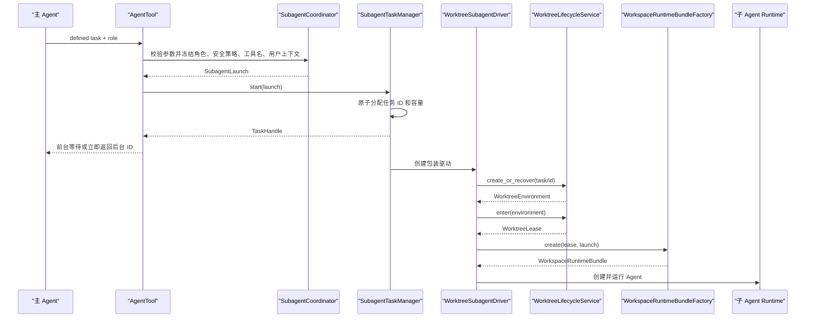
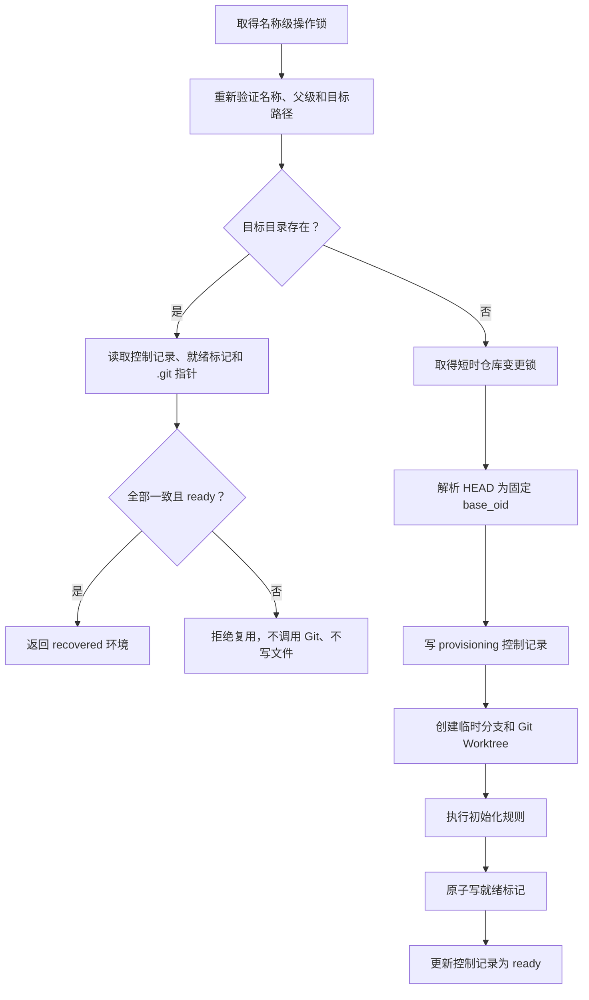
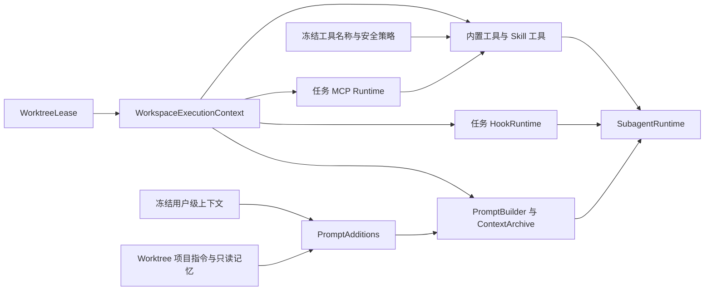
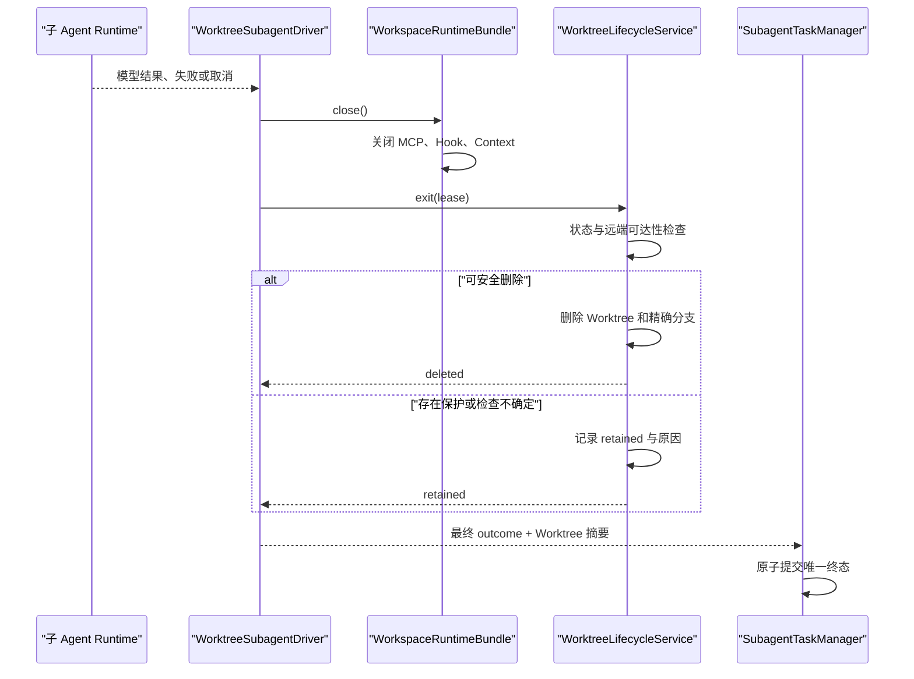
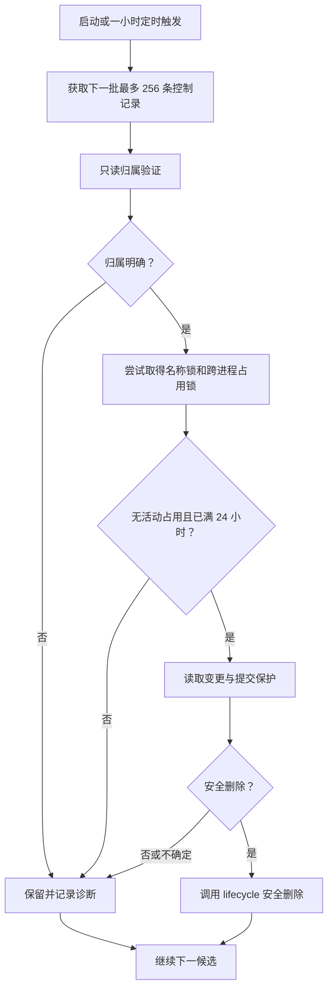

# 子 Agent Worktree 隔离 Plan

## 架构概览

本阶段采用“生命周期核心、环境初始化、工作区运行时、子 Agent 接入、后台清理、本地命令”六层结构。Worktree 能力位于独立模块中，子 Agent 只通过稳定接口申请和释放隔离环境；共享模式与 Fork 模式继续走现有路径。

### 生命周期核心

新增 Worktree 生命周期模块，统一负责仓库识别、名称验证、路径规划、Git 调用、管理记录、占用租约、变更保护和资源删除。

托管目录固定为：

```text
<主工作区>/.mewcode/worktrees/<逻辑名称>
```

临时分支固定使用：

```text
mewcode/worktree/<逻辑名称>
```

Git 共享目录中另设不受检出内容影响的控制区：

```text
<git-common-dir>/mewcode/worktrees/
├── records/       # 按规范名称摘要保存管理记录
└── locks/         # 仓库变更锁与每个环境的占用锁
```

每个 Worktree 内保存 `.mewcode/worktree.json` 就绪标记。复用或删除必须交叉验证控制区记录、就绪标记、Worktree 的 `.git` 指针、公共 Git 目录及分支引用；任何单一文件都不能独立证明归属。

生命周期模块对外提供创建、进入、退出、状态查询和删除能力。创建与恢复共用入口：目标不存在时执行 Git 创建和初始化；目标存在时只读取固定数量的元数据文件，不调用 Git、不写文件。进入会取得跨进程占用锁并返回租约；退出释放租约，再根据工作区状态和远端引用可达性决定删除或保留。

所有 Git 调用经独立执行器使用 argv 参数、显式 `cwd`、受控环境、超时和有界输出执行，不经过 shell，也不执行 fetch、push 或其他网络操作。

### 名称、路径与并发边界

逻辑名称先经过纯语法验证，再进行平台路径验证。除 Spec 规定的字符、段数和长度限制外，还拒绝 Windows 设备名、尾随点、尾随空格、大小写折叠碰撞和规范化后不再保持原名的路径段。

路径解析逐级检查托管根到目标父目录，不跟随符号链接、目录联接或重解析点。删除前重新执行同样检查，避免检查后路径被替换。

并发采用两级锁：

- 每个逻辑名称对应一个跨进程占用锁，在任务整个活动期持有，阻止复用、删除和后台清理。
- Git 公共管理区使用短时仓库变更锁，只包围分支和 Worktree 管理状态的修改，不覆盖模型运行或普通状态读取。

因此，同一环境的冲突操作严格串行，而不同 Worktree 的模型、文件操作和保护检查可以并行。

### 管理记录与状态

Git 公共控制区记录是生命周期的持久控制面，Worktree 内就绪标记是数据面的归属证明。两者采用版本化 JSON、严格字段和原子替换写入，内容只包含：

- 规范逻辑名称及其规范键；
- 仓库身份摘要；
- Worktree 绝对路径；
- 完整临时分支引用；
- 创建基线提交；
- 已验证的 Git Hook 仓库相对路径（如有）；
- 任务身份；
- 创建时间与最后使用时间；
- 生命周期状态及有界保留原因。

生命周期状态包括 `provisioning`、`ready`、`active`、`retained`、`deleting` 和 `deleted`。完整初始化后才写入就绪标记并进入 `ready`；任务取得租约后进入 `active`；退出不能清理时进入 `retained`。中断留下的 `provisioning` 状态不能恢复为可运行环境。

仓库身份使用规范化 Git 公共目录生成稳定摘要；标记不保存凭据、Hook 内容、配置内容、命令原始输出或任务内部消息。

### 声明式初始化

新增严格配置文件：

```text
<主工作区>/.mewcode/worktrees.yaml
```

该文件是可提交的项目配置，并通过 `.gitignore` 例外纳入版本控制。格式带固定版本号，包含最多 256 条有序规则；规则类型为 `copy`、`link` 或 `git_hooks`，每条包含仓库相对路径和 `required` 布尔值。

安全默认规则以可选方式复制：

```text
.mewcode/config.yaml
.mewcode/permissions.local.yaml
.mewcode/hooks.local.yaml
.mewcode/instructions.md
.mewcode/memory/
```

额外文件不会因被 Git 忽略而自动复制。`copy` 只接受主工作区内明确声明且未被 Git 跟踪的忽略内容，并复制到 Worktree 的同一相对位置；因此不能把主工作区中已跟踪文件的未提交版本带入 Worktree。`link` 只接受主工作区内真实存在、未被跟踪且被忽略的目录，并在相同相对位置建立平台目录链接。

`git_hooks` 指向 Worktree 内的项目 Hook 目录。任务进程通过受控 Git 环境覆盖获得该路径，不修改仓库共享配置或用户配置。未声明该规则时保留 Git 自身的公共 Hook 默认行为。

初始化按声明顺序执行并记录本次调用拥有的产物。必需规则失败触发逆序安全回滚；可选规则失败形成有界诊断。所有必需步骤成功后才原子写入就绪标记。

### 按 Worktree 装配运行时

新增不可变的工作区执行上下文，包含规范绝对根路径、环境覆盖、Git Hook 设置和隔离身份。所有工作区相关组件从该上下文构造，不读取或修改进程当前目录。

隔离任务进入 Worktree 后，为该任务重新装配：

- 绑定新 `Workspace` 的内置文件、搜索和命令工具；
- 绑定 Worktree 的权限目标解析器，但继续使用任务创建时冻结的权限规则和权限模式；
- 绑定 Worktree 的 Prompt 环境和上下文归档；
- 从 Worktree 加载项目指令和项目记忆，并与主 Agent 已冻结的用户级指令和用户级记忆合并；
- 从 Worktree 加载项目 Hook 与本地 Hook 配置，创建任务级 Hook 运行时，使命令 Hook 使用 Worktree `cwd`；
- 从 Worktree 加载项目 MCP 配置并创建任务级 MCP 运行时，使 stdio 服务使用 Worktree `cwd`；
- 将任何进入隔离任务的 Skill 进程工具重新绑定到 Worktree `cwd` 和 `MEWCODE_WORKSPACE_ROOT`。

角色定义、实际允许的工具名称、父模式安全上限、持久权限规则和权限模式仍采用委派创建时的冻结快照。重新装配后若冻结工具名在 Worktree 运行时中不存在，任务在首次模型请求前明确失败，不用其他工具替代。

Hook 的项目配置与执行器按任务隔离，但进程级 `once` 消费状态、后台数量预算和安全诊断通过共享状态协调；项目 Hook 的信任决定沿用已经验证的同一仓库信任结果，不把嵌套 Worktree 当成新的未知项目。

MCP 连接按隔离任务持有并在任务关闭时回收。HTTP MCP 虽不依赖本地目录，也使用同一任务配置快照；stdio MCP 明确继承 Worktree 的 `cwd` 和安全环境。

### 路径缓存与项目上下文

新增绝对路径键规范器。文件读取观察、项目指令展开、项目记忆索引、Prompt 环境及配置快照均以规范化绝对来源路径作为键；Windows 同时使用大小写规范键。

主目录和不同 Worktree 中的相同相对路径不能命中同一缓存项。用户级文件继续指向相同绝对来源，可以共享不可变快照。生命周期切换不执行全局缓存清空。

项目记忆只为子 Agent 构造只读 Prompt 视图，不运行自动记忆更新、事务恢复、索引重写或孤儿清理，避免读取上下文时改变 Worktree。子 Agent 结束后也不把其记忆写回主目录。

### 子 Agent 接入

角色 frontmatter 增加可选 `isolation` 字段并解析为 `shared` 或 `worktree`；缺省为 `shared`。角色目录仍在应用启动时冻结。

协调器继续验证原 Agent 工具参数，不增加隔离参数。对于定义式角色，它冻结工具名称和安全策略；共享角色继续生成现有运行时，Worktree 角色则生成异步驱动工厂。

任务管理器先原子分配不可预测任务 ID，再由驱动工厂使用该 ID 派生逻辑名称、创建或恢复 Worktree、取得租约并装配任务运行时。环境就绪前不会调用 Provider。

Worktree 驱动包装现有子 Agent 运行时，在成功、失败、取消及启动异常路径都执行退出。模型结果状态与 Worktree 清理状态分别记录：任务可以模型执行成功但因文件变更而保留目录。任务快照、前台工具结果、后台通知和本地任务详情增加有界的隔离摘要。

Fork 式与共享定义式任务不经过 Worktree 模块，其请求、工具 schema 和缓存前缀保持不变。

### 后台清理

新增仓库级清理器，由 REPL 启动流程创建后台任务：启动时立即触发一次扫描，此后使用可注入时钟每小时触发。单轮从持久控制记录中按稳定顺序最多取 256 个候选，不递归遍历任意目录。

每个候选重新调用生命周期核心，依次验证：

1. 名称、路径、双份管理记录、`.git` 指针、仓库和分支归属；
2. 当前进程任务状态、跨进程占用锁、生命周期状态及 24 小时期限；
3. 未提交状态和相对基线新增提交的远端跟踪引用可达性。

提交保护使用本地引用计算，不访问网络。任一步骤不确定即保留；单个候选失败只记录诊断并继续。清理器没有强制删除入口。

### 本地命令

命令层新增 `/worktrees` 和 `/worktree delete <名称> [--force]`，直接调用生命周期服务，不注册任何模型工具。

`/worktrees` 读取控制记录并逐项做只读归属验证，只展示安全、有界的摘要；伪造或损坏项目只计入诊断，不作为可操作环境展示。

删除命令先执行严格名称解析，再调用生命周期删除。`--force` 仅传递给本次显式调用，不能写入配置或会话状态，也不能覆盖活动租约和归属验证。

## 核心数据结构

### 角色隔离声明

```python
class AgentIsolation(StrEnum):
    SHARED = "shared"
    WORKTREE = "worktree"
```

`AgentDefinition` 增加：

```python
isolation: AgentIsolation = AgentIsolation.SHARED
```

解析器允许 frontmatter 缺少 `isolation`，缺少时补 `shared`；若存在则必须是严格字符串 `shared` 或 `worktree`。

### 初始化配置

```python
class WorktreeRuleKind(StrEnum):
    COPY = "copy"
    LINK = "link"
    GIT_HOOKS = "git_hooks"


@dataclass(frozen=True)
class WorktreeInitRule:
    kind: WorktreeRuleKind
    path: PurePosixPath
    required: bool
    origin: str


@dataclass(frozen=True)
class WorktreeConfig:
    version: int
    rules: tuple[WorktreeInitRule, ...]


@dataclass(frozen=True)
class WorktreeConfigSnapshot:
    config: WorktreeConfig | None
    error: str | None
```

```python
class WorktreeConfigLoader:
    def load(self, path: Path) -> WorktreeConfigSnapshot: ...
```

配置格式固定为：

```yaml
version: 1
rules:
  - type: copy
    path: .env
    required: true
  - type: link
    path: node_modules
    required: false
  - type: git_hooks
    path: .githooks
    required: true
```

规则只接受 `type`、`path`、`required` 三个字段。路径使用正斜杠仓库相对格式；拒绝空路径、`.`、`..`、绝对路径、反斜杠、控制字符和规范化别名。

安全默认规则在项目规则之前合并。项目规则与默认规则使用相同类型和路径时，以项目规则替换默认规则，从而允许项目把默认可选项提升为必需项；同一项目文件内的重复规则属于配置错误。

配置错误形成冻结的无效快照，不阻止共享模式启动；请求 Worktree 隔离时在首次模型调用前失败。删除、列表和后台清理不依赖初始化配置，因此无效配置不会阻止用户处理遗留环境。

### 名称与仓库身份

```python
@dataclass(frozen=True)
class WorktreeName:
    value: str
    segments: tuple[str, ...]
    canonical_key: str


@dataclass(frozen=True)
class RepositoryIdentity:
    workspace_root: Path
    common_git_dir: Path
    repository_id: str
    managed_root: Path
    control_root: Path


@dataclass(frozen=True)
class WorktreeLayout:
    name: WorktreeName
    root: Path
    branch_ref: str
    record_path: Path
    lock_path: Path
```

```python
class WorktreePathPolicy:
    def parse_name(self, value: str) -> WorktreeName: ...
    def layout(
        self,
        repository: RepositoryIdentity,
        name: WorktreeName,
    ) -> WorktreeLayout: ...
    def validate_ancestors(self, layout: WorktreeLayout) -> None: ...
    def validate_delete_target(self, layout: WorktreeLayout) -> None: ...
```

`canonical_key` 使用平台大小写规范化结果；记录文件名和锁文件名使用该键的 SHA-256 摘要，不直接拼接不可信名称。

任务逻辑名称由独立工厂产生：

```python
class WorktreeNameFactory:
    def for_task(self, task_id: str) -> WorktreeName: ...
```

产品格式为 `task/<32 位小写十六进制值>`。正常 UUID 任务 ID 使用其随机值；测试或注入 ID 使用 SHA-256 派生，确保仍满足路径段上限。

### 持久记录

```python
class WorktreeState(StrEnum):
    PROVISIONING = "provisioning"
    READY = "ready"
    ACTIVE = "active"
    RETAINED = "retained"
    DELETING = "deleting"
    DELETED = "deleted"


@dataclass(frozen=True)
class WorktreeRecord:
    schema_version: int
    management_id: str
    repository_id: str
    name: str
    canonical_key: str
    root: Path
    branch_ref: str
    base_oid: str
    git_hooks_path: PurePosixPath | None
    task_id: str
    state: WorktreeState
    created_at: datetime
    last_used_at: datetime
    retained_reason: str | None = None


@dataclass(frozen=True)
class WorktreeMarker:
    schema_version: int
    management_id: str
    repository_id: str
    name: str
    branch_ref: str
    base_oid: str
    git_hooks_path: PurePosixPath | None
    task_id: str
    ready: bool
```

`management_id` 使用随机 128 位值并同时写入控制记录和就绪标记，用于关联本次创建的两份元数据；它不是绕过路径与 Git 归属检查的授权令牌。

```python
class WorktreeRecordStore:
    def read_record(self, layout: WorktreeLayout) -> WorktreeRecord: ...
    def read_marker(self, layout: WorktreeLayout) -> WorktreeMarker: ...
    def write_record(self, record: WorktreeRecord) -> None: ...
    def write_marker(self, layout: WorktreeLayout, marker: WorktreeMarker) -> None: ...
    def validate_filesystem_identity(
        self,
        repository: RepositoryIdentity,
        layout: WorktreeLayout,
    ) -> WorktreeRecord: ...
    def remove_owned_metadata(
        self,
        layout: WorktreeLayout,
        management_id: str,
    ) -> None: ...
```

`validate_filesystem_identity` 是快速恢复的核心：只读取控制记录、就绪标记、Worktree `.git` 文件、对应 Git 管理目录中的 `commondir` 和 `HEAD`，不调用 Git、不扫描工作树、不写文件。

### Git 后端与保护状态

```python
@dataclass(frozen=True)
class GitCommandResult:
    exit_code: int
    stdout: bytes
    stderr_summary: str
    timed_out: bool
    output_exceeded: bool


class GitCommandRunner:
    async def run(
        self,
        args: tuple[str, ...],
        *,
        cwd: Path,
        environment: Mapping[str, str] = MappingProxyType({}),
        timeout_seconds: float,
    ) -> GitCommandResult: ...
```

```python
@dataclass(frozen=True)
class WorktreeProtection:
    head_oid: str | None
    tracked_changes: bool
    untracked_count: int
    unpublished_commit_count: int
    remote_refs_available: bool
    check_failed: bool
    reason: str | None

    @property
    def safe_to_delete(self) -> bool: ...


class GitWorktreeBackend:
    def discover_repository(self, workspace: Path) -> RepositoryIdentity: ...
    async def resolve_head(self, repository: RepositoryIdentity) -> str: ...
    async def add(
        self,
        repository: RepositoryIdentity,
        layout: WorktreeLayout,
        base_oid: str,
    ) -> None: ...
    async def protection(
        self,
        environment: "WorktreeEnvironment",
    ) -> WorktreeProtection: ...
    async def remove_worktree(
        self,
        environment: "WorktreeEnvironment",
        *,
        force: bool,
    ) -> None: ...
    async def delete_branch(
        self,
        environment: "WorktreeEnvironment",
        *,
        expected_oid: str,
    ) -> None: ...
```

工作区修改使用 porcelain v2 状态读取。未发布提交使用等价于以下集合计算：

```text
<base_oid>..HEAD --not --remotes
```

结果非空即受保护；没有有效远端跟踪引用时，所有新增提交都留在结果中。保护检查同时解析当前 `HEAD` 为 `head_oid`；删除 Worktree 后，分支删除使用完整引用和该次保护检查得到的 `head_oid` 做条件删除，不按简称或模糊匹配删除。即使显式强制删除也不能绕过当前 OID 解析、归属验证或条件引用删除；这些检查失败时返回拒绝结果。

### 初始化器

```python
@dataclass(frozen=True)
class InitializationDiagnostic:
    rule: WorktreeInitRule
    message: str


@dataclass(frozen=True)
class InitializationResult:
    diagnostics: tuple[InitializationDiagnostic, ...]
    process_environment: Mapping[str, str]
    git_hooks_path: PurePosixPath | None


class WorktreeInitializer:
    async def initialize(
        self,
        repository: RepositoryIdentity,
        environment: "WorktreeEnvironment",
        config: WorktreeConfig,
    ) -> InitializationResult: ...
```

初始化器内部维护只属于本次调用的回滚日志：

```python
@dataclass
class InitializationJournal:
    created_paths: list[Path]
    created_links: list[Path]
```

回滚仅处理日志中记录且重新验证仍属于本次环境的对象。Git Hook 规则不修改配置文件，而是在 `InitializationResult` 中同时返回运行时环境覆盖和可持久化的安全相对路径。新建流程把该相对路径写入控制记录及就绪标记；快速恢复据此重新构造环境覆盖，无须读取初始化配置或执行写入。

### 生命周期对象与服务

```python
@dataclass(frozen=True)
class WorktreeEnvironment:
    repository: RepositoryIdentity
    layout: WorktreeLayout
    record: WorktreeRecord
    process_environment: Mapping[str, str]
    recovered: bool
    diagnostics: tuple[InitializationDiagnostic, ...] = ()


@dataclass
class WorktreeLease:
    environment: WorktreeEnvironment
    task_id: str
    acquired_at: datetime
    _lock: FileLock
    _released: bool = False
```

`WorktreeLease` 不能被复制或序列化；只能交回创建它的生命周期服务释放。

```python
class WorktreeDeleteStatus(StrEnum):
    DELETED = "deleted"
    ALREADY_ABSENT = "already_absent"
    RETAINED = "retained"
    ACTIVE = "active"
    REJECTED = "rejected"


@dataclass(frozen=True)
class WorktreeExitResult:
    state: WorktreeState
    path: Path
    branch_ref: str
    protection: WorktreeProtection | None
    retained_reason: str | None


@dataclass(frozen=True)
class WorktreeDeleteResult:
    status: WorktreeDeleteStatus
    path: Path | None
    branch_ref: str | None
    reason: str | None


@dataclass(frozen=True)
class WorktreeStatus:
    name: str
    state: WorktreeState
    path: Path
    branch_ref: str
    last_used_at: datetime
    retained_reason: str | None
```

```python
class WorktreeLifecycleService:
    async def create_or_recover(
        self,
        name: WorktreeName,
        *,
        task_id: str,
    ) -> WorktreeEnvironment: ...

    async def enter(
        self,
        environment: WorktreeEnvironment,
        *,
        task_id: str,
    ) -> WorktreeLease: ...

    async def exit(self, lease: WorktreeLease) -> WorktreeExitResult: ...

    async def delete(
        self,
        name: WorktreeName,
        *,
        force: bool = False,
    ) -> WorktreeDeleteResult: ...

    async def list_managed(self) -> tuple[WorktreeStatus, ...]: ...

    async def cleanup_expired(
        self,
        *,
        now: datetime,
        minimum_age: timedelta,
        limit: int,
    ) -> "CleanupReport": ...
```

`create_or_recover` 在取得名称级操作锁后重新判断目标是否存在。存在时立即进入纯文件系统恢复分支；快速恢复只接受控制记录状态为 `ready`、`task_id` 与本次调用一致，且双份记录中的 Git Hook 相对路径一致的目标。`active`、`retained`、`provisioning`、`deleting` 或任务身份不匹配均拒绝恢复。恢复成功后从已验证的仓库相对 Hook 路径重建任务进程环境，仍不调用 Git、不重新初始化且不写文件。目标不存在时才解析当前 `HEAD`、写入 `provisioning` 控制记录并创建 Git Worktree。解析出的提交立即保存为 `base_oid`，后续步骤不再重新解释 `HEAD`。

`exit` 总是先将租约从活动集合移除，再进行保护检查；仅在完成状态持久化后释放跨进程锁，避免清理器在退出中途接管目标。

### 工作区执行上下文与运行时组合

```python
@dataclass(frozen=True)
class WorkspaceExecutionContext:
    workspace: Workspace
    root: Path
    environment: Mapping[str, str]
    isolation_name: str | None
    branch_ref: str | None


@dataclass(frozen=True)
class UserPromptSnapshot:
    custom_instructions: str | None
    long_term_memory: str | None


@dataclass(frozen=True)
class ProjectPromptSnapshot:
    custom_instructions: str | None
    long_term_memory: str | None
    diagnostics: tuple[str, ...]
```

```python
class WorkspaceProjectContextLoader:
    def load(
        self,
        root: Path,
        *,
        cache: "AbsolutePathSnapshotCache",
    ) -> ProjectPromptSnapshot: ...
```

项目记忆加载接口是只读的，不调用现有会写索引和事务的 `MemoryStore.load_indexes()`。

```python
@dataclass
class WorkspaceRuntimeBundle:
    execution: WorkspaceExecutionContext
    tools: ToolRegistry
    prompt_builder: PromptBuilder
    hook_runtime: HookRuntime
    context_manager: ContextManager
    context_additions: PromptAdditions
    mcp_runtime: McpRuntime | None

    async def close(self) -> None: ...


class WorkspaceRuntimeBundleFactory:
    async def create(
        self,
        lease: WorktreeLease,
        launch: "SubagentLaunch",
    ) -> WorkspaceRuntimeBundle: ...
```

工厂按冻结工具名称重新构造工作区工具。每个可进入隔离任务的工作区相关工具必须由工厂显式重建；没有声明为工作区无关、又没有重建方式的工具使任务启动失败，不能复用绑定主目录的实例。

### 绝对路径缓存

```python
@dataclass(frozen=True)
class AbsolutePathKey:
    path: Path
    platform_key: str


class AbsolutePathSnapshotCache(Generic[T]):
    def get(self, path: Path) -> T | None: ...
    def put(self, path: Path, value: T) -> None: ...
    def discard(self, path: Path) -> None: ...
```

缓存构造键时要求绝对、已规范化来源路径；Windows 使用 `normcase` 后的字符串作为比较键。文件读取观察缓存也改为使用 `AbsolutePathKey`，不再保存裸相对路径。

### 子 Agent 启动与结果

`SubagentLaunch` 增加：

```python
isolation: AgentIsolation = AgentIsolation.SHARED
frozen_tool_names: frozenset[str] = frozenset()
user_prompt: UserPromptSnapshot = UserPromptSnapshot(None, None)
```

```python
@dataclass(frozen=True)
class WorktreeTaskSummary:
    isolation: AgentIsolation
    name: str | None = None
    state: WorktreeState | None = None
    path: Path | None = None
    branch_ref: str | None = None
    retained_reason: str | None = None
```

`SubagentDriverOutcome`、`SubagentTaskSnapshot` 和 `SubagentNotification` 增加：

```python
worktree: WorktreeTaskSummary = WorktreeTaskSummary(AgentIsolation.SHARED)
```

```python
class WorktreeSubagentDriver:
    async def prepare(self) -> None: ...
    async def events(self) -> AsyncIterator[SubagentProgress]: ...
    async def cancel(self) -> None: ...
    async def close(self) -> None: ...

    @property
    def outcome(self) -> SubagentDriverOutcome: ...
```

`prepare` 顺序固定为：生成逻辑名称 → 创建或恢复 → 进入租约 → 装配运行时。`close` 顺序固定为：停止任务运行时 → 关闭任务 MCP/Hook/Context → 执行 Worktree 退出 → 合成模型结果与隔离摘要。

任务管理器在驱动关闭完成后重新读取最终 `outcome`，使退出阶段产生的保留或删除状态进入任务快照；保留 Worktree 本身不把成功的模型结果改成失败。

### 后台清理

```python
@dataclass(frozen=True)
class CleanupDiagnostic:
    name: str | None
    message: str


@dataclass(frozen=True)
class CleanupReport:
    checked: int
    deleted: int
    retained: int
    diagnostics: tuple[CleanupDiagnostic, ...]


class WorktreeJanitor:
    async def start(self) -> None: ...
    async def scan_once(self) -> CleanupReport: ...
    async def close(self) -> None: ...
```

构造参数注入墙上时钟、单调时钟、sleep、扫描间隔、过期期限和候选上限。`start` 只创建后台扫描任务，不等待完整扫描；`close` 有界取消，不强制处理剩余候选。

### 本地命令接口

`CommandRuntime` 增加：

```python
async def list_worktrees(self) -> tuple[WorktreeStatus, ...]: ...
async def delete_worktree(
    self,
    name: str,
    *,
    force: bool,
) -> WorktreeDeleteResult: ...
```

`Conversation` 只做代理，不自行解释路径、保护状态或强制语义。命令处理器严格解析：

```text
/worktrees
/worktree delete <逻辑名称>
/worktree delete <逻辑名称> --force
```

其他顺序、额外参数、重复 `--force` 或空名称均返回用法错误。

## 模块设计

### `mewcode.worktrees.models`

**职责：**

- 定义 Worktree 配置、仓库身份、路径布局、管理记录、就绪标记、租约、保护状态、生命周期结果和清理报告。
- 集中维护所有限制常量、状态枚举和有界诊断。
- 对时间、OID、完整分支引用、绝对路径和状态组合做不可变模型校验。

**依赖：** 仅标准库。

该模块不得导入 `subagents`、`commands`、`conversation`、Hook、MCP 或 Provider，保证生命周期核心可独立测试和复用。

### `mewcode.worktrees.config`

**职责：**

- 严格解析 `.mewcode/worktrees.yaml`。
- 注入安全默认规则并按类型与路径合并项目覆盖。
- 验证规则数量、字段集合、布尔类型和仓库相对路径。
- 将解析失败保存为冻结错误快照，不影响共享模式启动。

**对外接口：** `WorktreeConfigLoader.load()`。

**依赖：** `worktrees.models`、YAML 解析库。

不读取 Git 状态，不创建目录，不判断源文件是否存在；这些属于初始化阶段。

### `mewcode.worktrees.paths`

**职责：**

- 校验逻辑名称和初始化规则路径。
- 生成托管目录、完整分支引用、控制记录路径和锁路径。
- 拒绝路径遍历、平台别名、Windows 设备名、大小写碰撞及重解析点。
- 在删除前重新验证最终绝对目标。

**对外接口：** `WorktreePathPolicy`、`WorktreeNameFactory`。

**依赖：** `worktrees.models`、标准库文件状态接口。

该模块不调用 Git，也不创建目标目录；所有纯验证可在任何副作用前运行。

### `mewcode.worktrees.records`

**职责：**

- 严格编码、解码和原子更新控制记录及就绪标记。
- 只读解析 Worktree `.git` 文件，以及关联管理目录中的 `commondir`、`HEAD`。
- 交叉验证管理 ID、仓库身份、名称、绝对路径、分支和基线。
- 实现零 Git、零写入的快速恢复检查。
- 只删除与预期管理 ID 一致的控制元数据。

**对外接口：** `WorktreeRecordStore`。

**依赖：** `worktrees.models`、`worktrees.paths`。

解析 `.git` 指针时只接受普通文件和预期格式；所有派生路径必须重新落入已知 Git 公共目录。未知字段、符号链接、损坏 JSON、重复字段和不规范编码均拒绝。

### `mewcode.worktrees.git`

**职责：**

- 使用 `asyncio.create_subprocess_exec` 执行结构化 Git argv。
- 通过 `.git` 目录或指针文件及 `commondir` 做纯文件系统仓库身份定位，并解析基线提交、创建分支和 Worktree。
- 读取 porcelain v2 工作区状态。
- 计算相对基线且无法从任何有效远端跟踪引用到达的提交。
- 删除精确 Worktree，并以完整引用和预期 OID 条件删除临时分支。
- 对 stderr 只保留有界、脱敏摘要。

**对外接口：** `GitCommandRunner`、`GitWorktreeBackend`。

**依赖：** `worktrees.models`、进程停止辅助函数。

仓库身份定位不启动 Git 进程；这样应用重启后的快速恢复仍是纯文件系统路径。新建、保护和删除才通过执行器调用 Git。该模块不执行 shell，不接受任意 Git 子命令字符串，不运行网络命令，也不负责解释是否允许强制删除。

### `mewcode.worktrees.initializer`

**职责：**

- 验证初始化规则的源和目标。
- 确认 `copy`、`link` 源未被 Git 跟踪且已被忽略，防止复制主目录的已跟踪未提交内容。
- 执行有界复制、平台目录链接和 Git Hook 环境构造。
- 检查目标不存在或与预期内容完全一致，不覆盖不同内容。
- 维护本次调用的回滚日志。
- 区分必需规则失败与可选诊断。

**对外接口：** `WorktreeInitializer.initialize()`。

**依赖：** `worktrees.models`、`worktrees.config`、`worktrees.paths`、受限 Git 查询接口。

复制目录使用显式有界遍历，不跟随符号链接。Windows 链接实现单独封装，以便测试重解析点与权限失败；链接失败不回退复制。

Git Hook 环境构造器负责安全追加 `core.hooksPath` 覆盖，并拒绝畸形或超限的既有 `GIT_CONFIG_*` 注入。覆盖仅进入该任务及其子进程环境。

### `mewcode.worktrees.lifecycle`

**职责：**

- 编排创建、恢复、进入、退出、列表和删除。
- 管理名称级异步锁、仓库短时变更锁和跨进程文件锁。
- 保证状态转换、写入顺序、回滚所有权和幂等结果。
- 在退出和普通删除时执行变更与提交保护。
- 只在显式删除调用中接受 `force=True`。
- 将平台、Git 和文件系统异常收敛为安全结果或有界错误。

**对外接口：** `WorktreeLifecycleService`。

**依赖：** `worktrees.config`、`paths`、`records`、`git`、`initializer`、现有 `FileLock`。

创建顺序固定为：

```text
名称/路径验证
  -> 名称级锁
  -> 重新检查目标
  -> 已存在：纯文件系统恢复
  -> 不存在：仓库短锁 + 解析 HEAD + provisioning 记录
  -> Git Worktree
  -> 初始化
  -> 就绪标记
  -> ready 记录
```

删除顺序固定为：

```text
名称/路径验证
  -> 名称级锁
  -> 归属验证
  -> 活动租约检查
  -> 保护检查（仅 force 可跳过）
  -> deleting 记录
  -> 删除 Worktree
  -> 条件删除精确分支
  -> deleted 结果
  -> 删除匹配管理 ID 的控制记录
```

若 Worktree 已移除但分支条件删除失败，返回保留诊断并保留控制记录，后续重试只处理尚未完成的精确步骤。

### `mewcode.worktrees.janitor`

**职责：**

- 启动时调度一次扫描，之后每小时调度。
- 维护稳定候选游标，单轮最多检查 256 条控制记录。
- 调用生命周期服务的安全清理入口，不自行删除文件或分支。
- 汇总每个候选的删除、保留与诊断结果。
- 在应用关闭时有界取消。

**对外接口：** `WorktreeJanitor`。

**依赖：** `worktrees.lifecycle`、`worktrees.models`。

清理器永远传递 `force=False`。活动判断同时依赖当前进程租约表和跨进程锁；锁无法取得等同活动或不确定，必须保留。

### `mewcode.worktrees.__init__`

**职责：**

- 汇总稳定公共类型和服务。
- 不执行仓库发现或其他导入时副作用。

### `mewcode.processes`

**修改职责：**

- 增加统一环境合并辅助函数。
- 支持向任务子进程安全追加工作区环境，而不改变 `os.environ`。
- 保持现有 shell 命令执行行为；Git 生命周期仍使用独立的 exec 后端。

环境至少注入：

```text
MEWCODE_WORKSPACE_ROOT=<worktree absolute path>
```

存在 Git Hook 规则时再注入有序 `GIT_CONFIG_COUNT`、`GIT_CONFIG_KEY_n`、`GIT_CONFIG_VALUE_n`。Hook、Skill 和 MCP 各自既有的凭据过滤在合并前执行，工作区覆盖不能恢复已删除凭据。

### `mewcode.tools`

**修改职责：**

- `create_builtin_registry` 接受完整工作区执行上下文。
- `RunCommandTool` 将 Worktree 根作为 `ProcessRequest.cwd`，并传递任务环境。
- 文件与搜索工具继续绑定独立 `Workspace`。
- 文件读取观察改用规范绝对路径键。
- 新增工作区工具绑定注册表，区分可重建工具与明确的工作区无关工具。

任何既非可重建、又未声明工作区无关的冻结工具都不能进入隔离任务。工具名相同不足以证明可安全复用。

### `mewcode.continuity.instructions`

**修改职责：**

- 保留现有合并 `content` 行为。
- 额外保留按 `PROJECT_LOCAL`、`PROJECT_ROOT`、`USER` 划分的内容。
- 所有 include 访问使用规范绝对路径缓存键。
- Worktree 任务重新加载两个项目作用域，用户作用域使用任务创建时快照。

现有主 Agent 调用者不需要改变输出格式。

### `mewcode.continuity.memory_*`

**修改职责：**

- 将纯读取、解码、排序和 Prompt 视图构造从写入型 `MemoryStore` 中提取为可复用函数。
- `MemoryManager` 能返回项目和用户分作用域 Prompt 视图，同时保留现有合并视图。
- 新增只读项目记忆加载器，从 Worktree 的项目记忆目录构造视图，不建目录、不写索引、不恢复事务、不清理文件。
- 用户级记忆使用任务创建时的主运行时快照。

只读加载失败产生诊断和空项目记忆，不破坏用户记忆；若相关项目规则被声明为必需，其文件准备失败已经在初始化阶段阻止任务启动。

### `mewcode.hooks`

**修改职责：**

- `HookActionExecutor` 接受显式工作目录和环境覆盖。
- `HookRuntime` 接受共享的进程状态对象与任务私有队列。
- `once` 身份由来源作用域、仓库相对配置路径、规则索引和规则指纹组成，不因 Worktree 绝对路径不同而重复消费。
- 用户 Hook 使用启动时冻结快照；项目与项目本地 Hook 从 Worktree 重新加载。
- 项目外部动作沿用主仓库已确认的信任结果。
- Prompt 队列、后台任务和关闭行为仍按任务隔离。

共享状态只包含进程级 `once`、后台数量预算和诊断协调；不会共享临时 Prompt、任务取消或执行器工作目录。

### `mewcode.mcp`

**修改职责：**

- `McpRuntime` 和 stdio transport 接受工作区环境覆盖。
- stdio MCP 使用 Worktree 根启动，并合并任务 Git Hook/工作区环境。
- Worktree 运行时从该目录重新加载项目 MCP 配置，并与启动时冻结的用户配置合并。
- 只为冻结工具名中实际需要的 MCP 服务保留工具；缺失名称使任务启动失败。
- 任务关闭时有界关闭其 MCP runtime 和线程。

主 Agent 的 MCP runtime 继续绑定主目录，不因隔离任务重启或重配置。

### `mewcode.skills`

**修改职责：**

- `SkillProcessTool` 保存可重建声明，而非只保存启动时目录。
- 增加按 `WorkspaceExecutionContext` 重建工具实例的能力。
- 重建后的进程使用 Worktree `cwd`、`MEWCODE_WORKSPACE_ROOT` 和任务环境。
- 定义式子 Agent 仍不继承主 Agent 活动 Skill，也不能调用 `load_skill`。

该修改只建立正确的目录绑定能力，不扩大任何角色的工具白名单。

### `mewcode.prompting` 与 `mewcode.context`

**修改职责：**

- 每个 Worktree 运行时创建自己的 `PromptEnvironmentProvider`、`PromptBuilder` 和 `ContextArchive`。
- Context 归档路径位于对应 Worktree 的 `.mewcode/context/`。
- Hook 事件中的 `workspace.root` 使用实际 Worktree 绝对路径。
- 不增加全局“当前工作区”变量或切换接口。

### `mewcode.subagents.models` 与 `parser`

**修改职责：**

- 增加 `AgentIsolation`。
- 让 `isolation` 成为唯一可选 frontmatter 字段，其他七个原字段仍必需。
- 给任务快照、通知和结果增加 `WorktreeTaskSummary`。
- 保持旧角色解析为 `shared`。

**覆盖：** F1–F2。

### `mewcode.subagents.coordinator` 与 `policy`

**修改职责：**

- 委派参数结构保持不变。
- 对定义式角色冻结允许工具名称和策略，而不假设冻结工具实例可在任意工作区复用。
- 只为 `worktree` 定义式角色选择隔离驱动。
- Fork 与共享角色继续使用现有注册表和运行时。
- 分离用户级指令/记忆快照与项目级内容。

**覆盖：** F2–F4、F32、F37。

### `mewcode.subagents.workspace_runtime`

**职责：**

- 根据 `WorktreeLease` 创建 `WorkspaceExecutionContext`。
- 重新装配工具、权限目标解析、Prompt、Context、Hook 和 MCP。
- 合并 Worktree 项目上下文与冻结用户上下文。
- 验证冻结工具名完整可用。
- 按 MCP → Hook → Context 的逆依赖顺序关闭资源。

**对外接口：** `WorkspaceRuntimeBundleFactory`。

**依赖：** `worktrees` 公共接口以及 tools、permissions、continuity、prompting、context、hooks、mcp。

### `mewcode.subagents.worktree_driver`

**职责：**

- 把 Worktree 生命周期包裹在现有 `SubagentRuntime` 外。
- 确保环境准备完成后才创建 Agent Run。
- 在成功、失败、取消和启动异常路径统一退出。
- 将清理或保留结果写入最终 outcome。
- 防止 `close()` 重复执行生命周期。

**对外接口：** `WorktreeSubagentDriver`。

**依赖：** `worktrees.lifecycle`、`subagents.workspace_runtime`、现有 `SubagentRuntime`。

### `mewcode.subagents.runtime` 与 `tasks`

**修改职责：**

- 共享模式保留现有运行时创建路径。
- 运行时装配接受显式工作区 bundle，不再硬编码主 `Workspace`、PromptBuilder 和 HookRuntime。
- 任务管理器在驱动关闭后读取最终 outcome。
- 任务摘要、前后台结果和通知携带隔离信息。
- 清理失败只有在无法安全确定 Worktree 状态时才把运行时清理标为失败；正常“因变更保留”不改变模型成功终态。

**覆盖：** F32–F38。

### `mewcode.commands`、`conversation` 与 `repl`

**修改职责：**

- `CommandRuntime` 增加 Worktree 列表和删除接口。
- 注册 `/worktrees` 与 `/worktree` 本地命令并严格解析参数。
- 格式化安全、有界状态，不显示管理 ID、仓库控制目录、Git 原始输出或配置内容。
- `Conversation` 将命令请求代理给生命周期服务。
- `Conversation.start()` 启动 Janitor；`close()` 有界关闭 Janitor，并在子 Agent 收敛后完成剩余状态写入。
- 现有 `/tasks` 和 `/task <id>` 增加隔离摘要。

**覆盖：** F38–F46。

### `mewcode.cli`

**职责：**

- 作为唯一组合根装配 Worktree 配置快照、路径策略、Git 后端、记录存储、初始化器、生命周期服务、运行时 bundle 工厂和 Janitor。
- 把主仓库 Hook 信任结果提供给任务 Hook 工厂。
- 分离根 Hooked Provider 与可供任务绑定 HookRuntime 的底层 Provider。
- 在非 Git 工作区构造“隔离不可用”服务；Git 可执行文件不可用则只在需要新建、保护或删除时惰性报告，而不是终止整个应用。
- 将生命周期服务注入子 Agent、Conversation 和命令运行时。

启动时不创建 Worktree，也不因发现 `worktree` 角色而执行 Git。只有隔离任务、列表、删除或 Janitor 首轮扫描触发仓库能力。

### 依赖方向

```text
worktrees.models
    ↓
config / paths / records / git
    ↓
initializer
    ↓
lifecycle
    ↓
janitor

tools / continuity / hooks / mcp / skills
    ↓
subagents.workspace_runtime
    ↓
subagents.worktree_driver
    ↓
subagents.tasks

commands → CommandRuntime 协议 ← conversation
                               ↑
                              cli
```

`mewcode.worktrees` 永远不导入 `subagents` 或 UI；`commands` 不导入生命周期实现；所有跨层依赖在 `cli` 组合。

### 功能需求归属

| 需求 | 主负责模块 |
|---|---|
| F1–F2 | `subagents.models`、`parser`、`coordinator` |
| F3–F10 | `worktrees.paths`、`records`、`lifecycle` |
| F11–F22 | `worktrees.git`、`records`、`lifecycle` |
| F23–F31 | `worktrees.config`、`initializer` |
| F32–F38 | `subagents.workspace_runtime`、`worktree_driver`、`runtime`、`tasks` |
| F39–F44 | `worktrees.janitor`、`lifecycle` |
| F45–F46 | `commands`、`conversation`、`worktrees.lifecycle` |

### 非功能需求归属

| 需求 | 主要落实位置 |
|---|---|
| N1–N5 | 显式工作目录传播、`worktrees.models`、`paths`、`lifecycle`、任务级运行时隔离 |
| N6–N12 | 纯文件系统恢复、`records`、`git`、`initializer`、`janitor`、绝对路径缓存 |
| N13–N22 | 结构化进程执行、路径与归属验证、条件删除、初始化边界、保守保护和有界诊断 |
| N23–N28 | 就绪协议、拥有资源回滚、幂等生命周期、租约与 Janitor 三层过滤、持久记录 |
| N29–N34 | 可选角色字段、共享与 Fork 兼容路径、任务运行时重建、平台适配与惰性失败 |
| N35–N40 | 依赖注入测试缝、临时仓库/本地远端 fixtures、失败/并发/端到端与完整回归测试 |

## 模块交互

### 应用启动



启动阶段只解析配置和构造对象，不创建目录、分支或 Worktree。仓库身份定位由生命周期服务惰性执行：

- 首次隔离任务、`/worktrees`、删除命令或后台扫描触发纯文件系统身份定位；
- 发现成功后冻结 `RepositoryIdentity`；
- 非 Git 工作区缓存安全失败原因；Git 可执行文件不可用只在需要 Git 的操作中报告；
- 共享模式、Fork 模式及普通主 Agent 不受影响。

Worktree 配置在应用启动时形成快照。用户级 Hook、MCP、指令、记忆和权限输入也沿用启动快照；每个隔离任务只从 Worktree 重新加载项目级及项目本地内容。

### Worktree 定义式委派



后台委派在任务注册后即可返回，不等待 Worktree 创建或首次模型响应。创建、初始化、Hook/MCP 启动失败都由已注册任务收敛为失败终态，并通过现有任务通知机制返回。

前台任务在 Worktree 准备阶段可以产生有界进度，例如 `provisioning`、`initializing` 和 `runtime_setup`；这些进度不得包含 Git 原始输出、配置内容或管理 ID。

### 创建与快速恢复



快速恢复分支不读取初始化源、不遍历工作树、不刷新时间戳，也不尝试修复。后续 `enter` 才会更新活动状态和最后使用时间。

新建分支或目录失败时，生命周期服务根据控制记录、预期分支和本次回滚日志逆序处理。只能证明属于本次调用的资源才会被移除；无法确认的对象保留并产生诊断。

### 环境初始化数据流

```text
启动时 WorktreeConfigSnapshot
        +
主工作区当前忽略文件/目录
        +
新 Worktree 已检出内容
        |
        v
规则逐条验证
        |
        +-- copy ------> 同相对路径复制
        +-- link ------> 同相对路径目录链接
        `-- git_hooks -> 任务环境中的 core.hooksPath
        |
        v
全部必需规则成功
        |
        v
写入 ready 标记
```

每条 `copy` 或 `link` 规则执行前，通过主仓库 Git 查询确认源未被跟踪且被忽略。该检查只读取索引和忽略规则，不修改 Git 状态。

项目规则可把默认可选规则提升为必需。默认规则源不存在时只产生可选诊断；必需源不存在时创建失败。

### Worktree 运行时装配



具体装配顺序：

1. 从租约构造 `WorkspaceExecutionContext`。
2. 创建绑定 Worktree 的 `Workspace` 和内置工具。
3. 从冻结的用户 MCP 配置与 Worktree 项目 MCP 配置构造任务 MCP runtime。
4. 根据冻结工具名选择内置、MCP、可重建 Skill 和明确工作区无关工具。
5. 若任一冻结工具无法安全重建，则关闭已创建资源并在首次模型请求前失败。
6. 用冻结权限规则和 Worktree 权限目标解析器构造权限控制器。
7. 用冻结用户 Hook 规则与 Worktree 项目 Hook 规则构造任务 Hook runtime。
8. 读取 Worktree 项目指令及只读项目记忆，与冻结用户上下文合并。
9. 创建 Worktree PromptBuilder、ContextArchive、ContextManager 和 Provider 包装。
10. 最后创建 Agent Run。

任务 Provider 包装顺序为：

```text
HookedProvider(
    RequestBoundaryProvider(
        共享底层 UsageTrackingProvider
    ),
    task_hook_runtime
)
```

根 Agent 保持自己的 Hook runtime 和 Provider 包装。Worktree 定义式任务不需要保持 Fork 缓存前缀，因此可以使用任务级 Hook 包装；Fork 路径完全不变。

### 显式工作目录传播

所有工作区相关操作从 `WorkspaceExecutionContext` 取值：

| 操作 | 显式目录传播 |
|---|---|
| 文件、搜索工具 | 使用绑定 Worktree 根的 `Workspace` |
| 普通命令 | `ProcessRequest.cwd = worktree root` |
| Command Hook | Hook 执行器 `cwd = worktree root` |
| Skill 进程工具 | 子进程 `cwd` 与 `MEWCODE_WORKSPACE_ROOT` |
| stdio MCP | 服务进程 `cwd = worktree root` |
| Prompt 环境 | `workspace_root = worktree root` |
| Context 归档 | 根目录位于 Worktree |
| Git 用户操作 | 继承任务 Git Hook 环境 |
| 生命周期 Git | 后端显式使用主仓库或目标 Worktree `cwd` |

任何模块都不调用 `os.chdir()`，也不提供全局当前工作区 setter。

### 缓存与上下文加载

项目指令加载时，每个入口和 include 文件先转换为 `AbsolutePathKey`。项目记忆读取的索引和 note 文件也按绝对路径键缓存。相同内容位于不同 Worktree 时会产生不同键。

用户级上下文在委派时形成不可变快照：

```text
UserPromptSnapshot
├── 用户 instructions
└── 用户 memory
```

Worktree 准备后重新生成：

```text
ProjectPromptSnapshot
├── Worktree .mewcode/instructions.md
├── Worktree MEWCODE.md
└── Worktree .mewcode/memory/
```

两者只在当前任务的动态 Prompt 区合并。项目加载诊断仅进入任务安全诊断，不写回主会话。

文件读取观察缓存接收工具请求解析后的绝对路径。写入或编辑成功后只失效同一任务、同一绝对路径的观察，不影响主 Agent 或其他 Worktree。

### 正常完成、失败与取消



关闭工作区进程先于删除，避免 Windows 文件占用导致误判。任务占用锁保持到退出状态写入完成。

取消只请求停止 Agent Run，不直接删除目录。Provider 失败、上下文失败、工具异常和取消都走同一个 bundle 关闭与 Worktree 退出流程。

若任务尚未创建 Worktree 就失败，摘要显示 `worktree` 模式但没有路径；若创建后清理失败，则显示已知路径、分支和保留原因。

### 变更保护

生命周期服务从目标 Worktree 获取：

```text
git status --porcelain=v2
git rev-list <base_oid>..HEAD --not --remotes
```

判断规则：

- 有已跟踪修改：保留；
- 有未跟踪且未忽略文件：保留；
- `rev-list` 返回任何提交：保留；
- 没有有效远端跟踪引用且存在新增提交：保留；
- 命令失败、输出超限、引用损坏或状态矛盾：保留；
- 全部为空且归属仍一致：允许删除。

普通退出与后台清理只能走此规则。显式 `--force` 仅跳过本段保护，之后仍重新验证租约、路径、双份记录、Git 指针、仓库、分支和预期引用。

### 后台清理



扫描游标只在一轮结束后推进。某候选超时或失败不会重试破坏性操作，而是留待后续周期。

### 本地列表与删除

`/worktrees` 调用 `list_managed()`：

1. 通过 `.git` 元数据惰性定位当前仓库，不启动 Git。
2. 枚举控制记录，不递归扫描任意目录。
3. 对每条记录执行纯文件系统归属验证。
4. 只返回验证成功的安全摘要。
5. 对损坏记录返回汇总诊断，不输出不可信路径内容。

`/worktree delete <name> [--force]`：

1. 命令层只解析结构，不触碰文件系统。
2. 生命周期层重新解析名称并生成唯一布局。
3. 默认执行完整保护。
4. `--force` 只作为本次布尔参数传入。
5. 返回 `deleted`、`already_absent`、`retained`、`active` 或 `rejected`。
6. 终端格式化确定消息，模型工具列表和 Agent schema 不发生变化。

### 应用关闭顺序

```text
停止接受新任务
  -> 取消并等待活动子 Agent
  -> 每个 Worktree 驱动关闭并执行退出保护
  -> 停止 Janitor
  -> 关闭根 Memory / Session / Context / MCP / Hook
```

Janitor 不与任务取消并行抢占同一租约。超过现有子 Agent 关闭期限的任务被取消后，生命周期仍只做保守退出；无法确认安全时保留现场，不延长应用关闭到无限期。

## 文件组织

```text
MewCode/
├── .gitignore
├── README.md
├── examples/
│   ├── agents/
│   │   └── worktree-coder.md
│   └── worktrees.yaml
├── src/mewcode/
│   ├── cli.py
│   ├── conversation.py
│   ├── processes.py
│   ├── worktrees/
│   │   ├── __init__.py
│   │   ├── models.py
│   │   ├── config.py
│   │   ├── paths.py
│   │   ├── records.py
│   │   ├── git.py
│   │   ├── links.py
│   │   ├── initializer.py
│   │   ├── lifecycle.py
│   │   └── janitor.py
│   ├── tools/
│   │   ├── __init__.py
│   │   ├── binding.py
│   │   ├── builtin.py
│   │   └── command_tool.py
│   ├── continuity/
│   │   ├── __init__.py
│   │   ├── instructions.py
│   │   ├── memory_models.py
│   │   ├── memory_prompt.py
│   │   ├── memory_store.py
│   │   └── memory_manager.py
│   ├── hooks/
│   │   ├── actions.py
│   │   ├── config.py
│   │   ├── models.py
│   │   └── runtime.py
│   ├── mcp/
│   │   ├── config.py
│   │   ├── runtime.py
│   │   ├── transport.py
│   │   └── stdio.py
│   ├── skills/
│   │   ├── process_tool.py
│   │   └── runtime.py
│   ├── subagents/
│   │   ├── __init__.py
│   │   ├── models.py
│   │   ├── parser.py
│   │   ├── catalog.py
│   │   ├── coordinator.py
│   │   ├── runtime.py
│   │   ├── workspace_runtime.py
│   │   ├── worktree_driver.py
│   │   ├── scoped_tools.py
│   │   ├── tasks.py
│   │   ├── notifications.py
│   │   └── control.py
│   └── commands/
│       ├── contracts.py
│       └── builtin.py
└── tests/
    ├── worktrees/
    │   ├── helpers.py
    │   ├── test_config.py
    │   ├── test_paths.py
    │   ├── test_records.py
    │   ├── test_git.py
    │   ├── test_links.py
    │   ├── test_initializer.py
    │   ├── test_lifecycle.py
    │   ├── test_janitor.py
    │   └── test_integration.py
    ├── test_processes.py
    ├── test_command_tool.py
    ├── test_instruction_loader.py
    ├── test_memory_manager.py
    ├── test_hook_actions.py
    ├── test_hook_runtime.py
    ├── test_mcp_config.py
    ├── test_mcp_runtime.py
    ├── test_skill_process_tool.py
    ├── test_subagent_parser.py
    ├── test_subagent_catalog.py
    ├── test_subagent_coordinator.py
    ├── test_subagent_runtime.py
    ├── test_subagent_worktree.py
    ├── test_subagent_tasks.py
    ├── test_subagent_notifications.py
    ├── test_subagent_control.py
    ├── test_builtin_commands.py
    ├── test_conversation.py
    └── test_cli.py
```

### 新建文件

| 文件 | 职责 |
|---|---|
| `src/mewcode/worktrees/__init__.py` | Worktree 公共导出 |
| `src/mewcode/worktrees/models.py` | 配置、身份、记录、状态、租约与结果模型 |
| `src/mewcode/worktrees/config.py` | 严格配置解析和安全默认规则 |
| `src/mewcode/worktrees/paths.py` | 名称、平台路径、托管布局和重解析点校验 |
| `src/mewcode/worktrees/records.py` | 控制记录、就绪标记和纯文件系统恢复 |
| `src/mewcode/worktrees/git.py` | 结构化 Git 执行、状态、可达性和精确删除 |
| `src/mewcode/worktrees/links.py` | Unix 符号链接与 Windows 目录链接封装 |
| `src/mewcode/worktrees/initializer.py` | 复制、链接、Git Hook 环境和回滚 |
| `src/mewcode/worktrees/lifecycle.py` | 创建、进入、退出、列表、删除和保护编排 |
| `src/mewcode/worktrees/janitor.py` | 启动扫描、周期扫描和三层安全过滤 |
| `src/mewcode/tools/binding.py` | 工作区相关工具的显式重建注册 |
| `src/mewcode/continuity/memory_prompt.py` | 无写入副作用的分作用域记忆 Prompt 加载 |
| `src/mewcode/subagents/workspace_runtime.py` | Worktree 任务运行时 bundle 装配 |
| `src/mewcode/subagents/worktree_driver.py` | 子 Agent 与 Worktree 生命周期包装 |
| `examples/worktrees.yaml` | 初始化规则示例 |
| `examples/agents/worktree-coder.md` | `isolation: worktree` 角色示例 |
| `tests/worktrees/*` | Worktree 核心单元、竞态和端到端测试 |
| `tests/test_subagent_worktree.py` | 子 Agent 隔离运行时集成测试 |

### 主要修改文件

| 文件组 | 修改内容 |
|---|---|
| `.gitignore` | 明确忽略托管目录，并允许提交 `.mewcode/worktrees.yaml` |
| `README.md` | 文档化角色字段、配置、生命周期、命令、保护和非沙箱边界 |
| `processes.py` | 任务环境安全合并 |
| `tools/*` | 工作区重建、命令环境和绝对路径观察 |
| `continuity/*` | 指令/记忆按作用域拆分及只读 Worktree 加载 |
| `hooks/*` | 任务 cwd、共享 once/预算和任务私有执行状态 |
| `mcp/*` | 用户/项目配置分层和任务 stdio cwd |
| `skills/*` | Skill 进程工具按工作区重建 |
| `subagents/*` | 隔离字段、冻结工具名、驱动选择、结果摘要和关闭时序 |
| `commands/*` | `/worktrees`、`/worktree delete` 及任务摘要 |
| `conversation.py` | 生命周期命令代理和 Janitor 启停 |
| `cli.py` | 全部依赖装配、惰性 Git 能力和 Provider 分层 |

现有测试优先扩展原文件；只有 Worktree 核心和跨模块隔离场景使用新测试文件。所有测试仓库均在临时目录创建。

## 技术决策

| 决策点 | 选择 | 理由 |
|---|---|---|
| 托管目录 | `<workspace>/.mewcode/worktrees/` | 位于仓库内、天然按项目归属，现有 `.mewcode` 忽略策略可阻止误提交 |
| 控制记录位置 | `<git-common-dir>/mewcode/worktrees/` | 不随 Worktree 检出变化，支持崩溃识别和跨进程锁 |
| 归属证明 | 控制记录 + Worktree 就绪标记 + `.git` 指针 + 分支交叉验证 | 单一标记容易被伪造或损坏，多源一致才允许恢复或删除 |
| 临时分支 | `refs/heads/mewcode/worktree/<逻辑名称>` | 可预测映射便于精确检查和幂等处理，不依赖扫描或模糊匹配 |
| 任务目录名 | `task/<32 hex>` | 满足段长限制，不直接使用可能含非法字符的外部任务 ID |
| 创建基线 | 目标确认不存在后，在仓库短锁内把 `HEAD` 解析成固定 OID | 不复制未提交修改，也避免后续步骤重新解释移动引用 |
| 快速恢复 | 纯文件系统固定元数据检查 | 满足零 Git、零写入和常量工作量要求 |
| Git 调用 | `create_subprocess_exec` + argv | 避免 shell 注入，便于限定子命令、cwd、环境、输出和超时 |
| Worktree 切换 | 不切换进程 cwd；每个组件绑定不可变执行上下文 | 并发任务互不污染，也无需切换时清理全局状态 |
| 并发锁 | 名称级租约 + 短时仓库变更锁 | 同目标严格串行，共享 Git 管理修改安全，任务执行仍可并行 |
| 初始化配置 | 严格版本化 YAML + 安全默认规则 | 项目可扩展，同时拒绝未知字段和隐式扫描 |
| 复制条件 | 只复制明确声明、未跟踪且被忽略的内容 | 保证主工作区的已跟踪未提交修改不会进入新 Worktree |
| 依赖处理 | 目录链接，失败不复制 | 控制磁盘开销，避免无提示的大规模复制 |
| Git Hooks | 任务环境覆盖 `core.hooksPath` | 让任务 Git 使用正确 Hook，不修改公共或用户 Git 配置 |
| 项目上下文 | 从 Worktree 重载项目内容，使用冻结用户快照 | 保持目录语义正确，同时避免用户级状态在并发任务间漂移 |
| 项目记忆 | 只读 Prompt 加载 | 子 Agent 需要正确上下文，但不应更新或修复任务目录中的记忆 |
| 权限 | 冻结规则与模式，重建 Worktree 路径解析器 | 保持 Phase 12 能力冻结，同时让相对路径在隔离目录内判定 |
| Hook | Worktree 项目规则 + 冻结用户规则 + 任务执行器 | 项目 Hook 与检出内容一致，用户规则稳定，命令 cwd 正确 |
| Hook once | 共享进程状态，使用作用域相对规则身份 | 不因同一项目规则位于不同绝对 Worktree 路径而重复执行 |
| MCP | 每个隔离任务独立 runtime | stdio cwd 无法在共享进程中按调用切换；独立 runtime 语义明确 |
| Skill 工具 | 按工作区执行上下文重建 | 避免复用绑定主目录的进程工具，同时不继承活动 Skill |
| Provider | 共享底层 Provider/用量账本，任务单独包装 Hook | 保留全局用量统计和客户端复用，同时确保 Hook 上下文与 cwd 隔离 |
| 缓存键 | 规范绝对路径；Windows 再大小写规范化 | 相同相对路径在不同 Worktree 中不会误命中 |
| 变更检测 | porcelain v2 + 未忽略 untracked | 稳定、机器可读，并准确保护未提交工作 |
| 推送判定 | `base..HEAD --not --remotes` | 直接表达“新增提交是否被任一远端跟踪引用包含”，无需网络 |
| 不确定状态 | 一律保留 | 删除错误的代价远高于遗留临时目录 |
| 自动清理 | 生命周期服务的非强制入口 | 后台逻辑无法绕过交互删除的安全检查 |
| 强制删除 | 仅本地命令逐次布尔参数 | 不进入模型 schema、配置、会话或自动流程 |
| 模型与清理结果 | 分开记录 | 有修改而保留目录不应把成功完成的代码任务标成失败 |
| 非 Git 工作区 | 惰性不可用服务 | Worktree 角色明确失败，共享模式保持兼容 |
| 自动合并 | 不实现 | 合并策略属于上层协作阶段，本模块只提供隔离和安全生命周期 |

### 被否决的方案

| 方案 | 不采用原因 |
|---|---|
| 每次切换调用 `chdir` | 进程级全局状态无法支持并发 |
| 为每个任务复制完整仓库 | 磁盘与初始化成本高，失去 Git Worktree 共享优势 |
| 目录存在就直接复用 | 无法证明归属，存在路径预置攻击 |
| 快速恢复调用 `git worktree list` | 违反零 Git 要求，并引入外部状态变化风险 |
| 只在 Worktree 内保存一个标记 | 标记可损坏或被替换，无法安全授权删除 |
| 自动复制全部忽略内容 | 容易复制密钥、缓存和大体积产物 |
| 依赖链接失败后复制 | 会把平台能力问题静默变成大规模磁盘写入 |
| 修改共享 `core.hooksPath` | 会影响主工作区及其他 Worktree |
| 所有子 Agent 共用 MCP stdio 进程 | 服务 cwd 在启动时固定，不能安全按调用切换 |
| 退出时自动提交或 stash | 会未经用户授权改变版本历史或隐藏工作状态 |
| 后台清理使用 `--force` | 会破坏未提交或未推送成果 |
| 通过本地分支 upstream 的 ahead 值判断推送 | 已由其他远端分支包含的提交可能被误判 |
| 自动 fetch 验证远端 | 引入网络副作用、凭据使用和不可预测延迟 |
| 将 Worktree 当作 OS 沙箱 | Git 目录隔离不能阻止恶意绝对路径访问 |
