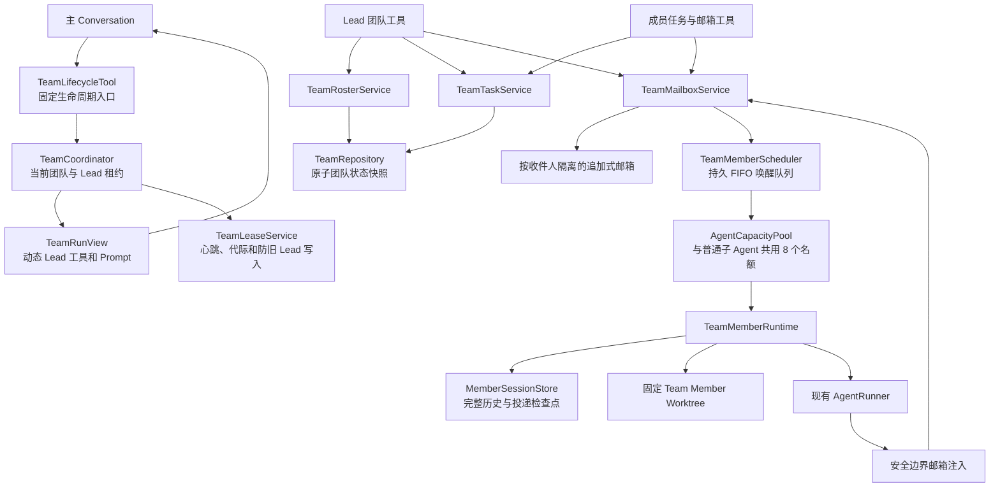
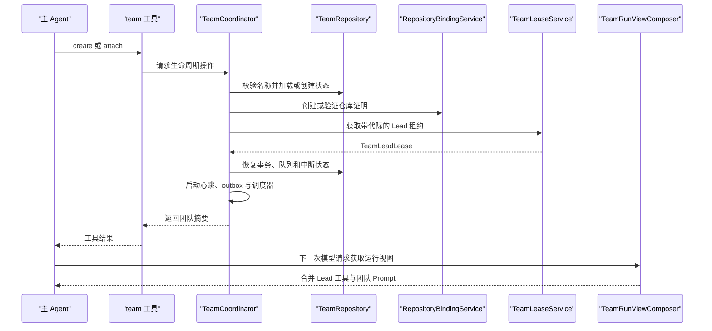
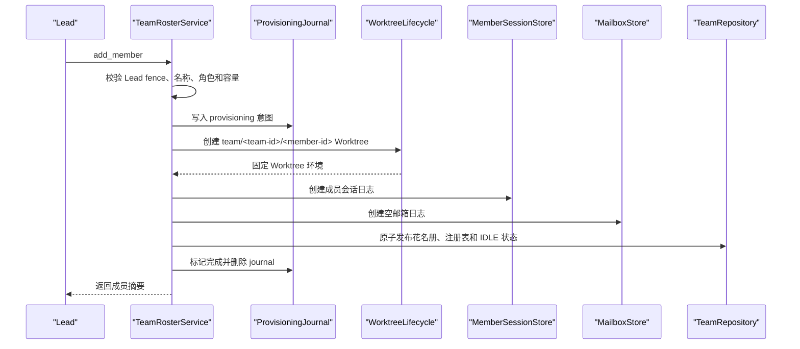
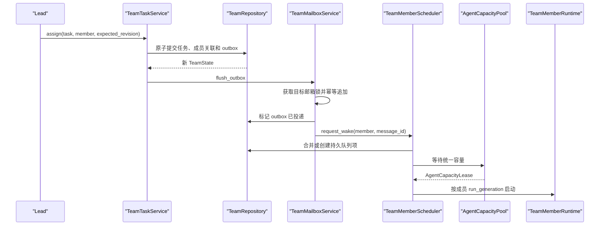
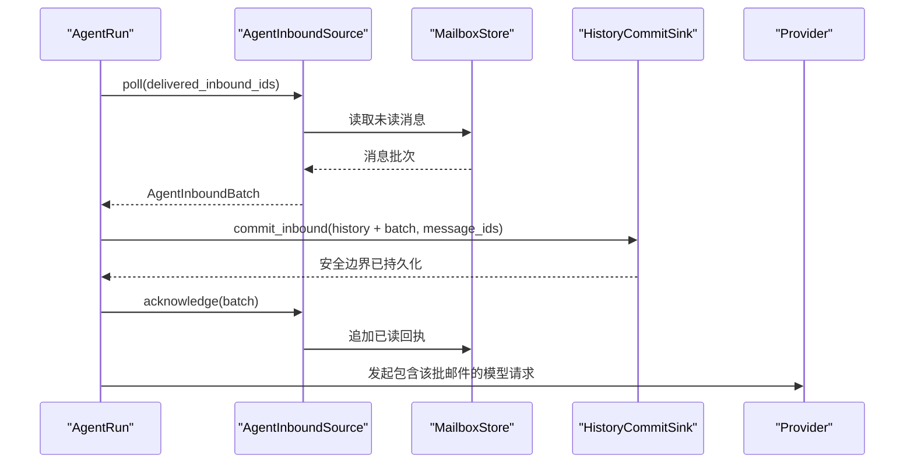
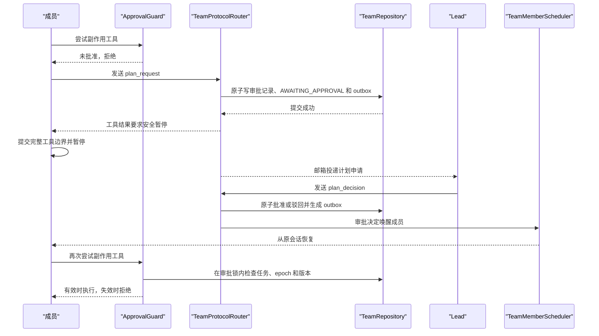

# Phase 14A 持久团队核心 Plan

## 架构概览

Phase 14A 新增独立的 `teams` 领域层。它复用现有 Agent Loop、角色目录、权限、Hook、MCP 和 Worktree 基础设施，但不把长期成员塞进 `SubagentTaskManager`：普通子 Agent 的“运行一次后进入终态并清理”语义与团队成员的“自然结束后空闲、随后原地恢复”不兼容。



### 1. 团队协调层

`TeamCoordinator` 是应用进程内唯一的团队门面，维护当前主对话挂载的团队、活动 Lead 租约、Lead 身份以及成员运行时。它负责创建、挂载、重新关联和卸载，并在租约丢失时立即撤销 Lead 工具、停止继续调度成员。

团队创建或挂载发生在工具调用中；现有 `AgentRunView` 在下一次模型请求前重新取视图，因此无需重启主 Agent，就能完成普通工具集与 Lead 工具集的切换。

### 2. 团队持久化层

每个团队在 `~/.mewcode/teams/<team-name>/` 下拥有独立目录：

- 一个严格版本化的团队状态快照，统一保存清单、花名册、任务、审批、持久队列和待投递系统事件。
- 每位参与者一个追加式邮箱日志及独立锁。
- 每位成员一个追加式会话日志，保存完整历史、邮箱投递检查点和恢复状态。
- 独立的租约、状态锁、邮箱锁和成员恢复锁。

团队状态通过“写临时快照、同步、原子替换”提交，避免跨多个元数据文件产生半个成员或半次任务更新。任务变更产生的通知先进入同一状态快照中的持久 outbox，再由邮箱服务按消息 ID 幂等投递。

### 3. Lead 租约与仓库绑定

`TeamLeaseService` 使用短临界区锁更新带代际号的心跳租约。所有 Lead 管理操作都携带租约代际；旧 Lead 即使在进程暂停后恢复，也无法继续写入新一代团队状态。

团队创建时在 Git 公共管理目录写入带随机证明的仓库绑定记录。普通挂载同时校验用户目录中的团队记录和仓库侧证明；仓库移动后，显式重新关联会验证证明、Git 指针、团队 Worktree 和临时分支，再更新路径记录。路径相同但仓库证明不同的项目不能接管团队。

### 4. 花名册与长期 Worktree

`TeamRosterService` 管理成员状态机、冻结角色版本和增删改操作。`TeamMemberProvisioner` 采用“先暂存资源、最后发布花名册”的创建顺序：建立固定 Worktree、成员会话和邮箱后，才原子发布有效成员；失败时按日志回滚，无法安全删除的 Worktree保留为诊断现场但不会注册成员。

现有 Worktree 记录增加用途和稳定拥有者字段：

- 普通子 Agent Worktree 仍按任务退出策略处理。
- 团队成员 Worktree 在成员空闲或应用退出时只释放占用并回到可恢复状态，不执行自动删除。
- 后台清理跳过有效花名册拥有的团队 Worktree。
- 移除成员时才调用现有未提交、未发布成果保护执行安全删除。

### 5. 共享任务与邮箱

`TeamTaskService` 在单个团队状态事务中完成修订检查、权限检查、状态转换、依赖环验证、原子领取和下游可运行性计算。任务通知写入持久 outbox，避免“任务已指派但消息丢失”。

`TeamMailboxService` 使用注册表解析目标，并通过收件人级重试锁向邮箱日志追加消息或已读回执。广播复用一个关联标识，为每个目标生成确定的投递标识，因此可以报告部分失败并安全重试。

七种协议由独立协议校验器处理；业务方向约束在持久化前检查，不让模型自行解释一个任意载荷是否算有效审批。

### 6. 成员调度与统一容量

新增进程级 `AgentCapacityPool`，容量默认为 8：

- 普通子 Agent 继续采用“没有名额则立即失败”的既有行为。
- 团队成员采用持久 FIFO 排队；进程重启后从团队快照恢复队列。
- 获得容量的成员得到一次性容量租约，运行结束、失败或取消时必须释放。

`TeamMemberScheduler` 合并邮件唤醒、显式恢复和容量释放事件。同一成员只有一个调度键和一个恢复锁，因此不会被重复启动。

### 7. 长期成员运行时

`TeamMemberRuntime` 每次唤醒都会创建一个新的 `AgentRun`，但输入是该成员持久历史，输出继续提交到同一 `MemberSessionStore`；因此运行协程是短暂的，成员身份与上下文是长期的。

运行时按固定 Worktree 重建：

- 工作区文件与命令工具
- 项目指令和项目记忆
- 项目 Hook 与用户 Hook
- 独立 stdio MCP runtime
- 上下文归档和文件读取观察缓存
- 冻结角色、模型、权限规则与工具范围
- 绑定当前成员身份的任务和邮箱工具

自然结束只关闭本次运行资源并把成员设为空闲，不关闭成员会话或删除 Worktree。

### 8. 安全边界消息注入

`AgentRunner` 增加通用的安全边界入站接口，供 Lead 和团队成员共同使用：

1. 每轮模型请求前查询未投递邮件。
2. 将邮件渲染为带消息 ID 的不可信上下文消息。
3. 先把该消息提交到对应会话历史。
4. 提交成功后再向邮箱追加已读回执。
5. 若在两步之间崩溃，恢复时根据会话中的消息 ID补写回执，不重复加入上下文。

运行中的新邮件因此会在下一模型边界进入上下文，而不会中断当前模型流或工具调用。

### 9. 审批策略

需要审批的成员使用动态 `TeamMemberToolPolicy`。它始终先应用冻结角色、全局禁用、工作区和权限规则，再叠加审批门禁：

- 未批准时，只允许角色中的只读能力、任务读取、邮箱读取与计划申请。
- 审批决定按任务 ID、计划版本和申请 ID匹配。
- 任务重新指派、重置或依赖变化时，任务服务在同一状态事务中使批准失效。
- 批准后只撤销审批门禁，不扩大冻结角色原本的能力。

## 核心数据结构

所有持久模型使用不可变 `dataclass`、严格字段集合、时区感知时间和显式 `schema_version`。名称同时保存展示值与规范键；内部关联使用不可变随机 ID，不用可变名称做外键。

### 团队聚合

```python
class TeamMemberStatus(StrEnum):
    PROVISIONING = "provisioning"
    QUEUED = "queued"
    RUNNING = "running"
    AWAITING_APPROVAL = "awaiting_approval"
    IDLE = "idle"
    STOPPED = "stopped"
    INTERRUPTED = "interrupted"
    FAILED = "failed"


class TeamMemberBackend(StrEnum):
    IN_PROCESS = "in_process"


class TeamTaskStatus(StrEnum):
    PENDING = "pending"
    IN_PROGRESS = "in_progress"
    COMPLETED = "completed"
    FAILED = "failed"
    CANCELLED = "cancelled"


class PlanApprovalStatus(StrEnum):
    PENDING = "pending"
    APPROVED = "approved"
    REJECTED = "rejected"
    INVALIDATED = "invalidated"


class TeamProtocol(StrEnum):
    TEXT = "text"
    TASK_ASSIGNMENT = "task_assignment"
    TASK_STATUS = "task_status"
    PLAN_REQUEST = "plan_request"
    PLAN_DECISION = "plan_decision"
    MEMBER_IDLE = "member_idle"
    STOP_REQUEST = "stop_request"
```

```python
@dataclass(frozen=True)
class TeamName:
    value: str
    canonical_key: str


@dataclass(frozen=True)
class RepositoryBinding:
    repository_marker_id: str
    repository_id: str
    workspace_root: Path
    common_dir: Path
    proof_nonce: str
    created_at: datetime
    relinked_at: datetime | None = None


@dataclass(frozen=True)
class TeamManifest:
    team_id: str
    name: TeamName
    leader_name: str
    repository: RepositoryBinding
    created_at: datetime
    updated_at: datetime
```

`repository_marker_id` 和 `proof_nonce` 同时出现在用户团队目录及 Git 公共管理目录中。`repository_id` 仍保留当前路径归一化身份，用于普通快速校验；移动后的显式重新关联依靠持久证明确认这是同一仓库。

### 冻结角色与成员

```python
@dataclass(frozen=True)
class FrozenRoleSnapshot:
    snapshot_id: str
    role_name: str
    source_fingerprint: str
    description: str
    system_prompt: str
    profile_name: str
    max_turns: int
    permission_mode: PermissionMode
    allowed_tool_names: tuple[str, ...]
    denied_tool_names: tuple[str, ...]
    permission_rules: PermissionRuleSets
    created_at: datetime


@dataclass(frozen=True)
class TeamMemberRecord:
    member_id: str
    name: TeamName
    role: FrozenRoleSnapshot
    backend: TeamMemberBackend
    requires_approval: bool
    status: TeamMemberStatus
    worktree_name: str
    worktree_root: Path
    worktree_owner_id: str
    mailbox_name: str
    session_name: str
    current_task_id: str | None
    active_run_id: str | None
    run_generation: int
    last_error: str | None
    created_at: datetime
    updated_at: datetime
```

`profile_name` 在成员创建时解析为实际 Profile，不持久化 `inherit`。`run_generation` 每次恢复递增，用于拒绝旧协程晚到的状态提交。

### 共享任务

```python
@dataclass(frozen=True)
class TeamTask:
    task_id: str
    revision: int
    approval_epoch: int
    title: str
    description: str
    status: TeamTaskStatus
    assignee_id: str | None
    dependency_ids: tuple[str, ...]
    created_by: str
    result: str
    created_at: datetime
    updated_at: datetime
    started_at: datetime | None
    finished_at: datetime | None


@dataclass(frozen=True)
class TeamTaskView:
    task: TeamTask
    blocked: bool
    blocking_task_ids: tuple[str, ...]
    claimable: bool
```

`blocked` 不落盘，而是从当前依赖状态计算。任务指派或进入 `IN_PROGRESS` 时同步更新成员的 `current_task_id`；终态转换清除该字段。

### 审批记录

```python
class PlanDecision(StrEnum):
    APPROVE = "approve"
    REJECT = "reject"


@dataclass(frozen=True)
class PlanApprovalRecord:
    request_id: str
    member_id: str
    task_id: str
    task_revision: int
    approval_epoch: int
    plan_version: int
    plan_text: str
    summary: str
    status: PlanApprovalStatus
    decision: PlanDecision | None
    feedback: str | None
    requested_at: datetime
    decided_at: datetime | None
```

有效批准必须同时满足：

```text
status == APPROVED
member_id == 当前任务负责人
task_id == 成员当前任务
approval_epoch == 任务当前 approval_epoch
plan_version == 成员当前提交版本
```

任务重新指派、重置或替换依赖时递增 `approval_epoch`，从而在同一任务事务中使旧批准失效。

### 邮箱和协议载荷

```python
@dataclass(frozen=True)
class MailboxRegistration:
    participant_id: str
    participant_name: TeamName
    mailbox_name: str
    is_lead: bool


@dataclass(frozen=True)
class TeamMessage:
    schema_version: int
    message_id: str
    correlation_id: str | None
    sender_id: str
    recipient_id: str
    summary: str
    body: str
    protocol: TeamProtocol
    payload: ProtocolPayload
    sent_at: datetime
    read: bool
```

严格协议载荷：

| 协议 | 载荷字段 |
|---|---|
| `text` | 无额外字段 |
| `task_assignment` | `task_id`、`task_revision`、`assigned_by` |
| `task_status` | `task_id`、`task_revision`、`status` |
| `plan_request` | `request_id`、`task_id`、`task_revision`、`approval_epoch`、`plan_version` |
| `plan_decision` | `request_id`、`task_id`、`plan_version`、`decision`、`feedback` |
| `member_idle` | `member_id`、`task_id`、`task_status`、`result_summary` |
| `stop_request` | `member_id`、`reason` |

邮箱日志包含两类记录：

```python
@dataclass(frozen=True)
class MailboxMessageRecord:
    message: TeamMessage


@dataclass(frozen=True)
class MailboxReadRecord:
    receipt_id: str
    message_ids: tuple[str, ...]
    read_at: datetime
```

读取邮箱时重放追加日志，根据回执计算最终 `read` 状态，不原地改写旧消息。

### 持久队列与 outbox

```python
class MemberWakeReason(StrEnum):
    MESSAGE = "message"
    EXPLICIT_RESUME = "explicit_resume"
    APPROVAL_DECISION = "approval_decision"
    RECOVERED_QUEUE = "recovered_queue"


@dataclass(frozen=True)
class MemberQueueEntry:
    queue_id: str
    sequence: int
    member_id: str
    reason: MemberWakeReason
    message_ids: tuple[str, ...]
    requested_at: datetime


@dataclass(frozen=True)
class TeamOutboxEntry:
    outbox_id: str
    message: TeamMessage
    delivered: bool
    created_at: datetime
    delivered_at: datetime | None
    last_error: str | None
```

同一成员只能有一个未完成队列项；后续消息 ID合并进现有项。广播为每个目标建立独立 outbox 项，共享 `correlation_id`。

### 团队状态快照

```python
@dataclass(frozen=True)
class TeamState:
    schema_version: int
    revision: int
    manifest: TeamManifest
    members: Mapping[str, TeamMemberRecord]
    registry: Mapping[str, MailboxRegistration]
    tasks: Mapping[str, TeamTask]
    approvals: Mapping[str, PlanApprovalRecord]
    queue: tuple[MemberQueueEntry, ...]
    outbox: tuple[TeamOutboxEntry, ...]
    updated_at: datetime
```

`members`、`tasks` 和 `approvals` 使用稳定 ID为键；`registry` 使用规范名称为键。整个快照提交前执行跨字段一致性校验。

### 租约与附件

```python
@dataclass(frozen=True)
class TeamLeadLeaseRecord:
    schema_version: int
    team_id: str
    lease_id: str
    generation: int
    holder_session_id: str
    holder_process_id: str
    heartbeat_at: datetime


@dataclass(frozen=True)
class TeamLeadLease:
    record: TeamLeadLeaseRecord
    released: bool = False


@dataclass(frozen=True)
class TeamAttachment:
    state: TeamState
    lease: TeamLeadLease
    root_session_id: str
```

所有 Lead 和成员状态写入都携带 `lease_id + generation` 作为 fencing token。旧代际写入即使拿到状态锁也必须失败。

### 成员会话与入站批次

```python
@dataclass(frozen=True)
class MemberSessionState:
    member_id: str
    session_id: str
    messages: tuple[ChatMessage, ...]
    delivered_message_ids: frozenset[str]
    context_archive_id: str
    last_activity: datetime | None
    last_complete_boundary: int


@dataclass(frozen=True)
class AgentInboundBatch:
    batch_id: str
    messages: tuple[ChatMessage, ...]
    mailbox_message_ids: tuple[str, ...]
```

团队邮件渲染为结构化 `ChatMessage`，使用新的 `MessageKind.TEAM_INBOUND`，内容保留消息 ID并明确标注不可信边界。

### Worktree 拥有者

```python
class WorktreePurpose(StrEnum):
    SUBAGENT_TASK = "subagent_task"
    TEAM_MEMBER = "team_member"


@dataclass(frozen=True)
class WorktreeOwner:
    purpose: WorktreePurpose
    owner_id: str
    persistent: bool
```

旧 `task_id` 调用通过兼容适配器映射为 `SUBAGENT_TASK`；团队成员使用稳定 `member_id`，后台清理根据 `persistent` 和有效花名册证明跳过长期目录。

## 核心接口

### 路径与团队仓库

```python
class TeamPaths:
    @classmethod
    def for_user(cls, user_root: Path, name: TeamName) -> TeamPaths: ...

    team_root: Path
    state_file: Path
    lease_file: Path
    state_lock: Path
    lease_lock: Path
    mailboxes_root: Path
    members_root: Path
    transactions_root: Path
```

```python
class TeamRepository:
    def list(self) -> tuple[TeamSummary, ...]: ...
    def create(self, state: TeamState) -> TeamState: ...
    def load(self, name: TeamName) -> TeamState: ...

    def compare_and_swap(
        self,
        name: TeamName,
        *,
        expected_revision: int,
        lease_fence: tuple[str, int],
        candidate: TeamState,
    ) -> TeamState: ...

    def validate(self, state: TeamState) -> None: ...
```

`compare_and_swap` 在状态锁内重新加载当前状态、验证租约 fence、修订版本和完整候选快照，然后写入 `revision + 1`。

### Lead 租约与仓库证明

```python
class TeamLeaseService:
    async def acquire(
        self,
        team: TeamName,
        *,
        root_session_id: str,
        process_id: str,
    ) -> TeamLeadLease: ...

    async def renew(self, lease: TeamLeadLease) -> TeamLeadLease: ...
    async def validate(self, lease: TeamLeadLease) -> None: ...
    async def release(self, lease: TeamLeadLease) -> None: ...
```

```python
class TeamRepositoryBindingService:
    async def create_binding(
        self,
        team_id: str,
        workspace: Path,
    ) -> RepositoryBinding: ...

    async def verify(
        self,
        binding: RepositoryBinding,
        workspace: Path,
    ) -> RepositoryIdentity: ...

    async def relink(
        self,
        attachment: TeamAttachment,
        workspace: Path,
    ) -> RepositoryBinding: ...
```

### 团队协调器

```python
class TeamCoordinator:
    async def create(
        self,
        name: str,
        *,
        root_session_id: str,
    ) -> TeamAttachment: ...

    def list(self) -> tuple[TeamSummary, ...]: ...

    async def attach(
        self,
        name: str,
        *,
        root_session_id: str,
    ) -> TeamAttachment: ...

    async def relink(self, workspace: Path) -> TeamAttachment: ...
    async def detach(self) -> None: ...
    async def close(self) -> tuple[TeamDiagnostic, ...]: ...

    def active_attachment(self) -> TeamAttachment | None: ...
    def root_run_view(self, base: AgentRunView) -> AgentRunView: ...
    def root_inbound_source(self) -> AgentInboundSource: ...
```

`detach()` 在释放租约前检查无 `RUNNING`、`QUEUED` 或活动恢复动作。`close()` 则按关闭语义等待安全边界并把未收敛运行记录为中断。

### 花名册与审批

```python
class TeamRosterService:
    async def add_member(
        self,
        actor: TeamActor,
        *,
        name: str,
        role_name: str,
        backend: str,
        requires_approval: bool,
    ) -> TeamMemberRecord: ...

    def list_members(self, actor: TeamActor) -> tuple[TeamMemberRecord, ...]: ...

    async def refresh_role(
        self,
        actor: TeamActor,
        member_name: str,
    ) -> TeamMemberRecord: ...

    async def resume(
        self,
        actor: TeamActor,
        member_name: str,
        *,
        reason: str,
    ) -> TeamMemberRecord: ...

    async def stop(
        self,
        actor: TeamActor,
        member_name: str,
        *,
        reason: str,
    ) -> TeamMemberRecord: ...

    async def remove(
        self,
        actor: TeamActor,
        member_name: str,
    ) -> MemberRemovalResult: ...
```

```python
class TeamApprovalService:
    async def request(
        self,
        actor: TeamActor,
        *,
        task_id: str,
        plan_version: int,
        plan_text: str,
        summary: str,
    ) -> PlanApprovalRecord: ...

    async def decide(
        self,
        actor: TeamActor,
        *,
        request_id: str,
        decision: PlanDecision,
        feedback: str | None,
    ) -> PlanApprovalRecord: ...

    async def invalidate_for_task(
        self,
        task_id: str,
        *,
        reason: str,
    ) -> tuple[PlanApprovalRecord, ...]: ...

    @asynccontextmanager
    async def side_effect_permit(
        self,
        actor: TeamActor,
        task_id: str,
    ) -> AsyncIterator[ApprovalPermit]: ...
```

任务失效操作和普通副作用工具执行使用同一个成员级审批锁：已开始且持有有效 permit 的工具可以结束，失效提交完成后新的副作用调用全部拒绝。

### 共享任务

```python
class TeamTaskService:
    async def create(
        self,
        actor: TeamActor,
        *,
        title: str,
        description: str,
        dependency_ids: Sequence[str] = (),
    ) -> TeamTaskView: ...

    def get(self, actor: TeamActor, task_id: str) -> TeamTaskView: ...

    def list(
        self,
        actor: TeamActor,
        *,
        status: TeamTaskStatus | None = None,
        assignee: str | None = None,
    ) -> tuple[TeamTaskView, ...]: ...

    async def update(
        self,
        actor: TeamActor,
        task_id: str,
        *,
        expected_revision: int,
        title: str | None = None,
        description: str | None = None,
        dependency_ids: Sequence[str] | None = None,
    ) -> TeamTaskView: ...

    async def assign(
        self,
        actor: TeamActor,
        task_id: str,
        member_name: str,
        *,
        expected_revision: int,
    ) -> TeamTaskView: ...

    async def claim(
        self,
        actor: TeamActor,
        task_id: str,
        *,
        expected_revision: int,
    ) -> TeamTaskView: ...

    async def transition(
        self,
        actor: TeamActor,
        task_id: str,
        status: TeamTaskStatus,
        *,
        expected_revision: int,
        result: str = "",
    ) -> TeamTaskView: ...

    async def delete(
        self,
        actor: TeamActor,
        task_id: str,
        *,
        expected_revision: int,
    ) -> None: ...
```

每个变更在一次团队状态事务中同时完成任务更新、成员 `current_task_id`、审批失效及 outbox 生成。

### 邮箱与协议路由

```python
class TeamMailboxService:
    async def send(
        self,
        actor: TeamActor,
        *,
        recipient: str,
        summary: str,
        body: str,
        protocol: TeamProtocol,
        payload: Mapping[str, object],
        message_id: str | None = None,
    ) -> DeliveryResult: ...

    async def broadcast(
        self,
        actor: TeamActor,
        *,
        summary: str,
        body: str,
        protocol: TeamProtocol,
        payload: Mapping[str, object],
        correlation_id: str | None = None,
    ) -> BroadcastResult: ...

    def list(
        self,
        actor: TeamActor,
        *,
        unread_only: bool = True,
        limit: int = 100,
        cursor: str | None = None,
    ) -> MailboxPage: ...

    async def mark_read(
        self,
        actor: TeamActor,
        message_ids: Sequence[str],
    ) -> tuple[str, ...]: ...

    async def flush_outbox(self) -> OutboxFlushResult: ...
```

```python
class TeamProtocolRouter:
    async def prepare(
        self,
        actor: TeamActor,
        draft: TeamMessageDraft,
    ) -> ProtocolTransition: ...

    async def committed(
        self,
        transition: ProtocolTransition,
    ) -> None: ...
```

`prepare()` 严格解析载荷及方向，并生成需要和消息一起提交的状态变化，例如计划申请、审批决定或停止请求。消息与状态变化先写入团队快照，再由 `flush_outbox()` 投递。

### 成员会话与安全边界入站

```python
class InboundHistoryCommitSink(HistoryCommitSink, Protocol):
    @property
    def delivered_inbound_ids(self) -> frozenset[str]: ...

    def commit_inbound(
        self,
        messages: Sequence[ChatMessage],
        inbound_ids: Sequence[str],
    ) -> None: ...
```

```python
class AgentInboundSource(Protocol):
    async def poll(
        self,
        committed_ids: frozenset[str],
    ) -> AgentInboundBatch | None: ...

    async def acknowledge(self, batch: AgentInboundBatch) -> None: ...
```

`AgentRunner.start()` 增加：

```python
def start(
    ...,
    history_commit_sink: HistoryCommitSink | None = None,
    inbound_source: AgentInboundSource | None = None,
) -> AgentRun: ...
```

每轮开始时，`AgentRun` 先轮询入站消息，通过 `commit_inbound()` 把消息和 ID写入同一会话记录，再调用 `acknowledge()` 追加邮箱已读回执。

```python
class MemberSessionStore:
    def create(
        self,
        member: TeamMemberRecord,
    ) -> MemberSessionBinding: ...

    def open(
        self,
        member: TeamMemberRecord,
    ) -> tuple[MemberSessionBinding, MemberSessionState]: ...


class MemberSessionBinding(InboundHistoryCommitSink):
    def commit(self, messages: Sequence[ChatMessage]) -> None: ...
    def commit_inbound(
        self,
        messages: Sequence[ChatMessage],
        inbound_ids: Sequence[str],
    ) -> None: ...
    def close(self) -> None: ...
```

### 统一容量与成员调度

```python
class AgentCapacityPool:
    async def try_acquire(
        self,
        owner_kind: str,
        owner_id: str,
    ) -> AgentCapacityLease | None: ...

    async def acquire(
        self,
        owner_kind: str,
        owner_id: str,
    ) -> AgentCapacityLease: ...

    async def close(self) -> None: ...
```

普通子 Agent 使用 `try_acquire()`；团队调度器持久化队列后使用等待式 `acquire()`。`AgentCapacityLease.close()` 幂等释放名额。

```python
class TeamMemberScheduler:
    async def restore(self, attachment: TeamAttachment) -> None: ...

    async def request_wake(
        self,
        member_id: str,
        *,
        reason: MemberWakeReason,
        message_ids: Sequence[str] = (),
    ) -> MemberQueueEntry | None: ...

    async def stop(self, member_id: str, *, reason: str) -> None: ...
    async def close(self) -> tuple[TeamDiagnostic, ...]: ...
```

### 成员运行时

```python
class TeamMemberRuntimeFactory:
    async def create(
        self,
        attachment: TeamAttachment,
        member: TeamMemberRecord,
        capacity: AgentCapacityLease,
    ) -> TeamMemberRuntime: ...


class TeamMemberRuntime:
    async def events(self) -> AsyncIterator[TeamMemberProgress]: ...
    async def cancel(self) -> None: ...
    async def close(self) -> None: ...

    @property
    def outcome(self) -> TeamMemberOutcome: ...
```

`TeamMemberOutcome` 区分 `IDLE`、`AWAITING_APPROVAL`、`STOPPED`、`INTERRUPTED` 和 `FAILED`，不会把自然结束映射成普通子 Agent的永久 `COMPLETED`。

### Worktree 生命周期扩展

```python
class WorktreeNameFactory:
    def for_team_member(
        self,
        team_id: str,
        member_id: str,
    ) -> WorktreeName: ...


class WorktreeLifecycleService:
    async def create_or_recover(
        self,
        name: WorktreeName,
        *,
        owner: WorktreeOwner,
    ) -> WorktreeEnvironment: ...

    async def enter(
        self,
        environment: WorktreeEnvironment,
        *,
        owner: WorktreeOwner,
    ) -> WorktreeLease: ...

    async def suspend(self, lease: WorktreeLease) -> WorktreeExitResult: ...
```

现有 `task_id` 参数继续作为兼容入口映射到普通子 Agent拥有者；现有 `exit()` 继续执行普通任务清理，团队成员空闲时只调用 `suspend()`。

## 模块设计

### `teams.models`

**职责：** 定义团队、成员、任务、审批、邮箱、队列、租约、诊断和运行结果的不可变模型与枚举。  
**对外接口：** 上一节列出的所有核心数据结构。  
**依赖：** `providers.ChatMessage`、权限模型和 Worktree 基础模型；不依赖任何团队服务或文件系统模块。

这是团队包依赖图的最底层。

### `teams.paths`

**职责：** 校验团队名和成员名，生成用户团队目录、状态文件、邮箱、成员会话、锁及事务日志位置；拒绝路径穿越、大小写别名、符号链接和 Windows 保留名称。  
**对外接口：** `TeamNamePolicy`、`TeamPaths`。  
**依赖：** `teams.models`、现有 Worktree 路径安全辅助函数。

名称规范键采用 Unicode 规范化后的大小写折叠值；实际目录段只接受安全 ASCII 子集，避免不同平台对同一名称产生不同路径。

### `teams.codec`

**职责：** 严格编码和解码团队状态、租约、仓库证明、事务日志、邮箱记录及成员会话扩展记录；拒绝重复字段、未知字段、错误类型、NaN、无时区时间和未知版本。  
**对外接口：** 每种持久模型的 `encode_*`、`decode_*` 及流式邮箱重放。  
**依赖：** `teams.models`、现有会话消息编解码原语。

成员会话和主会话共享 `ChatMessage` 编解码，不复制 Provider 专属消息解释逻辑。

### `teams.repository`

**职责：** 枚举团队、创建初始状态、加载并完整校验状态快照、执行带修订版本和租约 fence 的原子替换、保存及恢复跨资源操作日志。  
**对外接口：** `TeamRepository`、`TeamMutationRunner`、`TeamProvisioningJournalStore`。  
**依赖：** `teams.paths`、`teams.codec`、重试锁和原子文件写入辅助模块。

`TeamMutationRunner` 在并发写入造成团队快照修订冲突时重新加载并重放纯状态转换；调用方提供的任务 `expected_revision` 仍严格检查，不因内部重试而接受过期任务修改。

### `teams.leases`

**职责：** 获取、续期、验证和释放 Team Lead 租约；维护递增代际号及 fencing token；识别 60 秒过期租约。  
**对外接口：** `TeamLeaseService`。  
**依赖：** `teams.repository`、`teams.codec`、`teams.paths`、重试锁、可替换时钟。

心跳任务只更新租约记录，不重写完整团队状态。租约丢失事件通过回调通知 `TeamCoordinator`。

### `teams.repository_binding`

**职责：** 创建和验证仓库侧团队证明；发现当前 Git 身份；显式重新关联移动后的仓库；协调 Worktree 指针修复及记录更新。  
**对外接口：** `TeamRepositoryBindingService`。  
**依赖：** `teams.repository`、现有 `GitWorktreeBackend`、`WorktreeRecordStore` 和路径策略。

重新关联使用单独操作日志。恢复完成前团队保持不可挂载，不向模型暴露一半已修复的成员目录。

### `teams.domain`

**职责：** 提供无 I/O 的团队状态校验与转换：

- 成员状态机
- 任务权限及状态转换
- 依赖环检测与阻塞计算
- 原子领取和指派
- 审批创建、决定及失效
- 队列合并与出队
- 注册表一致性
- outbox 事件生成

**对外接口：** `validate_team_state()` 以及返回“新状态 + 领域事件”的纯转换函数。  
**依赖：** 仅 `teams.models`。

任务、邮箱、审批和花名册服务都调用该层，避免服务之间相互调用形成循环依赖。

### `teams.tasks`

**职责：** 实现共享任务接口、参与者授权、任务修订冲突、依赖图操作以及领域事件提交。  
**对外接口：** `TeamTaskService`。  
**依赖：** `teams.domain`、`teams.repository`、`teams.approvals` 提供的成员审批并发锁。

任务服务不会直接写邮箱；任务变更在状态事务中生成 outbox，由邮箱服务异步幂等投递。

### `teams.protocols`

**职责：** 严格解析七种协议载荷、校验发送方向及引用对象，并把协议消息转换成领域状态变化。  
**对外接口：** `TeamProtocolRouter`、各协议载荷解析器。  
**依赖：** `teams.domain`、`teams.models`。

普通文本协议没有领域状态变化；计划申请、审批决定和停止请求会同时生成状态变化及消息 outbox。

### `teams.mailbox`

**职责：**

- 名称注册表解析
- 点对点与广播消息构造
- 收件人级锁和追加式日志
- 唯一消息去重
- 未读分页与读取回执
- outbox 投递和部分失败报告
- 投递成功后的成员唤醒通知

**对外接口：** `TeamMailboxService`、`TeamMailboxStore`。  
**依赖：** `teams.protocols`、`teams.repository`、`teams.codec`、`teams.paths`。

邮箱存储层不知道 Agent 运行时；它只通过 `MemberWakeSink` 协议报告已持久化消息，避免与调度器循环依赖。

### `teams.approvals`

**职责：** 提交和决定审批、查询有效批准、管理成员级异步审批锁，并向普通副作用工具提供执行 permit。  
**对外接口：** `TeamApprovalService`、`ApprovalGate`、`ApprovalPermit`。  
**依赖：** `teams.domain`、`teams.repository`。

审批失效操作先取得成员审批锁，等待已获 permit 的工具离开临界区，再提交新 `approval_epoch`。副作用工具包装器在同一锁内重新检查当前批准，消除“策略检查后、工具执行前”失效的竞态。

### `teams.roster`

**职责：** 新增成员、冻结角色快照、刷新角色、显式恢复、停止和安全移除；执行花名册授权和成员状态机。  
**对外接口：** `TeamRosterService`、`TeamMemberProvisioner`。  
**依赖：** 角色目录、`teams.repository`、`teams.domain`、`teams.sessions`、`teams.scheduler`、Worktree 生命周期和仓库绑定服务。

新增成员使用操作日志：

```text
写 provisioning journal
  -> 创建固定 Worktree
  -> 创建成员会话
  -> 创建空邮箱日志
  -> 原子发布花名册、注册表和成员状态
  -> 删除 journal
```

恢复时，已发布成员完成收尾；未发布成员执行保守回滚。无法安全删除的 Worktree转为保留诊断，但不加入花名册。

### `teams.sessions`

**职责：** 创建、打开、重放和提交长期成员会话；保存邮箱投递 ID、上下文归档身份和完整安全边界；修复尾部不完整工具组。  
**对外接口：** `MemberSessionStore`、`MemberSessionBinding`。  
**依赖：** `teams.codec`、现有 Continuity 消息编解码和 sanitization。

该模块不使用主会话的 30 天过期策略，不自动删除长期成员历史。只有成员移除后，且 Worktree 与会话均确认不再活动时，才能清理会话。

### `teams.inbound`

**职责：** 将邮箱消息渲染为有界、不可信的 `TEAM_INBOUND` 消息；为 Lead 和成员实现 `AgentInboundSource`；根据已提交 ID补写邮箱已读回执。  
**对外接口：** `LeadInboundSource`、`MemberInboundSource`、`render_inbound_batch()`。  
**依赖：** `teams.mailbox`、`teams.sessions`、`providers.ChatMessage`。

渲染内容只包含消息的安全字段和协议载荷，不把成员正文拼入系统优先级指令。

### `agent.capacity`

**职责：** 提供进程级 8 名额容量池、等待队列、幂等租约释放和关闭行为。  
**对外接口：** `AgentCapacityPool`、`AgentCapacityLease`。  
**依赖：** 仅 `asyncio` 和可替换 ID生成器。

`SubagentTaskManager` 获得共享容量池后不再自行统计全局活动数量；它仍保留任务表和当前前台限制。

### `teams.policy`

**职责：** 构造冻结角色工具集合，硬排除普通 Agent、Skill、团队生命周期和成员管理入口；叠加审批状态及租约 fence；包装普通副作用工具执行。  
**对外接口：** `TeamMemberToolPolicy`、`ApprovalGuardedTool`、`build_member_tool_scope()`。  
**依赖：** `teams.approvals`、`teams.models`、现有工具策略与工作区绑定。

团队任务和邮箱工具仍在各自服务中执行参与者级授权，不能仅依靠工具是否出现在 schema 中。

### `teams.runtime`

**职责：** 在成员固定 Worktree 内构造一次 Agent 运行，恢复持久历史，绑定入站邮箱、审批策略、Hook、MCP、上下文归档、权限和容量租约；将 Agent 停止原因映射为团队成员结果。  
**对外接口：** `TeamMemberRuntimeFactory`、`TeamMemberRuntime`。  
**依赖：** `teams.sessions`、`teams.inbound`、`teams.policy`、现有 AgentRunner、Workspace runtime 和 Worktree 生命周期。

Worktree 工作区服务的通用装配部分从当前子 Agent 专属工厂中抽出；普通子 Agent适配器保持原入口和行为。

### `teams.scheduler`

**职责：** 恢复持久队列，合并唤醒请求，按 FIFO 获取容量，保证每成员最多一个运行，驱动运行时，提交空闲/等待审批/失败状态并投递通知。  
**对外接口：** `TeamMemberScheduler`。  
**依赖：** `agent.capacity`、`teams.runtime`、`teams.repository`、`teams.domain`、`MemberWakeSink`。

调度器只在团队持有有效 Lead 租约时启动新成员。租约失效后停止出队，并取消或收敛当前运行。

### `teams.tools`

**职责：** 定义四个固定 schema：

- `team`：普通主 Agent生命周期入口
- `team_member`：Lead 花名册管理
- `team_task`：Lead 与成员共享任务
- `team_message`：Lead 与成员邮箱及广播

所有工具使用固定字符串参数，不把团队名、成员名或任务 ID做成动态枚举。混合读写动作在控制操作内根据当前 Agent 模式和参与者身份执行动作级安全检查。

### `teams.coordinator`

**职责：** 装配所有团队服务、维护当前附件、启动租约心跳与邮箱 outbox、组合根 Agent 运行视图、向成员工具提供绑定身份，并协调启动与关闭顺序。  
**对外接口：** `TeamCoordinator`、`TeamRunViewComposer`。  
**依赖：** 所有团队服务；这是团队包依赖图的最上层。

### 现有模块调整

- `agent.runner`：增加安全边界入站源和 `TEAM_INBOUND` 历史提交；支持团队工具返回的安全暂停结果。
- `providers.base`：增加 `MessageKind.TEAM_INBOUND`，Provider 仍按普通用户上下文编码。
- `continuity.session_*`：主会话记录可原子提交入站消息 ID，并在恢复时暴露已提交 ID。
- `worktrees.models/records/paths/lifecycle/janitor`：增加 Worktree 用途、稳定拥有者、团队成员命名、`suspend()` 及持久成员清理豁免。
- `subagents.tasks`：接入共享 `AgentCapacityPool`，保持满载立即失败。
- `subagents.workspace_runtime`：抽取普通子 Agent和团队成员都可复用的 Worktree 服务装配。
- `conversation`：组合 Skill 与 Team 运行视图，并始终绑定 Lead 入站源。
- `cli`：创建共享容量池和团队服务，注册固定 `team` 工具，并按依赖顺序关闭。
- `tools` 与 `permissions`：仅增加团队工具导出及审批包装适配，不改变现有普通权限语义。

### 模块依赖顺序

```text
teams.models
  -> teams.paths / teams.codec
  -> teams.repository / teams.domain / teams.leases / teams.repository_binding
  -> teams.tasks / teams.protocols / teams.mailbox / teams.approvals / teams.sessions
  -> teams.inbound / teams.policy / teams.runtime / teams.scheduler / teams.roster
  -> teams.tools
  -> teams.coordinator
  -> conversation / cli
```

依赖只向下，不允许持久层反向引用工具或运行时。邮箱通过协议回调通知调度器，运行时通过领域事务更新状态，避免 `mailbox <-> scheduler` 和 `runtime <-> roster` 环。

## 模块交互

### 1. 创建或挂载团队并升格 Lead



挂载恢复顺序：

1. 严格读取团队状态，不修复损坏文件。
2. 验证当前仓库证明；路径变化时要求显式 `relink`。
3. 获取 Lead 租约。
4. 恢复未结束的 provisioning/relink journal。
5. 将遗留 `RUNNING` 成员转换为可恢复的 `INTERRUPTED` 状态，并生成 Lead 通知。
6. 重放 outbox，补齐已提交会话对应的邮箱已读回执。
7. 恢复持久待运行队列，但不自动重放中断成员。
8. 启动租约心跳和团队服务。
9. 下一模型边界才切换工具与 Prompt。

`INTERRUPTED` 属于“非活动、可恢复”的空闲类状态；普通消息可视为 Lead 的继续决定并唤醒，显式停止则进入 `STOPPED`。

### 2. 新增长期成员



故障处理：

- 发布花名册前失败：成员名称仍可重试，已创建资源按 journal 回滚。
- Worktree 无法安全回滚：保留 Worktree 及诊断，但不发布注册表或有效成员。
- 发布后、删除 journal 前崩溃：恢复时看到成员已存在，只执行幂等收尾。
- 冻结角色在发布前完成；成员状态中不保存对活动角色目录对象的引用。

新成员初始为 `IDLE`，不会仅因创建就调用模型。任务指派、普通消息或 Lead 显式恢复才会进入队列。

### 3. 任务指派、outbox 与成员唤醒



状态顺序保证：

- 任务变更先成功，消息才可能出现。
- 邮箱投递失败时 outbox 保留，任务状态不回滚。
- 邮箱已经追加但 outbox 状态未提交时，重试用 `message_id` 去重。
- 唤醒失败或容量不足不影响消息持久化。
- 同一成员已有队列项时只合并新消息 ID，不新增第二个运行。
- 调度器真正获得容量后才把成员从 `QUEUED` 改为 `RUNNING` 并递增 `run_generation`。

普通子 Agent调用共享容量池的非等待入口；无名额时继续保持现有“立即失败”行为，不进入团队队列。

### 4. 邮件进入持久上下文



崩溃窗口：

- `commit_inbound` 前崩溃：邮件仍未读，下次重新投递。
- `commit_inbound` 后、回执前崩溃：会话已保存消息 ID；恢复时只补写回执，不重复加入历史。
- 回执后崩溃：会话和邮箱均确认投递。
- Provider 请求期间崩溃：消息已在历史中，下次继续时模型仍能看到，不需要重新注入。

运行期间新到邮件不会取消当前模型或工具。下一轮进入上述流程。多封消息被渲染成一个有界批次，但每个原始消息 ID独立保留。

### 5. 需要审批成员的完整流程



计划申请工具结果带通用的“安全暂停”元数据。`AgentRun` 在该工具结果及历史完整提交后，以暂停原因结束本次协程；调度器保持成员为 `AWAITING_APPROVAL`，释放 Worktree 占用和容量名额。

审批决定行为：

- `approve`：审批记录转为 `APPROVED`，成员进入持久队列。
- `reject`：保存反馈，成员同样被唤醒以修改计划；仍保持审批门禁。
- 新计划版本：旧申请转为 `INVALIDATED`。
- 任务重新指派、重置或替换依赖：在任务事务中递增 `approval_epoch` 并使当前批准失效。

普通副作用工具由 `ApprovalGuardedTool` 包装。任务失效操作与工具执行竞争时：

```text
工具先获得 permit  -> 本次工具完成 -> 任务变更提交 -> 后续工具拒绝
任务变更先获得锁    -> approval_epoch 更新 -> 工具重新检查并拒绝
```

### 6. 自然结束、失败与空闲通知

成员运行自然结束时：

```text
AgentRun 完整提交最终历史
  -> 关闭本次 MCP / Hook / Context 运行资源
  -> suspend 固定 Worktree（保留目录和分支）
  -> 原子提交成员 IDLE + 清除 active_run_id
  -> 在同一状态事务中生成 member_idle outbox
  -> 释放 AgentCapacityLease
  -> 异步投递 Lead 邮箱
```

若成员没有显式完成当前任务，任务保持原状态，空闲消息显示该事实。

失败时：

```text
持久化最后完整历史边界
  -> suspend Worktree
  -> 提交 FAILED + 有界错误 + 失败通知
  -> 保持任务状态不变
  -> 释放容量
```

等待审批时使用 `AWAITING_APPROVAL`，显式停止使用 `STOPPED`，两者都不发送普通空闲通知。

如果 Worktree `suspend()` 或成员状态提交失败，运行时以保守方式记录诊断；重新挂载时根据会话、Worktree 和 `run_generation` 将该成员归为 `INTERRUPTED`，不伪造成功空闲。

### 7. 显式停止、恢复和移除

停止运行中成员：

1. 在邮箱和状态 outbox 中记录 `stop_request`。
2. 调度器取消当前 AgentRun，并最多等待关闭期限。
3. 保留最后完整会话边界。
4. `suspend()` Worktree。
5. 提交 `STOPPED`，释放容量。
6. 后续普通消息继续入邮箱，但不自动唤醒。

停止排队成员会移除其队列项并直接进入 `STOPPED`。

移除成员前：

- 必须处于非活动状态。
- 不得仍负责非终态任务；Lead 需先重新指派或取消。
- 取得成员恢复锁，防止并发消息重新排队。
- 原子移除花名册、注册表和相关待运行项。
- 通过 journal 清理会话、邮箱及 Worktree。
- Worktree 有成果时保留现场，并在移除结果中返回安全路径和原因。

显式恢复要求成员为 `IDLE`、`INTERRUPTED`、`FAILED` 或 `STOPPED`，并携带非空原因。恢复 `STOPPED` 是唯一允许它再次运行的方式。

### 8. 应用退出与异常恢复

正常关闭顺序：

```text
停止接受新的团队工具调用
  -> 停止租约心跳但暂不释放租约
  -> 停止队列出队
  -> 等待活动成员到安全边界（最多 5 秒）
  -> 取消剩余运行并提交 INTERRUPTED
  -> suspend 所有活动 Worktree
  -> flush 邮箱 outbox 和会话回执
  -> 释放 Team Lead 租约
  -> 关闭普通子 Agent、MCP、Hook、Context 和主 Session
```

异常退出后的下一次挂载：

1. 获取过期租约的新代际。
2. 恢复未完成 journal。
3. 对状态仍为 `RUNNING` 的成员检查最后会话边界。
4. 将其设为 `INTERRUPTED`，清除旧 `active_run_id`，保留 `run_generation` 证据。
5. 不自动执行旧任务或旧工具。
6. 向 Lead 生成恢复通知。
7. 仅恢复原本尚未启动的持久队列项。

### 9. 租约丢失与双 Lead 防护

旧 Lead 心跳失败或写入发现 fence 过期时：

- `TeamRunViewComposer` 从下一请求移除 Lead 工具。
- 团队工具立即拒绝后续操作。
- 调度器停止出队并取消活动成员。
- 所有状态提交使用旧 fence 时失败。
- Worktree 的跨进程占用锁继续阻止新进程同时进入成员目录。

新 Lead 可以取得新代际并挂载，但只有旧进程释放对应 Worktree 后才能恢复该成员；在此期间成员显示为中断且工作目录忙，不发生静默共享。

## 文件组织

```text
MewCode/
├── README.md
├── src/mewcode/
│   ├── agent/
│   │   ├── __init__.py
│   │   ├── capacity.py                 # 新增：统一 Agent 并发容量
│   │   └── runner.py                   # 入站边界和安全暂停
│   ├── continuity/
│   │   ├── session_models.py           # 已提交入站 ID
│   │   ├── session_codec.py            # inbound_history 记录
│   │   └── session_repository.py       # 原子入站提交
│   ├── providers/
│   │   └── base.py                     # TEAM_INBOUND 消息类型
│   ├── teams/
│   │   ├── __init__.py
│   │   ├── models.py
│   │   ├── paths.py
│   │   ├── codec.py
│   │   ├── repository.py
│   │   ├── domain.py
│   │   ├── leases.py
│   │   ├── repository_binding.py
│   │   ├── tasks.py
│   │   ├── protocols.py
│   │   ├── mailbox.py
│   │   ├── approvals.py
│   │   ├── roster.py
│   │   ├── sessions.py
│   │   ├── inbound.py
│   │   ├── policy.py
│   │   ├── runtime.py
│   │   ├── scheduler.py
│   │   ├── tools.py
│   │   └── coordinator.py
│   ├── worktrees/
│   │   ├── __init__.py
│   │   ├── models.py
│   │   ├── paths.py
│   │   ├── records.py
│   │   ├── lifecycle.py
│   │   └── janitor.py
│   ├── subagents/
│   │   ├── tasks.py
│   │   └── workspace_runtime.py
│   ├── locking.py
│   ├── conversation.py
│   └── cli.py
└── tests/
    ├── teams/
    │   ├── __init__.py
    │   ├── helpers.py
    │   ├── test_models.py
    │   ├── test_paths_codec.py
    │   ├── test_repository.py
    │   ├── test_leases.py
    │   ├── test_repository_binding.py
    │   ├── test_domain_tasks.py
    │   ├── test_mailbox_protocols.py
    │   ├── test_approvals.py
    │   ├── test_sessions_inbound.py
    │   ├── test_roster.py
    │   ├── test_scheduler.py
    │   ├── test_runtime.py
    │   ├── test_tools.py
    │   └── test_integration.py
    ├── test_agent_capacity.py
    ├── test_agent_runner.py
    ├── test_session_codec.py
    ├── test_session_repository.py
    ├── test_subagent_tasks.py
    ├── test_subagent_worktree.py
    ├── test_conversation.py
    └── test_team_cli_integration.py
```

### 新建文件

| 文件 | 职责 |
|---|---|
| `src/mewcode/agent/capacity.py` | 普通子 Agent和团队成员共享的容量池及租约 |
| `src/mewcode/teams/models.py` | 团队领域模型、枚举、限制和结果 |
| `src/mewcode/teams/paths.py` | 安全名称、用户团队目录和成员路径布局 |
| `src/mewcode/teams/codec.py` | 团队状态、租约、邮箱、事务和会话严格编解码 |
| `src/mewcode/teams/repository.py` | 状态快照、CAS、原子写和 provisioning journal |
| `src/mewcode/teams/domain.py` | 无 I/O 状态机、依赖图、审批和队列转换 |
| `src/mewcode/teams/leases.py` | Lead 心跳租约、代际和 fencing |
| `src/mewcode/teams/repository_binding.py` | Git 仓库证明、验证和显式重新关联 |
| `src/mewcode/teams/tasks.py` | 任务 CRUD、领取、指派和状态转换 |
| `src/mewcode/teams/protocols.py` | 七种固定消息协议及方向校验 |
| `src/mewcode/teams/mailbox.py` | 邮箱日志、锁、广播、回执和 outbox |
| `src/mewcode/teams/approvals.py` | 计划审批、失效和副作用执行 permit |
| `src/mewcode/teams/roster.py` | 成员创建、冻结角色、刷新、停止、恢复和移除 |
| `src/mewcode/teams/sessions.py` | 长期成员历史与投递检查点 |
| `src/mewcode/teams/inbound.py` | Lead/成员邮箱安全边界注入 |
| `src/mewcode/teams/policy.py` | 成员工具裁剪和审批包装 |
| `src/mewcode/teams/runtime.py` | 单次长期成员 Agent 运行 |
| `src/mewcode/teams/scheduler.py` | 持久 FIFO、唤醒合并和运行驱动 |
| `src/mewcode/teams/tools.py` | 四个固定团队工具及控制操作 |
| `src/mewcode/teams/coordinator.py` | 当前团队、运行视图、心跳及关闭编排 |
| `tests/teams/*` | 团队领域、持久化、竞态和端到端测试 |
| `tests/test_agent_capacity.py` | 统一容量与释放竞态测试 |
| `tests/test_team_cli_integration.py` | 完整应用装配及跨进程恢复测试 |

### 主要修改文件

| 文件组 | 修改内容 |
|---|---|
| `locking.py` | 在现有 OS advisory lock 上增加带令牌元数据的有界重试包装；旧文件只有在没有活动 OS 锁时才回收 |
| `agent/runner.py` | 每轮安全边界轮询入站消息、原子提交投递 ID，并识别工具请求的安全暂停 |
| `providers/base.py` | 增加 `TEAM_INBOUND`，不改变供应商消息格式 |
| `continuity/session_*` | 主会话支持 `inbound_history` 记录及投递 ID重放 |
| `worktrees/*` | Worktree 用途和拥有者、团队成员名称、持久 `suspend()`、记录兼容及 Janitor 豁免 |
| `subagents/tasks.py` | 使用共享容量池，同时保持满载立即失败 |
| `subagents/workspace_runtime.py` | 抽取普通子 Agent和团队成员共用的工作区服务装配 |
| `conversation.py` | 组合 Skill/Team 动态视图并绑定 Lead 入站源 |
| `cli.py` | 装配容量池、团队服务、固定入口工具和关闭顺序 |
| `README.md` | 文档化团队目录、工具、审批、生命周期、限制和 Phase 14A 边界 |
| 现有测试 | 增加兼容断言，保证旧会话、普通子 Agent和 Worktree 语义不变 |

## 需求归属

| 需求 | 主要模块 |
|---|---|
| F1–F7 团队生命周期 | `tools`、`coordinator`、`repository`、`leases`、`repository_binding` |
| F8–F18 花名册与隔离 | `roster`、`policy`、`scheduler`、Worktree 扩展、`agent.capacity` |
| F19–F28 共享任务 | `domain`、`tasks`、`repository`、outbox |
| F29–F40 邮箱与唤醒 | `protocols`、`mailbox`、`inbound`、`scheduler` |
| F41–F46 审批 | `approvals`、`protocols`、`policy`、`domain` |
| F47–F54 会话与恢复 | `sessions`、`runtime`、`inbound`、`scheduler`、`coordinator` |
| N1–N6 容量与性能 | 固定工具 schema、按需会话加载、`agent.capacity` |
| N7–N15 持久一致性 | `codec`、`repository`、`leases`、`mailbox`、journal |
| N16–N20 恢复可靠性 | `sessions`、`inbound`、`runtime` |
| N21–N28 安全权限 | `policy`、`approvals`、路径及 Worktree 校验 |
| N29–N34 兼容与测试 | 适配层、依赖注入及完整测试目录 |

## 技术决策

| 决策点 | 选择 | 理由 |
|---|---|---|
| 长期成员抽象 | 独立 `teams` 领域，不扩展 `SubagentTaskManager` 的终态模型 | 团队成员自然结束后仍存在；强行复用会让“完成”和“空闲”语义混乱 |
| 团队元数据 | 单个严格团队状态快照 + 原子替换 | 花名册、任务、审批、队列和 outbox 可一次提交，避免跨文件半事务 |
| 高频追加数据 | 邮箱和会话使用 JSONL | 消息与历史天然追加，崩溃时只需丢弃尾部不完整记录 |
| 跨资源创建 | provisioning/relink journal + 最后发布有效状态 | Git Worktree 和用户目录无法参与同一文件原子替换，需要可恢复操作日志 |
| 团队并发写 | 团队修订 CAS + 任务自身修订 | 团队 CAS处理不同 Agent并发，任务修订继续向模型暴露明确冲突 |
| 任务通知 | 状态事务内写 outbox，事务后幂等投递 | 避免任务已经指派但目标成员永远收不到消息 |
| 邮箱已读 | 追加回执，不原地重写消息 | 保持写入原子性并便于崩溃重放 |
| 邮箱锁 | OS advisory lock + 令牌/时间元数据 + 5 秒重试 | 活动锁不能被误删；崩溃遗留的旧锁文件在 OS 锁释放后可安全接管 |
| Lead 独占 | 心跳租约 + 递增代际 fencing，不长期持有 OS 锁 | 允许暂停进程的租约过期，同时使恢复后的旧 Lead失去写权限 |
| 仓库身份 | Git 公共目录中的随机团队证明 + 当前规范路径身份 | 路径验证快，持久证明允许显式识别移动后的同一仓库 |
| Worktree 身份 | 增加 `purpose` 和稳定 `owner_id` | Janitor 必须区分可过期任务目录和长期成员目录 |
| 空闲 Worktree | `suspend()` 释放占用但保持 READY | 不需要长期占用文件句柄，重启后仍可由同一成员验证恢复 |
| 成员会话 | 独立长期 Session store，不使用主会话 30 天保留策略 | 团队成员必须跨长期空闲恢复，不能因普通会话维护被删除 |
| 邮件注入 | 先原子写入历史和消息 ID，再标记邮箱已读 | 同时避免消息丢失和同一成员上下文重复投递 |
| 入站内容角色 | `TEAM_INBOUND` 内部类型，供应商侧按不可信用户上下文发送 | 保留历史可恢复性，同时不让成员消息获得系统优先级 |
| 运行中收信 | Agent 每轮安全边界轮询 | 满足不打断模型/工具又能在多轮运行中及时协作 |
| 容量 | 一个进程级容量池 | 才能真正保证普通子 Agent和成员合计不超过 8 |
| 满载策略 | 普通子 Agent立即失败；团队成员持久 FIFO | 保持 Phase 12 兼容，同时满足长期团队不丢唤醒 |
| 工具可见性 | 固定 `team` 入口 + 运行视图动态合并 Lead 工具 | 当前 AgentRunner 已支持逐轮视图，正好满足“下一请求升格” |
| 团队工具数量 | `team`、`team_member`、`team_task`、`team_message` 四个固定工具 | schema 稳定且职责清晰，避免一个超大入口或大量碎片工具 |
| 混合读写工具安全 | 控制操作内按 action 和 `AgentControlContext` 检查 | 单工具 schema 稳定，同时 PLAN 模式不会执行创建、写入或停止动作 |
| 角色冻结 | 保存解析后的实际 Profile、工具名、权限模式和规则快照 | 跨重启不会因 `inherit`、角色文件或权限配置变化而漂移 |
| 角色刷新 | 仅空闲/停止时创建新快照 | 不修改当前运行的系统提示或工具能力 |
| 审批有效性 | `task_id + member_id + approval_epoch + plan_version` | 明确覆盖重新指派、依赖变化和新计划版本 |
| 审批竞态 | 成员级异步锁 + 副作用执行 permit | 防止批准在策略检查后失效但工具仍开始执行 |
| 等待审批 | 工具结果请求 Agent 在完整边界后安全暂停 | 及时释放模型容量，且不会把取消误报为成员失败 |
| 自然结束 | 映射为 `IDLE`，不映射任务完成 | 模型停止响应不等于业务任务已经完成 |
| 崩溃恢复 | `RUNNING -> INTERRUPTED`，不自动重放 | 外部副作用无法普遍保证幂等，安全性优先 |
| 消息协议 | 固定严格协议 union | 审批与停止不能依赖模型自由解释任意字典 |
| 广播 | 每目标独立消息 ID + 共享 correlation ID | 支持部分失败和安全重试 |
| 成员移除 | 先注销团队身份，再按 journal 安全清理 | 避免清理期间新消息或恢复重新激活成员 |
| 关闭顺序 | 先停止调度，再收敛成员，最后释放 Lead 租约 | 防止新 Lead在旧成员仍能写入时立即接管 |
| 平台策略 | 仅使用标准库文件、锁和 asyncio 能力 | Phase 14A 不依赖 tmux、终端 API 或新运行时依赖 |

### 被否决的方案

| 方案 | 不采用原因 |
|---|---|
| 直接把成员放进现有后台任务表 | 任务表只驻留进程，且自然结束后进入永久终态 |
| 每次消息重新 spawn 新子 Agent | 丢失长期成员身份、完整上下文和固定工作目录 |
| 所有成员共享主工作区 | 无法支持后续按成员合并，也会产生并发写冲突 |
| 每任务创建新 Worktree | 与固定成员目录及跨任务上下文不一致 |
| 成员空闲时继续持有 Worktree 文件锁 | 长期占用句柄，不利于应用退出、恢复和诊断 |
| 使用 SQLite 保存全部团队数据 | 与明确的邮箱文件/锁语义不一致，并给当前纯文件项目引入第二套持久化范式 |
| 花名册、任务和审批各写一个独立 JSON | 一次操作可能在多个文件之间留下半完成状态 |
| 邮件只放动态系统 Prompt | 不进入可恢复历史，崩溃后无法证明是否投递 |
| 先标记邮箱已读再写历史 | 两步之间崩溃会永久丢消息 |
| 只用长期 OS 锁实现 Lead 独占 | 进程暂停但未退出时无法按 60 秒规则接管 |
| 只用心跳时间、不使用 fencing | 旧 Lead恢复后仍可能覆盖新 Lead状态 |
| 自动恢复崩溃中的工具调用 | 无法判断外部副作用是否已经发生 |
| 每次恢复自动重载角色 | 长期成员行为和权限会静默漂移 |
| 团队工具 schema 内动态枚举成员和任务 | 每次花名册或任务变化都会改变模型工具缓存前缀 |
| 一个万能团队工具 | 参数组合复杂，动作级授权和错误语义难以审计 |
| 为每种 CRUD 动作建独立工具 | 工具数量过多，主 Agent和成员 schema 膨胀 |
| 依靠静态只读工具裁剪实现审批 | 无法表达“计划申请允许写邮箱，但其他副作用不允许” |
| 成员自然停止时自动完成任务 | 自然停止也可能是在等待信息或报告部分结果 |
| 允许任意协议字符串 | 接收方无法可靠区分审批、停止和普通不可信文本 |
| 广播共用一个物理消息记录 | 无法独立跟踪各收件人的成功、失败和已读状态 |
