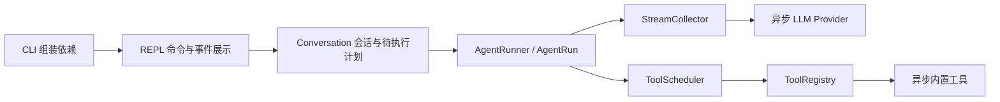
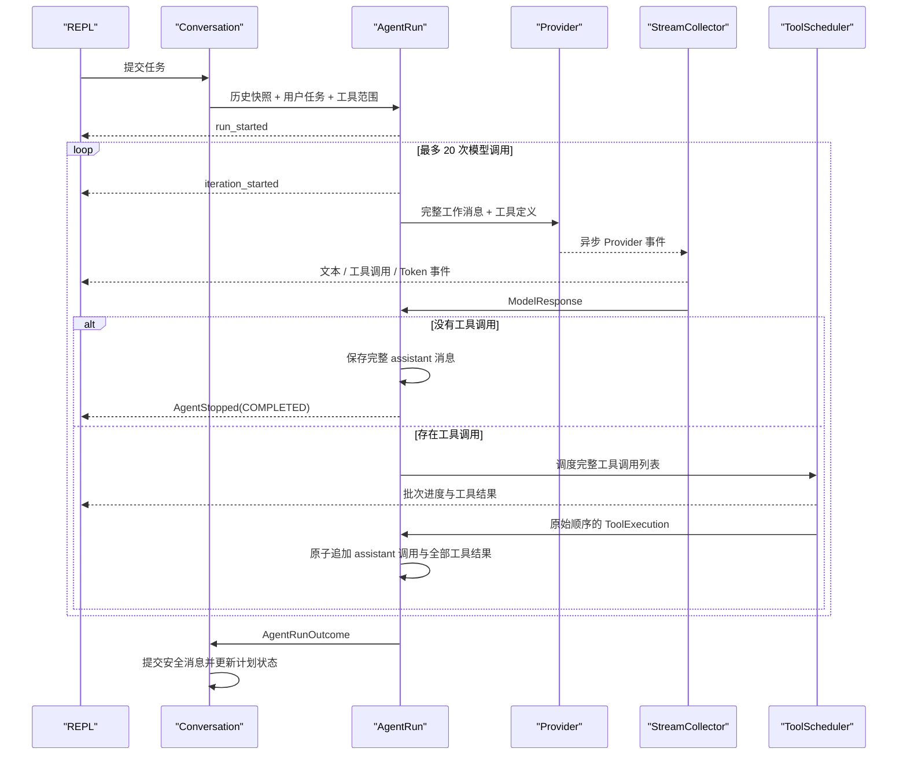

# MewCode Agent Loop Plan

## 架构概览

采用独立 Agent 执行层，保留现有分层边界：



### Conversation 会话层

保留为面向界面的应用入口，但移除现有“一次工具调用”编排。

它负责：

- 保存已提交的多轮消息历史。
- 提供普通任务、生成计划和执行计划三种入口。
- 保存一个待执行计划，并按 `/plan`、`/do` 结果更新其生命周期。
- 创建 Agent 运行并转发事件，不处理 Provider 原始事件或具体工具逻辑。

### AgentRunner 与 AgentRun

新增独立执行内核，负责 ReAct 循环和所有停止条件。

每次任务创建一个 `AgentRun`，内部维护：

- 本次任务的工作消息历史。
- 当前迭代和累计 Token 用量。
- 连续未知工具计数。
- 已启动的异步工具任务。
- 最终停止原因、最终文本和可提交消息。

`AgentRun` 对外提供异步事件流；运行结束后暴露结构化结果。Conversation 根据结果提交完整历史，并处理待执行计划。

### StreamCollector

负责双路流式收集：

- 收到文本增量时立即转换成 Agent 文本事件。
- 同时累积完整文本、全部工具调用和 Token 用量。
- 流正常结束后产出完整模型响应，供 Agent Loop 判断下一步。
- 流异常时丢弃当前未完成响应，但不影响此前已提交迭代。

这样无需在 Provider 或 REPL 中重复维护两套流状态。

### ToolScheduler

负责单次模型响应中的工具调度：

- 按原始顺序切分“相邻只读批次”和“单个副作用屏障”。
- 只读批次通过最多 4 个并发任务执行。
- 副作用工具独占执行。
- 工具结果事件按完成时间实时发出。
- 返回给 Agent Loop 的结果重新按原始工具调用顺序排列。
- 取消时停止尚未启动的批次并取消当前异步任务。

### ToolRegistry 与内置工具

工具注册中心增加显式安全分类和筛选能力：

- `read_file`、`find_files`、`search_code` 标为只读。
- `write_file`、`edit_file`、`run_command` 标为副作用。
- Plan Mode 使用只读注册中心视图，定义导出和执行查找都受同一边界限制。
- 工具执行接口改为异步；现有输入、输出和安全行为保持不变。
- 命令工具改用可取消的异步子进程，取消时先终止，必要时强制结束。

### Provider 层

两个 Provider 改为统一异步流接口，并负责：

- 解析多个并行工具调用。
- 归一化文本、完整工具调用和 Token 用量事件。
- 把完整模型响应及有序工具结果转换为供应商要求的消息格式。
- 在取消时关闭当前 SDK 流。
- 保持异常脱敏和 Anthropic thinking fallback 行为。

### REPL 与 CLI

REPL 只负责：

- 解析普通消息、`/plan <任务>`、`/do`、`/exit` 和 `/quit`。
- 异步消费统一 Agent 事件并格式化输出。
- 将运行期间的 `Ctrl+C` 转换为当前任务取消，并继续接受输入。

CLI 只负责创建 Provider、工具注册中心、AgentRunner、Conversation 和 REPL，不包含运行策略。

## 核心数据结构

### 工具安全与异步执行

```python
class ToolSafety(StrEnum):
    READ_ONLY = "read_only"
    SIDE_EFFECT = "side_effect"


class Tool(Protocol):
    name: str
    description: str
    parameters_schema: dict[str, Any]
    safety: ToolSafety

    async def execute(self, arguments: dict[str, Any]) -> ToolResult:
        ...
```

六个现有工具改为异步接口，并增加固定安全分类。

```python
@dataclass(frozen=True)
class ToolExecution:
    index: int
    request: ToolCallRequest
    result: ToolResult
```

`index` 保存模型原始调用顺序，不受并发完成顺序影响。

```python
class ToolRegistry:
    def get(self, name: str) -> Tool | None: ...
    def list(self) -> list[Tool]: ...
    def select(self, safety: set[ToolSafety]) -> ToolRegistry: ...
    async def execute(self, request: ToolCallRequest) -> ToolResult: ...
    def to_anthropic_tools(self) -> list[dict[str, Any]]: ...
    def to_openai_tools(self) -> list[dict[str, Any]]: ...
```

`select()` 返回共享相同工具实例的只读视图。Plan Mode 的工具定义导出和实际执行都使用该视图。

### Token 用量

```python
@dataclass(frozen=True)
class TokenUsage:
    input_tokens: int | None
    output_tokens: int | None
    total_tokens: int | None

    def add(self, other: TokenUsage) -> TokenUsage: ...
```

只要参与累计的某项存在未知值，该累计项也保持 `None`，不会把未知值当成零。

### Provider 事件与完整响应

```python
@dataclass(frozen=True)
class ProviderTextDelta:
    text: str


@dataclass(frozen=True)
class ProviderToolCall:
    request: ToolCallRequest


@dataclass(frozen=True)
class ProviderUsage:
    usage: TokenUsage


ProviderEvent = ProviderTextDelta | ProviderToolCall | ProviderUsage
```

Provider 只在工具名称、调用 ID 和参数已经完整时发出 `ProviderToolCall`。正常结束的模型流产生一次归一化 `ProviderUsage`。

```python
@dataclass(frozen=True)
class ModelResponse:
    text: str
    tool_calls: tuple[ToolCallRequest, ...]
    usage: TokenUsage
```

`ModelResponse` 只在供应商流正常结束后存在。

```python
class LLMProvider(Protocol):
    def tool_definitions(
        self,
        registry: ToolRegistry,
    ) -> list[dict[str, Any]]: ...

    def stream_reply(
        self,
        messages: list[ChatMessage],
        tools: list[dict[str, Any]] | None = None,
    ) -> AsyncIterator[ProviderEvent]: ...

    def assistant_messages(
        self,
        response: ModelResponse,
    ) -> list[ChatMessage]: ...

    def tool_result_messages(
        self,
        executions: Sequence[ToolExecution],
    ) -> list[ChatMessage]: ...
```

批量消息转换替代现有单次 `tool_call_message()` 和 `tool_result_message()`，确保：

- Anthropic 能把多个 `tool_use` 和对应 `tool_result` 按协议分组。
- OpenAI 能生成有序的 function-call 与 function-call-output 输入项。
- Agent Loop 不接触供应商专用消息格式。

### Agent 运行模式与停止原因

```python
class AgentMode(StrEnum):
    DIRECT = "direct"
    PLAN = "plan"
    EXECUTE = "execute"


class StopReason(StrEnum):
    COMPLETED = "completed"
    ITERATION_LIMIT = "iteration_limit"
    CANCELLED = "cancelled"
    UNKNOWN_TOOL_LIMIT = "unknown_tool_limit"
    STREAM_ERROR = "stream_error"
    ERROR = "error"
```

### Agent 事件

所有事件都携带 `run_id` 和 `iteration`。

```python
@dataclass(frozen=True)
class AgentTextDelta:
    run_id: str
    iteration: int
    text: str


@dataclass(frozen=True)
class AgentToolCall:
    run_id: str
    iteration: int
    request: ToolCallRequest


@dataclass(frozen=True)
class AgentToolResult:
    run_id: str
    iteration: int
    execution: ToolExecution


@dataclass(frozen=True)
class AgentTokenUsage:
    run_id: str
    iteration: int
    current: TokenUsage
    cumulative: TokenUsage


@dataclass(frozen=True)
class AgentProgress:
    run_id: str
    iteration: int
    phase: Literal[
        "run_started",
        "iteration_started",
        "model_completed",
        "tool_batch_started",
        "tool_batch_completed",
    ]
    completed: int | None = None
    total: int | None = None
    message: str = ""


@dataclass(frozen=True)
class AgentStopped:
    run_id: str
    iteration: int
    reason: StopReason
    final_text: str
    usage: TokenUsage
    error: str | None = None


AgentEvent = (
    AgentTextDelta
    | AgentToolCall
    | AgentToolResult
    | AgentTokenUsage
    | AgentProgress
    | AgentStopped
)
```

终端只读取事件的安全摘要；事件结构本身保留工具调用和结果，供其他界面使用。

### 流式收集器

```python
class StreamCollector:
    def __init__(self, run_id: str, iteration: int) -> None: ...

    def events(
        self,
        source: AsyncIterator[ProviderEvent],
        cumulative_usage: TokenUsage,
    ) -> AsyncIterator[AgentEvent]: ...

    @property
    def response(self) -> ModelResponse: ...
```

使用方式：

```python
collector = StreamCollector(run_id, iteration)

async for event in collector.events(provider_stream, cumulative_usage):
    yield event

response = collector.response
```

`response` 只能在流正常结束后读取；流异常或取消时访问会报状态错误。

### 工具调度

```python
class ToolSchedule:
    def events(self) -> AsyncIterator[AgentEvent]: ...

    @property
    def executions(self) -> tuple[ToolExecution, ...]: ...


class ToolScheduler:
    def __init__(self, max_read_concurrency: int = 4) -> None: ...

    def schedule(
        self,
        run_id: str,
        iteration: int,
        requests: Sequence[ToolCallRequest],
        registry: ToolRegistry,
    ) -> ToolSchedule: ...
```

`ToolSchedule.events()` 实时产生工具结果和批次进度事件，不重复产生 `AgentToolCall`。完成后，`executions` 始终按原始 `index` 排序。

### Agent 配置、结果与运行对象

```python
@dataclass(frozen=True)
class AgentRunConfig:
    max_iterations: int = 20
    unknown_tool_limit: int = 3


@dataclass(frozen=True)
class AgentRunOutcome:
    run_id: str
    mode: AgentMode
    reason: StopReason
    final_text: str
    new_messages: tuple[ChatMessage, ...]
    usage: TokenUsage
    error: str | None = None

    @property
    def completed(self) -> bool: ...
```

`new_messages` 只包含能够安全提交到会话历史的完整消息段。

```python
class AgentRun:
    def events(self) -> AsyncIterator[AgentEvent]: ...
    async def cancel(self) -> None: ...

    @property
    def outcome(self) -> AgentRunOutcome: ...


class AgentRunner:
    def __init__(
        self,
        provider: LLMProvider,
        scheduler: ToolScheduler,
        config: AgentRunConfig = AgentRunConfig(),
    ) -> None: ...

    def start(
        self,
        history: Sequence[ChatMessage],
        user_text: str,
        tools: ToolRegistry,
        mode: AgentMode = AgentMode.DIRECT,
    ) -> AgentRun: ...
```

单个 `AgentRun` 只能消费一次。结束前读取 `outcome` 会得到明确状态错误。

### 待执行计划与 Conversation

```python
@dataclass(frozen=True)
class PendingPlan:
    task: str
    text: str


class Conversation:
    def messages(self) -> list[ChatMessage]: ...
    def pending_plan(self) -> PendingPlan | None: ...

    def ask(self, user_text: str) -> AsyncIterator[AgentEvent]: ...
    def plan(self, task: str) -> AsyncIterator[AgentEvent]: ...
    def execute_plan(self) -> AsyncIterator[AgentEvent]: ...

    async def cancel_active(self) -> None: ...
```

行为约定：

- `ask()` 使用完整工具注册中心和 `DIRECT` 模式。
- `plan()` 使用只读注册中心和 `PLAN` 模式；仅在 `COMPLETED` 时替换待执行计划。
- `execute_plan()` 使用完整工具注册中心和 `EXECUTE` 模式。
- 执行计划成功后清除计划；失败、流错误或取消后保留。
- 同一 Conversation 同时只允许一个活动运行。
- 空计划任务或没有待执行计划时抛出可展示的会话错误，不创建 AgentRun。

## 模块设计

### Agent 事件模块

**文件：** `src/mewcode/agent/events.py`

**职责：**

- 定义 `AgentMode`、`StopReason`。
- 定义六类统一 Agent 事件及其联合类型。
- 不包含执行逻辑或终端格式化逻辑。

**对外接口：** `AgentTextDelta`、`AgentToolCall`、`AgentToolResult`、`AgentTokenUsage`、`AgentProgress`、`AgentStopped`、`AgentEvent`。

**依赖：** Provider 的 `TokenUsage` 和工具层的调用、结果类型。

### 流式收集模块

**文件：** `src/mewcode/agent/streaming.py`

**职责：**

- 消费 Provider 异步事件。
- 实时转发文本、完整工具调用和 Token 事件。
- 累积 `ModelResponse`。
- 确保只有正常结束的流能够读取完整响应。
- 不捕获并伪装 Provider 错误，由 AgentRun 决定停止原因。

**对外接口：** `StreamCollector`、`StreamStateError`。

**依赖：** Agent 事件和 Provider 事件，不依赖工具执行或会话状态。

### 工具调度模块

**文件：** `src/mewcode/agent/scheduler.py`

**职责：**

- 将工具调用划分为只读并发批次和副作用串行屏障。
- 使用信号量把只读并发限制为 4。
- 按完成时间产生 `AgentToolResult`。
- 产生工具批次开始、完成等进度事件。
- 保存按原始调用顺序排列的 `ToolExecution`。
- 取消时停止未启动批次，并为已取消调用生成结构化取消结果。

**对外接口：** `ToolScheduler`、`ToolSchedule`、`ToolScheduleStateError`。

**依赖：** Agent 事件和工具注册中心，不依赖 Provider 或 Conversation。

`ToolSchedule.events()` 不产生 `AgentToolCall`；该事件只由 StreamCollector 在完整调用到达时产生一次。

### Agent 循环模块

**文件：** `src/mewcode/agent/runner.py`

**职责：**

- 实现最多 20 次模型调用的 ReAct 循环。
- 为每次迭代创建 StreamCollector 和 ToolSchedule。
- 维护累计 Token、连续未知工具次数及本任务工作消息。
- 执行模型完成、迭代上限、取消、连续未知工具、流错误等停止策略。
- 只提交完整且协议配对的模型消息和工具结果。
- 始终产生且只产生一个 `AgentStopped`。
- 清理活动 Provider 流及工具任务。

**对外接口：** `AgentRunConfig`、`AgentRunOutcome`、`AgentRun`、`AgentRunner`、`AgentRunStateError`。

**依赖：** Provider、StreamCollector、ToolScheduler 和工具注册中心；不依赖 Conversation、REPL 或 CLI。

### Agent 包出口

**文件：** `src/mewcode/agent/__init__.py`

**职责：** 统一导出 Agent 公共类型，避免调用方依赖内部文件布局。

### Conversation 会话模块

**文件：** `src/mewcode/conversation.py`

**职责：**

- 保存已提交的 `ChatMessage` 历史。
- 保存一个 `PendingPlan`。
- 为普通任务、规划和执行计划选择正确模式与工具视图。
- 构造规划提示和执行提示。
- 代理活动 AgentRun 的事件，并在结束后提交 `new_messages`。
- 根据运行结果创建、保留或清除待执行计划。
- 保证同一会话同一时刻只有一个 AgentRun。

**对外接口：** `PendingPlan`、`Conversation`、`ConversationError`。

**依赖：** Agent 公共接口、Provider 消息类型和工具注册中心。

### Provider 基础模块

**文件：** `src/mewcode/providers/base.py`

**职责：**

- 保留配置、错误和 `ChatMessage` 类型。
- 新增 `TokenUsage`、`ProviderUsage`、`ModelResponse`。
- 把 `LLMProvider` 协议改为异步流和批量消息转换接口。
- 移除单工具消息转换接口。

### Anthropic Provider

**文件：** `src/mewcode/providers/anthropic_provider.py`

**职责：**

- 使用 Anthropic 异步客户端。
- 按内容块索引分别收集多个 `tool_use` 参数流。
- 归一化文本、完整工具调用和最终 Token 用量。
- 将完整响应转换为一个有序 assistant 内容块消息。
- 将同批工具结果转换为一个有序 `tool_result` 用户消息。
- 保留 adaptive thinking 到 manual thinking 的一次兼容回退。
- 取消时退出异步流上下文。

### OpenAI Provider

**文件：** `src/mewcode/providers/openai_provider.py`

**职责：**

- 使用 OpenAI 异步客户端和 Responses API。
- 按 item ID 分别收集多个 function call。
- 从完成事件提取统一 Token 用量。
- 将完整响应转换成 assistant 文本和有序 function-call 输入项。
- 将工具结果转换成有序 function-call-output 输入项。
- 取消时关闭异步响应流。

### 工具基础模块

**文件：** `src/mewcode/tools/base.py`

**职责：**

- 新增 `ToolSafety` 和 `ToolExecution`。
- 把 Tool 与 ToolRegistry 执行接口改为异步。
- 提供按安全分类筛选的注册中心视图。
- 保留参数校验、未知工具包装和结果截断能力。

### 文件及搜索工具

**文件：** `src/mewcode/tools/file_tools.py`、`src/mewcode/tools/search_tools.py`

**职责：**

- 增加安全分类。
- 提供异步执行入口。
- 将可能阻塞的文件和目录扫描放到工作线程执行。
- 保持现有路径边界、UTF-8、唯一替换、结果上限等行为。

### 命令工具

**文件：** `src/mewcode/tools/command_tool.py`

**职责：**

- 标记为副作用工具。
- 用异步子进程替代阻塞式命令执行。
- 保留危险命令检查、工作目录、超时和输出截断。
- 超时或取消时终止进程；短时间内未退出则强制结束。
- Windows 与 POSIX 都通过标准库支持，不新增 shell 依赖。

### REPL 模块

**文件：** `src/mewcode/repl.py`

**职责：**

- 解析 `/plan <任务>`、`/do` 和现有退出命令。
- 消费并格式化统一 Agent 事件。
- 工具事件仅展示名称、状态和短摘要。
- Token 与进度使用简短状态输出。
- 当前任务被 `Ctrl+C` 中断后触发取消并回到提示符。
- 单个事件渲染失败时终止当前运行并返回提示符，不让 REPL 退出。

### CLI 模块

**文件：** `src/mewcode/cli.py`

**职责：**

- 创建异步 Provider、完整工具注册中心、ToolScheduler、AgentRunner、Conversation 和 REPL。
- 管理异步运行器的生命周期。
- 保留启动配置错误及空闲状态 `Ctrl+C` 的退出码行为。

### 测试模块

新增聚焦测试：

- `tests/test_stream_collector.py`
- `tests/test_tool_scheduler.py`
- `tests/test_agent_runner.py`
- `tests/test_plan_mode.py`

更新现有 Provider、工具、Conversation、REPL 和 CLI 测试，使其覆盖异步接口与原行为兼容性。测试继续使用 `asyncio.run()`，不新增 `pytest-asyncio` 依赖。

## 模块交互

### 正常 Agent Loop



每轮事件顺序为：

```text
run_started
  -> iteration_started
  -> 文本增量 / 完整工具调用
  -> Token 用量
  -> model_completed
  -> [工具批次开始 -> 工具结果 -> 工具批次完成]*
  -> 下一迭代或 AgentStopped
```

### 流式收集

1. Provider 开始异步流。
2. `ProviderTextDelta` 到达后，Collector 立即发出 `AgentTextDelta`，同时追加到文本缓冲区。
3. 完整 `ProviderToolCall` 到达后，Collector 立即发出一次 `AgentToolCall`，并按出现顺序保存。
4. `ProviderUsage` 到达后，Collector 更新本轮用量并发出 `AgentTokenUsage`。
5. Provider 流正常结束后，Collector 冻结为 `ModelResponse`。
6. 如果流抛错或被取消，当前 Collector 不生成 `ModelResponse`，其缓冲内容不进入历史。

### 工具批次调度

例如模型按顺序请求：

```text
read A -> search B -> write C -> read D -> read E -> command F
```

调度结果为：

```text
[read A, search B] 并发
        -> [write C] 独占
        -> [read D, read E] 并发
        -> [command F] 独占
```

调度规则：

- 同一只读批次使用 `asyncio.as_completed()`，结果事件按实际完成时间产生。
- 信号量保证同时运行的只读工具不超过 4 个。
- 一个批次完全结束后才进入下一个批次。
- 未知工具不执行，立即生成失败结果，并作为串行屏障处理。
- 所有结果最终按原始 `index` 排序后交给 Provider 消息转换。
- 参数错误和普通工具失败不会中断剩余批次。

### 历史提交边界

AgentRun 使用私有工作历史，不在运行过程中直接修改 Conversation。

可提交的最小单位是：

```text
用户任务
  + 完整 assistant 响应
  + 如果有工具调用，则必须包含该响应全部调用的对应结果
```

具体规则：

- 最终纯文本响应完整结束后，可以提交。
- 工具响应只有在该批每个调用都有成功、失败或取消结果后才能提交。
- 当前模型流中途失败时，当前响应完全丢弃。
- 第 20 次响应仍请求工具时，该响应不提交，避免留下无结果的调用。
- 前面已经完成的迭代保留在 `new_messages` 中。
- Conversation 在 AgentRun 结束后一次性追加 `new_messages`。

### 连续未知工具

每轮完整响应结束后检查工具名称：

- 至少包含一个已注册工具：计数归零。
- 全部是未知工具：执行为结构化失败结果并将计数加一。
- 计数为 1 或 2：结果回写模型并继续。
- 计数达到 3：先保存完整调用与失败结果，再以 `UNKNOWN_TOOL_LIMIT` 停止，不再调用模型。
- 坏参数或已注册工具自身失败不计入未知工具次数。

### 取消

取消信号根据当前阶段处理：

- 模型流阶段：关闭 Provider 流，丢弃当前不完整响应。
- 只读并发批次：保留已完成结果，其余调用得到取消结果。
- 副作用工具阶段：请求工具停止；已经完成的副作用不回滚。
- 尚未开始的后续批次：全部标记为取消，不执行。
- 如果完整工具响应已经产生，则为每个调用补齐结果后提交协议配对段。
- 清理活动任务后产生唯一的 `AgentStopped(CANCELLED)`。

REPL 在运行期间收到 `Ctrl+C` 后调用 `cancel_active()`，等待清理并回到输入提示符。空闲提示符处的中断仍按 CLI 退出处理。

### 流错误与内部错误

Provider 流错误：

1. 保留已经发送到界面的文本。
2. 丢弃当前不完整响应。
3. 不自动重试。
4. 保留此前完整迭代。
5. 发出脱敏的 `AgentStopped(STREAM_ERROR)`。

意外内部错误采用相同清理流程，但停止原因为 `ERROR`。普通工具失败只作为工具结果，不属于内部错误。

### Plan Mode

`/plan <任务>`：

1. REPL 提取原始任务；空任务直接显示用法。
2. Conversation 构造明确的规划提示，要求先读取、最终输出计划。
3. AgentRun 使用只读注册中心视图和 `PLAN` 模式。
4. 只有以 `COMPLETED` 结束时，最终文本才成为新的 `PendingPlan`。
5. 失败或取消不会覆盖原有待执行计划。
6. 安全的会话消息仍按正常历史规则提交。

`/do`：

1. 没有待执行计划时直接提示，不创建 AgentRun。
2. Conversation 将原始任务和计划文本组合为执行提示。
3. AgentRun 使用完整注册中心和 `EXECUTE` 模式。
4. `COMPLETED` 后提交消息并清除计划。
5. 其他停止原因提交安全消息，但保留计划以便重试。

### 普通聊天

普通输入始终进入 `DIRECT` 模式并提供完整工具集合。模型不请求工具时，只经历一次模型调用，行为与现有流式聊天一致。

## 需求归属

| 需求 | 主要归属 |
|---|---|
| F1–F2 | `AgentRunner`、`AgentRun` |
| F3 | Agent 事件模块 |
| F4 | `StreamCollector` |
| F5 | Provider 多调用解析、`StreamCollector` |
| F6 | `ToolSafety`、`ToolScheduler` |
| F7 | `StreamCollector`、`ToolScheduler` |
| F8 | `ToolRegistry`、`AgentRunner` |
| F9–F11 | `AgentRunner` 停止策略 |
| F12 | `AgentRun`、异步工具、REPL |
| F13 | `StreamCollector`、历史提交边界 |
| F14–F16 | Agent 事件、Provider 用量归一化 |
| F17 | Conversation、只读注册中心视图 |
| F18–F20 | Conversation、REPL 命令解析 |
| F21–F22 | Conversation、AgentRunner、Provider |

所有功能需求均有唯一的主要编排层，不需要 REPL 参与 Agent 决策。

## 文件组织

```text
MewCode/
├── src/mewcode/
│   ├── agent/
│   │   ├── __init__.py             # Agent 公共出口
│   │   ├── events.py               # 模式、停止原因、统一事件
│   │   ├── streaming.py            # 双路流式收集
│   │   ├── scheduler.py            # 工具分批、并发和排序
│   │   └── runner.py               # ReAct 循环与停止策略
│   ├── providers/
│   │   ├── __init__.py             # 更新公共出口
│   │   ├── base.py                 # 异步协议、Token、完整响应
│   │   ├── anthropic_provider.py   # Anthropic 异步流适配
│   │   └── openai_provider.py      # OpenAI 异步流适配
│   ├── tools/
│   │   ├── __init__.py             # 更新公共出口
│   │   ├── base.py                 # 安全分类与异步注册中心
│   │   ├── builtin.py              # 六个工具注册
│   │   ├── file_tools.py           # 异步文件工具
│   │   ├── search_tools.py         # 可取消搜索工具
│   │   └── command_tool.py         # 可取消异步子进程
│   ├── conversation.py             # 会话历史与 Plan Mode
│   ├── repl.py                     # 命令解析与事件展示
│   └── cli.py                      # 依赖组装与运行器生命周期
├── tests/
│   ├── fakes.py                    # 可控异步 Provider 与工具
│   ├── test_stream_collector.py    # 新增
│   ├── test_tool_scheduler.py      # 新增
│   ├── test_agent_runner.py        # 新增
│   ├── test_plan_mode.py           # 新增
│   ├── test_conversation.py        # 更新异步会话行为
│   ├── test_tool_conversation.py   # 更新或合并旧单工具场景
│   ├── test_tool_providers.py      # 更新多调用与 Token
│   ├── test_providers.py           # 更新异步 SDK fake
│   ├── test_tools_base.py          # 更新安全分类与异步执行
│   ├── test_file_tools.py          # 更新异步调用
│   ├── test_search_tools.py        # 更新异步调用与取消
│   ├── test_command_tool.py        # 更新异步子进程与取消
│   └── test_repl.py                # 更新命令、事件和 Ctrl+C
├── docs/phase-3-agent-loop/
│   ├── spec.md
│   └── plan.md
└── README.md                       # 更新 Agent Loop 与 Plan Mode 用法
```

不新增运行时依赖，也不修改配置文件格式。

## 技术决策

| 决策点 | 选择 | 理由 |
|---|---|---|
| 异步基础 | Python 标准库 `asyncio` | 项目要求 Python 3.11+，无需新增依赖 |
| REPL 运行器 | 一个长生命周期 `asyncio.Runner` | 支持多轮异步任务，并能在单轮 `Ctrl+C` 后继续复用事件循环 |
| Provider 客户端 | `AsyncAnthropic` 与 `AsyncOpenAI` | 流读取和取消可直接传播，不用在线程中包装同步 SDK |
| 流式收集 | 带最终状态的 `StreamCollector` | 同时满足实时事件和完整响应读取，规避异步生成器不能返回值的问题 |
| Agent 执行 | 每个任务一个 `AgentRun` | 隔离迭代、取消、用量和最终结果，便于测试与清理 |
| 工具调度 | 带最终状态的 `ToolSchedule` | 结果事件按完成时间发送，最终结果按调用顺序读取 |
| 工具安全 | 工具声明固定 `ToolSafety` | 分类靠代码强制，不依赖名称猜测或模型提示 |
| Plan Mode | 注册中心只读视图 | 同一视图同时约束工具定义和实际执行，避免只隐藏定义但仍能执行 |
| 混合工具顺序 | 相邻只读并发，副作用作为屏障 | 在保留模型调用顺序的前提下获得安全并发 |
| 未知工具 | 立即失败并作为串行屏障 | 不执行未知代码，事件和顺序仍保持确定 |
| 工具结果消息 | Provider 批量转换 | 正确支持 Anthropic 内容块分组和 OpenAI 多输入项 |
| 历史提交 | AgentRun 内部累积，结束后由 Conversation 一次提交 | 防止流错误或取消留下半截响应和悬空工具调用 |
| 取消模型流 | 关闭 SDK 流并丢弃当前 Collector | 未完整响应不能用于后续判断或历史 |
| 取消工具批次 | 已完成结果保留，其余补取消结果 | 保证每个完整工具调用都有协议配对结果 |
| 命令取消 | `terminate`，短暂等待后 `kill` | 优先正常退出，同时满足及时返回要求 |
| 文件与搜索取消 | 只读扫描在线程中运行并使用协作停止标志；短文件写入视为不可分割临界段 | 避免取消后继续长期扫描，同时不制造半写入状态 |
| Token 缺失 | 使用 `None` 传播未知 | 不把供应商未提供的数据伪装成零 |
| 固定安全上限 | 20 次迭代、3 次未知工具、4 个只读并发 | 与已批准 Spec 一致，本章不扩展配置格式 |
| 计划保存 | Conversation 内存中只保存一个 `PendingPlan` | 满足两阶段流程，不引入持久化或工作流系统 |
| 隐藏推理 | Provider 不生成用户事件或历史消息 | 满足边界要求，同时保留普通文本和工具协议数据 |
| 异步测试 | 测试中使用 `asyncio.run()` | 不增加 `pytest-asyncio`，保持测试环境简单 |
| 兼容策略 | 保留工具名称、参数 Schema、结果结构和配置格式 | 只升级执行模型，不改变已有用户契约 |
