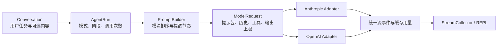
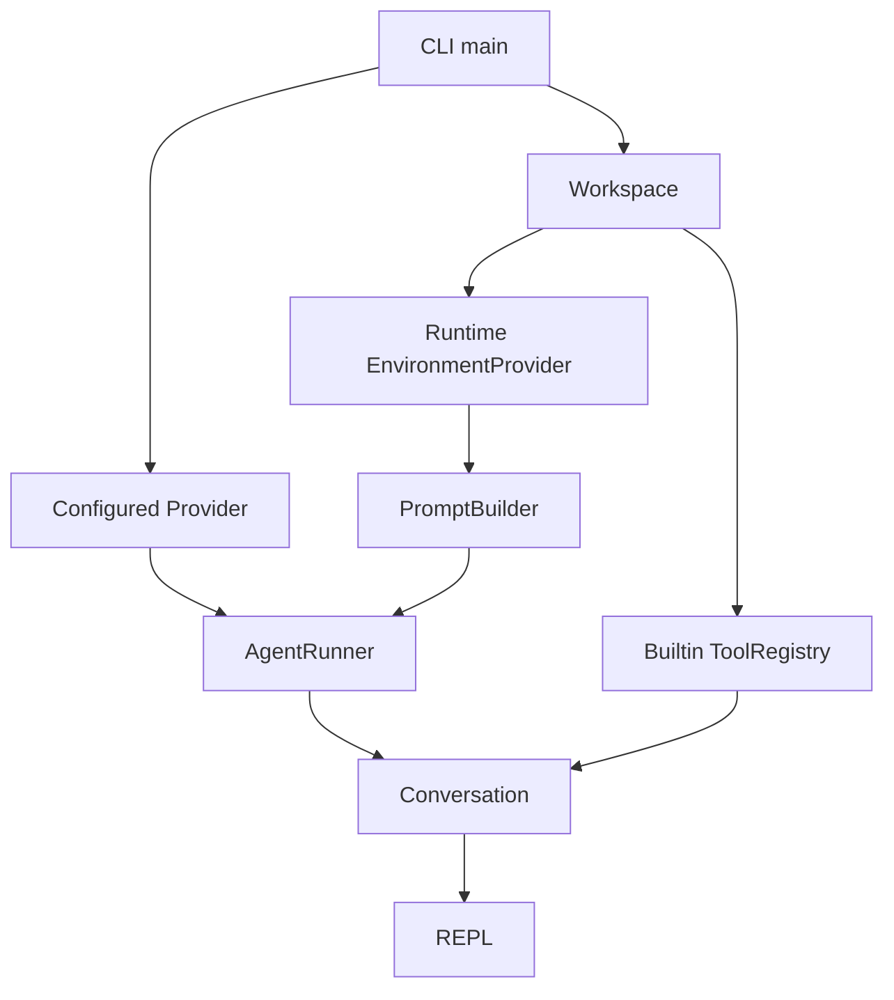
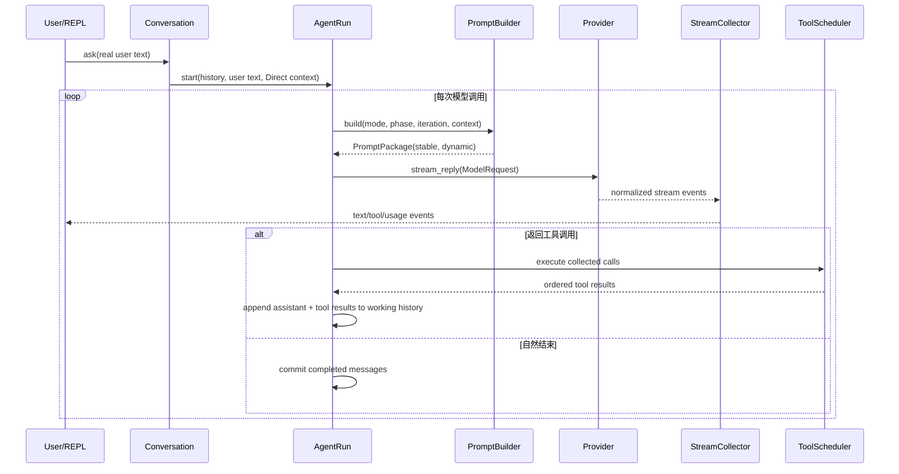
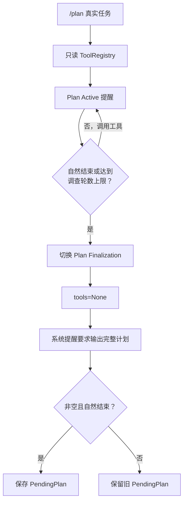
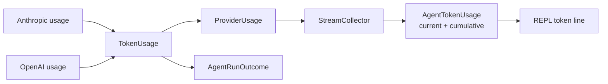

# MewCode 结构化系统提示与提示缓存 Plan

## 架构概览

整体采用“统一提示语义、Provider 只做协议映射”的单向依赖结构。



### 提示构建层

新增独立的 `prompting` 包，集中保存固定与可选模块的名称、优先级、稳定性和内容，负责环境信息采集、安全格式化、`<system-reminder>` 包装、动态内容转义、模式提醒模板以及第 1、5、9、13、17 次完整注入的判定。

构建结果拆成稳定系统块和动态系统块。稳定块包含身份至文本输出七个模块；动态块依次包含环境、自定义指令、Skill、长期记忆和当次模式提醒。

### 统一模型请求

在 Provider 边界前引入统一请求对象，包含已构建的稳定与动态系统块、当前完整会话历史、本次允许使用的工具注册表和本次最大输出 Token。

Agent Loop 不再提前生成某家 Provider 的工具 JSON，也不再把 Plan、执行或最终计划指令追加成伪造的 `user` 消息。

### Agent 与 Conversation 集成

`Conversation` 保留真实用户语义：

- `/plan` 只把用户提供的任务保存为用户消息。
- `/do` 以真实命令作为本次用户动作；原始任务与已批准计划通过动态系统上下文传递。
- Plan 最终输出阶段通过系统提醒切换目标，不再追加 `PLAN_FINAL_PROMPT` 用户消息。
- 可选模块由调用方在创建会话时统一传入，本阶段不自行发现内容。

`AgentRun` 在每次模型调用前根据模式、阶段和调用次数重新构建动态块，因此提醒节奏与实际 Provider 调用次数严格一致。

### Provider 适配

Anthropic：

- 工具定义按名称稳定排序。
- 顶层 system 使用多个文本块。
- 稳定系统块带缓存断点；由于 Anthropic 的缓存前缀包含其前方工具定义，因此同时覆盖稳定工具与系统指令。
- 动态系统块位于断点之后，历史继续使用 Messages API 原生结构。

OpenAI：

- input 首部放置 system 消息，稳定文本块末尾设置显式缓存断点，随后追加动态 system 消息和历史。
- 对官方 GPT-5.6 系列使用稳定缓存键和显式缓存模式，只允许稳定前缀写入缓存。
- 对旧模型或兼容接口不发送其可能拒绝的显式缓存字段，保留相同稳定前缀并依赖自动缓存。
- 工具定义同样按名称稳定排序，并参与缓存键指纹计算。

### 缓存用量与展示

统一 Token 用量增加“缓存读取”和“缓存写入”两个可空字段：

- Anthropic 映射缓存读取与缓存创建字段。
- OpenAI 映射 `cached_tokens` 与 `cache_write_tokens`。
- 现有流事件直接携带扩展后的用量对象。
- Agent 累计逻辑继续使用“任一值未知则累计未知”的规则。
- REPL 在现有 Token 行中追加本次及累计缓存数据，不新增独立事件类型。

### 验证与文档

自动测试分为提示构建、Provider 请求映射、模式注入、用量累计和现有行为回归五层，全部使用 fake/mock。

另新增人工验证文档，记录真实缓存验证步骤和五个固定定性场景，不由默认测试执行，也不读取真实密钥。

## 核心数据结构

### PromptSectionSpec

集中声明模块元数据。

```python
class PromptStability(StrEnum):
    STABLE = "stable"
    DYNAMIC = "dynamic"


@dataclass(frozen=True)
class PromptSectionSpec:
    key: str
    title: str
    priority: int
    stability: PromptStability
```

模块注册表固定为：

| Priority | Key | Title | Stability |
|---:|---|---|---|
| 100 | `identity` | Identity | stable |
| 200 | `system_constraints` | System Constraints | stable |
| 300 | `task_mode` | Task Mode | stable |
| 400 | `action_execution` | Action Execution | stable |
| 500 | `tool_use` | Tool Use | stable |
| 600 | `tone_style` | Tone and Style | stable |
| 700 | `text_output` | Text Output | stable |
| 800 | `environment` | Environment | dynamic |
| 900 | `custom_instructions` | Custom Instructions | dynamic |
| 1000 | `active_skill` | Active Skill | dynamic |
| 1100 | `long_term_memory` | Long-Term Memory | dynamic |

运行时提醒不伪装成普通模块，而是在上述内容之后作为独立 `<system-reminder>` 块追加。

### PromptEnvironment

只保存允许进入提示的环境白名单。

```python
@dataclass(frozen=True)
class PromptEnvironment:
    workspace_root: str
    operating_system: str
    current_date: str
    shell: str
```

运行时采集器接口：

```python
EnvironmentProvider = Callable[[], PromptEnvironment]

def runtime_environment_provider(
    workspace_root: Path,
) -> EnvironmentProvider:
    ...
```

采集器只读取工作区路径、平台名称、当天日期和经过 basename/白名单归一化的 Shell 名称，不遍历或复制环境变量。

### PromptAdditions

统一承接三个未来扩展入口。

```python
@dataclass(frozen=True)
class PromptAdditions:
    custom_instructions: str | None = None
    active_skill: str | None = None
    long_term_memory: str | None = None
```

内容会去除首尾空白；空字符串按未提供处理，内部格式保持不变。

### PromptRunContext

保存一次 Agent Run 的动态任务语义。

```python
@dataclass(frozen=True)
class PromptRunContext:
    task: str
    approved_plan: str | None = None
    additions: PromptAdditions = PromptAdditions()
```

- Direct 与 Plan 的 `task` 为真实用户文本。
- Execute 的 `task` 为原始任务，`approved_plan` 为最近批准的计划。
- 这些字段只用于构建动态系统内容，不直接写入历史。

### PromptPhase

区分普通循环与 Plan 最终输出阶段。

```python
class PromptPhase(StrEnum):
    ACTIVE = "active"
    PLAN_FINALIZATION = "plan_finalization"
```

### PromptPackage

Provider 收到的统一提示产物。

```python
@dataclass(frozen=True)
class PromptPackage:
    stable_system: str
    dynamic_system: str

    def rendered_system(self) -> str:
        ...
```

`rendered_system()` 使用恰好一个空行连接非空部分，主要供测试、调试和人工验证使用。Provider 保留两个独立内容块，以便在中间设置缓存断点。

### PromptBuilder

唯一负责模块拼装和模式提醒选择的组件。

```python
class PromptBuilder:
    def __init__(
        self,
        environment_provider: EnvironmentProvider,
    ) -> None:
        ...

    def build(
        self,
        context: PromptRunContext,
        *,
        mode: str,
        phase: PromptPhase,
        iteration: int,
    ) -> PromptPackage:
        ...
```

行为约束：

- `iteration < 1` 直接拒绝。
- `(iteration - 1) % 4 == 0` 时选择完整提醒；在当前 20 次上限内即第 1、5、9、13、17 次。
- Direct Mode 不需要额外模式提醒。
- Plan 与 Execute 根据 `mode`、`phase` 和上下文生成完整或精简提醒。
- 所有提醒统一通过 XML 转义后包装。

```python
def wrap_system_reminder(content: str) -> str:
    ...
```

### ModelRequest

替代当前分散的 `messages + provider tools + max_output_tokens` 参数。

```python
@dataclass(frozen=True)
class ModelRequest:
    prompt: PromptPackage
    messages: tuple[ChatMessage, ...]
    tools: ToolRegistry | None
    max_output_tokens: int = DEFAULT_MAX_TOKENS
```

`tools=None` 表示本次请求完全不公开工具，用于 Plan Finalization；空注册表仍表示合法但当前没有工具。

### LLMProvider

Provider 接口收敛为接收统一请求。

```python
class LLMProvider(Protocol):
    def stream_reply(
        self,
        request: ModelRequest,
    ) -> AsyncIterator[ProviderEvent]:
        ...

    def assistant_messages(
        self,
        response: ModelResponse,
    ) -> list[ChatMessage]:
        ...

    def tool_result_messages(
        self,
        executions: Sequence[ToolExecution],
    ) -> list[ChatMessage]:
        ...
```

删除公开的 `tool_definitions()`；工具注册表到供应商 JSON 的转换完全归 Provider 适配层负责。

### TokenUsage

在不改变现有字段含义的前提下扩展缓存数据。

```python
@dataclass(frozen=True)
class TokenUsage:
    input_tokens: int | None = None
    output_tokens: int | None = None
    total_tokens: int | None = None
    cache_read_tokens: int | None = None
    cache_write_tokens: int | None = None

    @classmethod
    def zero(cls) -> TokenUsage:
        ...

    def add(self, other: TokenUsage) -> TokenUsage:
        ...
```

五个字段都采用相同累计规则：任一侧未知，累计结果保持未知；明确的零可以正常相加。

### AgentRunner 与 Conversation

```python
class AgentRunner:
    def __init__(
        self,
        provider: LLMProvider,
        scheduler: ToolScheduler,
        prompt_builder: PromptBuilder | None = None,
        config: AgentRunConfig = AgentRunConfig(),
        *,
        id_factory: Callable[[], str] | None = None,
    ) -> None:
        ...

    def start(
        self,
        history: Sequence[ChatMessage],
        user_text: str,
        tools: ToolRegistry,
        mode: AgentMode = AgentMode.DIRECT,
        *,
        prompt_context: PromptRunContext | None = None,
    ) -> AgentRun:
        ...
```

未显式传入构建器或上下文时，分别使用当前工作区环境和 `user_text`，保持测试及现有调用方兼容。

```python
class Conversation:
    def __init__(
        self,
        runner: AgentRunner,
        tools: ToolRegistry,
        prompt_additions: PromptAdditions = PromptAdditions(),
    ) -> None:
        ...
```

`Conversation` 为每次 Direct、Plan、Execute 运行创建相应的 `PromptRunContext`，但不负责渲染提示。

## 模块设计

### `prompting.models`

定义所有提示层数据类型，不包含具体提示文本或运行时环境读取，只依赖 Python 标准库。

### `prompting.sections`

保存唯一的模块注册表和七个固定模块文本，根据注册表生成稳定与动态 section，不直接处理 Provider 格式。新增模块只需要添加一条 section 定义及对应内容提供器。

固定模块内容如下：

| 模块 | 核心内容 |
|---|---|
| Identity | MewCode 的身份、工作区内编码助手职责、理解目标并完成授权范围内工作 |
| System Constraints | 指令层级、范围控制、保护用户已有改动、不得伪造完成状态或证据 |
| Task Mode | 回答/审查/诊断不实施；构建/修复可实施并验证；Plan 与 Execute 的基本语义 |
| Action Execution | 先检查相关材料、持续推进、遇到真实权限或范围阻塞才停止、先验证再报告 |
| Tool Use | 专用工具优先、编辑已有文件前先读、命令工具只作补充、尊重工具安全边界 |
| Tone and Style | 直接、清楚、协作式表达，避免空泛赞美、重复和无关术语 |
| Text Output | 先给结果，保留必要证据、风险和下一步；路径与错误信息准确可定位 |

渲染格式统一为 Markdown 二级标题，固定文本使用 LF 换行，不根据操作系统改变。

### `prompting.environment`

根据工作区根目录构造 `EnvironmentProvider`，使用 `platform.system()` 获取操作系统，使用注入的 clock 生成 ISO 日期。Windows 返回归一化的 `PowerShell`；其他系统只保留 Shell basename，缺失时返回 `unknown`。不得枚举环境变量或输出 Shell 完整路径。

### `prompting.modes`

保存 Plan Active、Plan Finalization 和 Execute 的完整/精简模板，判断本次调用是否应使用完整提醒，对插入模板的用户任务和批准计划执行 XML 转义，并使用 `wrap_system_reminder()` 生成唯一外层标签。

模式行为：

- Direct：不增加提醒。
- Plan Active：只读调查、禁止修改、收集形成计划所需证据。
- Plan Finalization：不提供工具，只输出完整可执行计划。
- Execute：按批准计划实施、验证、最终总结；完整版本携带原任务与批准计划，精简版本只重申边界和继续目标。

### `prompting.builder`

从固定内容、运行时环境和 `PromptAdditions` 生成 section，按 priority 排序，省略空白可选内容，分别渲染 stable 与 dynamic section，并将当次模式提醒追加到 dynamic 末尾。

依赖方向：

```text
models <- sections
models <- environment
models <- modes
sections + environment + modes -> builder
```

Provider、Conversation 和工具模块不得反向参与提示内容拼装。

### `providers.base`

新增 `ModelRequest`，扩展 `TokenUsage`，收敛 `LLMProvider.stream_reply()`，移除 `tool_definitions()`。其余 Provider 事件、响应、内部思考隐藏和错误模型保持不变。

### `AnthropicProvider`

请求映射：

1. 从 `ModelRequest.tools` 生成按名称排序的 Anthropic 工具定义。
2. 官方 Anthropic 地址使用两个顶层 system 文本块：stable 块带 `cache_control: {"type": "ephemeral"}`，dynamic 块不带缓存标记。
3. 非官方 Anthropic 兼容地址使用拼接后的普通 system 字符串，不发送缓存扩展字段。
4. `messages` 只包含真实用户、模型、工具调用与工具结果历史。

用量映射：

- `cache_read_input_tokens` → `cache_read_tokens`
- `cache_creation_input_tokens` → `cache_write_tokens`
- 缺失和明确零分别保留。

### `OpenAIProvider`

请求映射：

1. 从 `ModelRequest.tools` 生成按名称排序的 Responses function tools。
2. input 开头依次放置 stable system message、dynamic system message、原有对话及 output items。
3. 对官方 `api.openai.com` 且模型名属于 `gpt-5.6` 系列的请求，在 stable `input_text` 末尾设置显式缓存断点，设置 explicit 模式和稳定 `prompt_cache_key`。
4. 旧模型和非官方兼容地址不发送断点、缓存模式或缓存键，继续依赖自动缓存及稳定前缀。
5. 现有 reasoning、工具流解析、结束原因和错误脱敏保持不变。

用量映射：

- `usage.input_tokens_details.cached_tokens` → `cache_read_tokens`
- `usage.input_tokens_details.cache_write_tokens` → `cache_write_tokens`

缓存键使用 SHA-256 摘要，不包含用户任务、动态环境、历史、API Key 或原始可选内容。

### `ToolRegistry` 与内置工具

`ToolRegistry.list()` 和 `select()` 保持现有顺序语义。只有 Provider JSON 转换时按工具名称排序，使注册来源顺序不会改变缓存前缀。

工具描述调整：

- `read_file` 明确其用于读取目标内容，并应在编辑已有文件前调用。
- `write_file` 明确用于新建或完整覆盖；覆盖已有文件前先读取。
- `edit_file` 明确调用前必须读取目标文件，并优先于 Shell 文本替换。
- `find_files`、`search_code` 明确优先于 Shell 的目录遍历和文本搜索。
- `run_command` 明确已有专用工具可完成时不得作为替代。

工具参数、结果、执行逻辑与安全分类不变。

### `AgentRun`

每次 Provider 调用前：

1. 根据 `AgentMode`、`plan_finalizing` 和 iteration 构造 `PromptPhase`。
2. 调用 `PromptBuilder.build()`。
3. 选择本次工具注册表；Plan Finalization 使用 `None`。
4. 创建不可变 `ModelRequest`。
5. 将请求交给 Provider。

Plan 调查自然结束时，完整调查响应仍进入本次运行的新历史，但不放入最终化请求的工作消息列表，避免 Anthropic 将其作为 prefill。此前工具调用和工具结果仍保留。最终计划完成后按原顺序写入历史。

### `Conversation`

- 删除 `PLAN_PROMPT` 与 `EXECUTE_PROMPT`。
- `ask()` 使用真实用户文本建立 Direct 上下文。
- `plan()` 使用干净任务文本建立 Plan 上下文。
- `execute_plan()` 以 `/do` 作为真实用户动作，把原任务与批准计划放入 `PromptRunContext`。
- `_run()` 显式接收并转交 `PromptRunContext`。
- `PromptAdditions` 在会话创建时保存，所有后续运行复用。
- 计划保存、替换、成功清除和失败保留规则不变。

### `StreamCollector`、事件与 REPL

`StreamCollector` 无需新增分支，扩展后的 `TokenUsage` 自动进入现有 `AgentTokenUsage`。Agent 累计、停止结果和 outcome 使用相同扩展结构。

REPL Token 行调整为：

```text
tokens: in=... out=... total=... cache-read=... cache-write=... cumulative=... cumulative-cache-read=... cumulative-cache-write=...
```

未知值继续显示 `n/a`，不显示供应商原始 usage 对象。

## 模块交互

### 启动装配



默认不提供任何可选模块；嵌入式调用方可以在构造 `Conversation` 时传入 `PromptAdditions`。

### 普通 Agent 调用



系统提示和 `<system-reminder>` 只存在于 `ModelRequest.prompt`，不会加入 `working_messages`、`new_messages` 或 `Conversation._messages`。

### 每次请求的逻辑排列

Anthropic：

```text
sorted tools
-> stable system block [cache breakpoint]
-> dynamic system block
   -> Environment
   -> Custom Instructions（可选）
   -> Active Skill（可选）
   -> Long-Term Memory（可选）
   -> <system-reminder>（模式需要时）
-> conversation history
```

OpenAI：

```text
stable system input_text [explicit breakpoint on official GPT-5.6]
-> dynamic system message
   -> Environment
   -> optional modules
   -> <system-reminder>
-> conversation history and prior output items
+ identical sorted tool definitions
+ stable prompt_cache_key derived from model + stable system + tools
```

只要固定文本和工具集合不变，动态环境、提醒、用户消息与工具结果都不会改变缓存断点之前的内容。

### Plan Mode



关键消息规则：

- `/plan` 后的真实任务是唯一新增用户消息。
- 调查阶段的 assistant/tool 历史正常保存。
- 不再创建“现在输出计划”的伪用户消息。
- 调查自然结束文本会进入最终会话历史，但不作为 Anthropic Finalization 的末尾 assistant prefill 回传。
- Finalization 的目标、无工具边界和输出要求全部来自动态系统提醒。

### Execute Mode

```text
/do
-> Conversation 读取 PendingPlan
-> 新增真实用户动作 "/do"
-> PromptRunContext(original task, approved plan)
-> Execute system reminder
-> 全工具 Agent Loop
-> 成功：清除 PendingPlan
-> 失败/取消：保留 PendingPlan
```

批准计划只存在于当次动态系统上下文，不会被包装成新的用户请求，也不会改变稳定缓存前缀。

### 工具循环

```text
ModelRequest.tools
-> Provider 按名称排序并转换工具定义
-> 模型返回工具调用
-> StreamCollector 收集完整调用
-> ToolScheduler 继续按原规则并发只读、串行副作用
-> Provider 将结果转换为协议消息
-> 下一次迭代重新生成当次动态提醒
```

排序只作用于公开给模型的工具定义，不改变调度器的调用顺序或结果回写顺序。

### 缓存统计回流



每次 usage 处理过程：

1. Provider 提取常规 Token 和缓存读写字段。
2. 缺失字段保持 `None`，明确零保持 `0`。
3. `StreamCollector` 立即产生本次及累计用量事件。
4. `AgentRun` 在响应结束后更新累计值。
5. 停止事件携带最终累计值。
6. REPL 只渲染统一字段，不读取供应商原始对象。

### 历史边界

会话历史只保存：

- 真实用户文本或真实 `/do` 动作。
- 完整的 assistant 响应。
- 完整的工具调用和工具结果。
- Provider 要求回传但不公开的内部 continuation item。

会话历史不保存：

- 固定系统模块。
- 环境信息。
- 三个可选模块。
- 完整或精简模式提醒。
- 缓存键、断点或缓存配置。
- 旧的 `PLAN_PROMPT`、`EXECUTE_PROMPT`、`PLAN_FINAL_PROMPT`。

## 文件组织

```text
MewCode/
├── pyproject.toml
├── README.md
├── src/
│   └── mewcode/
│       ├── cli.py
│       ├── conversation.py
│       ├── repl.py
│       ├── prompting/
│       │   ├── __init__.py
│       │   ├── models.py
│       │   ├── sections.py
│       │   ├── environment.py
│       │   ├── modes.py
│       │   └── builder.py
│       ├── agent/
│       │   └── runner.py
│       ├── providers/
│       │   ├── __init__.py
│       │   ├── base.py
│       │   ├── anthropic_provider.py
│       │   └── openai_provider.py
│       └── tools/
│           ├── base.py
│           ├── file_tools.py
│           ├── search_tools.py
│           └── command_tool.py
├── tests/
│   ├── fakes.py
│   ├── test_prompt_builder.py
│   ├── test_prompt_environment.py
│   ├── test_prompt_modes.py
│   ├── test_providers.py
│   ├── test_tool_providers.py
│   ├── test_tools_base.py
│   ├── test_agent_runner.py
│   ├── test_plan_mode.py
│   ├── test_conversation.py
│   ├── test_stream_collector.py
│   └── test_repl.py
└── docs/
    └── phase-4-prompt-architecture/
        ├── spec.md
        ├── plan.md
        ├── task.md
        ├── checklist.md
        └── manual-evaluation.md
```

文件边界：

- `prompting` 不依赖 Provider、Agent、Conversation 或 Tool 实现。
- Provider 可以依赖 `prompting.models` 与 `ToolRegistry`，但不能依赖模板内容。
- Agent 只依赖 `PromptBuilder` 和统一 Provider 接口。
- `manual-evaluation.md` 是实施产物，不在技术设计阶段提前创建。
- 不新增配置文件、不修改 `examples/config.yaml` 字段，也不建立项目指令、Skill 或记忆目录。
- `pyproject.toml` 仅增加满足当前缓存请求类型所需的最低 SDK 版本，不引入新第三方库。

## 技术决策

| 决策点 | 选择 | 理由 |
|---|---|---|
| 上层请求模型 | 使用统一 `ModelRequest` | 避免 Agent 提前了解 Provider 工具格式、system 结构或缓存字段。 |
| 提示产物 | `PromptPackage(stable_system, dynamic_system)` | 明确缓存边界，同时允许两个 Provider 使用各自内容块格式。 |
| 模块排序 | 集中注册表 + 数值 priority | 插入新模块时无需重写拼接链，排序规则可直接测试。 |
| 固定提示语言 | 控制指令使用英文，用户任务与可选内容保持原文 | 延续现有 Prompt 风格，并避免擅自翻译代码、Skill 或用户指令。 |
| 模块格式 | Markdown 二级标题，模块间一个空行，统一 LF | 可读、确定、易于快照和字节级比较。 |
| 动态标签 | `<system-reminder>` | 明确标识运行时系统补充，且与固定模块分离。 |
| 标签安全 | 只对插入提醒的任务和计划执行 XML 转义 | 防止用户内容提前关闭标签；调用方提供的可选系统内容在独立模块中保持原文。 |
| 模式频率 | `(iteration - 1) % 4 == 0` 使用完整提醒 | 在当前 20 次上限下准确得到第 1、5、9、13、17 次。 |
| Direct Mode | 不注入额外模式提醒 | 固定 Task Mode 已覆盖直接任务，避免每轮增加重复动态文本。 |
| Plan Finalization | 通过 `PromptPhase` 和 `tools=None` 切换 | 同时从提示和真实工具集合约束最终输出，不再伪造用户消息。 |
| Plan 调查自然文本 | 保存到最终历史，但不作为 Finalization 的末尾 assistant prefill | 保留完整响应记录，同时避免 Anthropic 将最终化请求理解为续写草稿。 |
| Execute 输入 | 保存真实 `/do` 用户动作，计划放动态系统上下文 | 区分真实交互和系统编排，不把批准计划冒充新的用户文本。 |
| Anthropic 缓存 | 官方地址使用 stable system block 上的 `cache_control` | 断点前可覆盖稳定工具定义和固定系统指令，动态 system 与历史留在其后。 |
| Anthropic 兼容地址 | 使用普通拼接 system，不发送缓存扩展 | 缓存能力未知时优先保持现有兼容行为，不因未知字段导致请求失败。 |
| OpenAI GPT-5.6 缓存 | 官方地址使用 system `input_text` 显式断点及 explicit 模式 | 防止默认隐式断点把变化后缀反复写入缓存。 |
| OpenAI 旧模型/兼容地址 | 不发送显式断点相关字段，依赖自动缓存 | 官方说明旧模型会拒绝新缓存字段；稳定前缀仍能获得其已有自动缓存能力。 |
| OpenAI system 位置 | 使用 input 中的 system message，不使用裸 `instructions` 字符串 | `input_text` 内容块可以承载显式断点，且动态 system 可独立追加。 |
| 缓存能力判断 | URL hostname + 当前已知模型族 | 不增加配置字段；只在明确支持时启用协议扩展。 |
| 缓存键 | `mewcode:` + 模型、稳定提示和规范化工具 JSON 的 SHA-256 摘要 | 稳定、短、无敏感内容；固定指令或工具变化时自动产生新键。 |
| 工具排序 | 只在 Provider 序列化时按名称排序 | 保证缓存确定性，同时不改变注册表、调度和工具结果顺序。 |
| 工具规则强化 | 全局规则一次 + 相关工具描述一次 | 满足双重强化，同时控制提示长度和重复。 |
| 可选模块入口 | `Conversation` 构造参数 | 提供真实调用入口，但不引入配置读取、发现或持久化。 |
| 环境信息 | 白名单字段 + 可注入 clock | 避免秘密泄露，并让日期和平台测试稳定。 |
| 缓存用量 | 扩展现有 `TokenUsage` | 复用事件、累计和停止结果，无需平行统计系统。 |
| 未知用量 | `None` 与 `0` 严格区分 | “供应商未提供”和“明确没有命中”具有不同语义。 |
| Anthropic total | 保持现有 `input + output` 含义 | 缓存读写单独报告，不改变已有统计口径。 |
| OpenAI total | 继续采用 API 返回的 `total_tokens` | 不从缓存明细重新推导或重复计数。 |
| SDK 版本 | `openai>=2.49.0`、`anthropic>=0.97.0` | 当前类型定义已覆盖显式断点、缓存模式和缓存 usage 字段。 |
| 自动测试 | 全部 fake/mock | 不读取真实密钥、不联网、不产生缓存费用。 |
| 真实缓存验证 | 独立人工步骤 | 缓存命中受模型、前缀长度和服务端状态影响，不适合作为默认测试。 |
| 定性评估 | 固定输入、Provider、模型、轨迹和通过条件 | 让人工前后对比可重复，而不是仅凭最终回答印象。 |

OpenAI 官方文档说明，GPT-5.6 应在稳定前缀末尾使用显式断点；旧模型会拒绝这些新字段；缓存读取和写入分别由 `cached_tokens` 与 `cache_write_tokens` 报告：<https://developers.openai.com/api/docs/guides/prompt-caching>。
