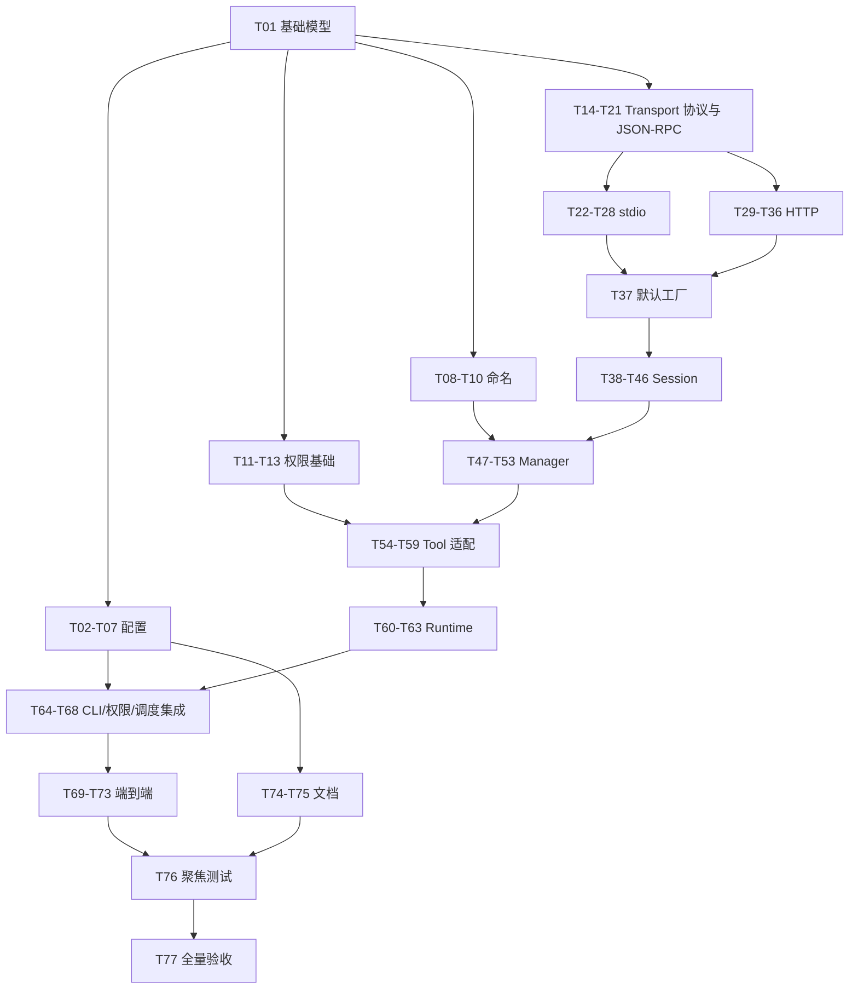

# Phase 6：MCP Client 实现任务清单

## 任务目标

在不改变现有同步 REPL 和 Agent 调用模型的前提下，按已批准的 `spec.md` 与 `plan.md` 实现 MCP `2025-11-25` 工具客户端。所有任务均为可独立提交、可精确验证的 2–5 分钟行为切片；除最终回归任务外，每个任务只引入一个主要行为。

## 文件清单

### 新建

| 文件 | 责任 |
|------|------|
| `src/mewcode/mcp/__init__.py` | MCP 子系统稳定公开入口 |
| `src/mewcode/mcp/models.py` | 协议常量、配置模型、诊断、错误、状态和结果模型 |
| `src/mewcode/mcp/config.py` | 用户级/项目级配置发现、合并、严格解析和环境变量展开 |
| `src/mewcode/mcp/naming.py` | Provider 安全公开名、权限 namespace 和碰撞检测 |
| `src/mewcode/mcp/transport.py` | Transport 与 TransportFactory 协议、默认工厂 |
| `src/mewcode/mcp/stdio.py` | stdio 子进程传输、framing 和关闭 |
| `src/mewcode/mcp/http.py` | Streamable HTTP、请求级 SSE、Session header 和关闭 |
| `src/mewcode/mcp/jsonrpc.py` | JSON-RPC 2.0 peer、pending 配对、超时、取消和反向请求 |
| `src/mewcode/mcp/session.py` | initialize、initialized、分页 `tools/list` 和 `tools/call` |
| `src/mewcode/mcp/manager.py` | 多 Server 并发启动、工具快照、调用路由、隔离和关闭 |
| `src/mewcode/mcp/tool.py` | `McpTool` 适配器与 `McpCallResult -> ToolResult` 转换 |
| `src/mewcode/mcp/runtime.py` | MCP 后台线程、长期事件循环和跨线程桥 |
| `tests/mcp_stdio_fake.py` | 可控的真实 stdio MCP 子进程 fixture |
| `tests/test_mcp_config.py` | 配置路径、合并、严格字段、环境展开和脱敏测试 |
| `tests/test_mcp_naming.py` | 名称保留、规范化、截断、namespace 和碰撞测试 |
| `tests/test_mcp_jsonrpc.py` | JSON-RPC 配对、乱序、超时、取消、ping 和失败测试 |
| `tests/test_mcp_transports.py` | stdio 与 HTTP JSON/SSE、限制、Session 和关闭测试 |
| `tests/test_mcp_session.py` | 握手、能力、分页、定义校验、调用与状态机测试 |
| `tests/test_mcp_manager.py` | 并发启动、隔离、注册、路由、缓存和关闭测试 |
| `tests/test_mcp_runtime.py` | 后台 loop、跨线程取消、部分失败和幂等关闭测试 |
| `tests/test_mcp_tools.py` | 权限声明、结果适配、ToolRegistry 和 Provider 格式测试 |
| `tests/test_mcp_integration.py` | stdio、HTTP、混合故障与清理端到端测试 |

### 修改

| 文件 | 变更 |
|------|------|
| `pyproject.toml` | 声明 `httpx>=0.28.1,<1` 直接依赖 |
| `src/mewcode/cli.py` | 加载 MCP 配置、启动 Runtime、组合工具、输出诊断并在 `finally` 关闭 |
| `src/mewcode/tools/base.py` | 新增 `PermissionTargetKind.TOOL`，允许静态权限 argument |
| `src/mewcode/permissions/config.py` | 允许已配置但离线的 MCP namespace 规则休眠 |
| `src/mewcode/permissions/targets.py` | 构造并校验静态 `TOOL(invoke)` 目标 |
| `tests/test_permission_config.py` | MCP deferred namespace 与未知工具 fail-closed 回归 |
| `tests/test_permission_targets.py` | 静态 TOOL 目标和旧目标类型回归 |
| `tests/test_repl.py` | CLI 无配置兼容、MCP 启停、warning 和关闭回归 |
| `examples/config.yaml` | 增加 stdio/HTTP 示例 |
| `README.md` | 增加配置、命名、权限、安全边界和不支持能力说明 |

### 明确不修改

`src/mewcode/providers/`、`src/mewcode/conversation.py`、`src/mewcode/agent.py`、`src/mewcode/scheduler.py` 和 `src/mewcode/repl.py`。MCP 通过现有 `Tool` 接口、ToolRegistry 和 Scheduler 行为接入。

## 实现任务

### A. 基础模型与配置

#### T01 — 建立 MCP 包、协议常量与直接依赖

- **文件**：`pyproject.toml`、`src/mewcode/mcp/__init__.py`、`src/mewcode/mcp/models.py`
- **依赖**：无
- **步骤**：声明 `httpx>=0.28.1,<1`；建立包入口；定义协议版本、消息/输出上限、`McpTimeouts`、配置 dataclass、诊断、阶段、错误、Session 状态和调用结果模型。
- **验证**：运行 `python -c "import httpx; from mewcode.mcp.models import MCP_PROTOCOL_VERSION, MCP_MAX_MESSAGE_BYTES; assert MCP_PROTOCOL_VERSION == '2025-11-25'; assert MCP_MAX_MESSAGE_BYTES == 4 * 1024 * 1024"`，预期退出码为 0。

#### T02 — 实现默认配置路径与缺省空配置

- **文件**：`src/mewcode/mcp/config.py`、`tests/test_mcp_config.py`
- **依赖**：T01
- **步骤**：实现 `~/.mewcode/config.yaml` 与 `<workspace>/.mewcode/config.yaml` 路径解析；两文件均不存在或均不含 `mcp_servers` 时返回空 Server 集和空诊断。
- **验证**：运行 `pytest -q tests/test_mcp_config.py::test_missing_files_return_empty_config tests/test_mcp_config.py::test_files_without_mcp_servers_are_backward_compatible`，预期 `2 passed`。

#### T03 — 实现两层 map 整项覆盖合并

- **文件**：`src/mewcode/mcp/config.py`、`tests/test_mcp_config.py`
- **依赖**：T02
- **步骤**：分别读取用户级和项目级 YAML；仅合并 `mcp_servers`；同名项目条目完整替换用户条目，未重名条目并集保留；要求 map key 为非空字符串 Server 名；不把项目配置交给 Provider Profile loader。
- **验证**：运行 `pytest -q tests/test_mcp_config.py::test_project_server_replaces_whole_user_entry tests/test_mcp_config.py::test_distinct_servers_are_merged tests/test_mcp_config.py::test_server_names_must_be_nonempty_strings`，预期 `3 passed`。

#### T04 — 严格解析 stdio Server 配置

- **文件**：`src/mewcode/mcp/config.py`、`tests/test_mcp_config.py`
- **依赖**：T03
- **步骤**：支持 `transport: stdio`、非空 `command`、字符串 `args` 列表和字符串 map `env`；拒绝未知字段、错误类型和缺失必填字段；单 Server 错误只产生 warning 并跳过。
- **验证**：运行 `pytest -q tests/test_mcp_config.py::test_parses_stdio_server tests/test_mcp_config.py::test_invalid_stdio_entries_are_isolated`，预期 `2 passed`。

#### T05 — 严格解析 HTTP Server 配置

- **文件**：`src/mewcode/mcp/config.py`、`tests/test_mcp_config.py`
- **依赖**：T04
- **步骤**：支持 `transport: http`、`http/https` URL 和字符串 map `headers`；拒绝未知字段、URL userinfo、非 HTTP scheme、错误类型和缺失 URL；单 Server 错误保持隔离。
- **验证**：运行 `pytest -q tests/test_mcp_config.py::test_parses_http_server tests/test_mcp_config.py::test_invalid_http_entries_are_isolated`，预期 `2 passed`。

#### T06 — 实现 env/header 的 `${VAR}` 展开

- **文件**：`src/mewcode/mcp/config.py`、`tests/test_mcp_config.py`
- **依赖**：T05
- **步骤**：只在 stdio `env` 值和 HTTP `headers` 值展开合法 token；支持多个 token 和已定义空值；缺失变量或畸形 token 使该 Server 无效；不展开 command、args 或 URL。
- **验证**：运行 `pytest -q tests/test_mcp_config.py::test_expands_env_and_header_values tests/test_mcp_config.py::test_missing_or_malformed_variable_skips_server tests/test_mcp_config.py::test_command_args_and_url_are_not_expanded`，预期 `3 passed`。

#### T07 — 实现保留 header 与安全配置诊断

- **文件**：`src/mewcode/mcp/config.py`、`tests/test_mcp_config.py`
- **依赖**：T06
- **步骤**：大小写不敏感地忽略保留协议 header；文件级 YAML/根结构错误抛 `McpConfigError`；诊断只包含 Server、阶段和安全摘要，不包含 env/header 值。
- **验证**：运行 `pytest -q tests/test_mcp_config.py::test_reserved_headers_are_ignored_case_insensitively tests/test_mcp_config.py::test_file_level_yaml_error_is_fatal tests/test_mcp_config.py::test_diagnostics_do_not_leak_secret_values`，预期 `3 passed`。

### B. 命名与权限基础

#### T08 — 保留合法 MCP 公开名

- **文件**：`src/mewcode/mcp/naming.py`、`tests/test_mcp_naming.py`
- **依赖**：T01
- **步骤**：构造 `<server>__<remote_tool>`；当 base 满足 Provider 字符集且不超过 64 字符时原样保留；调用仍保存原始远端工具名。
- **验证**：运行 `pytest -q tests/test_mcp_naming.py::test_legal_base_name_is_preserved tests/test_mcp_naming.py::test_remote_name_is_kept_separately`，预期 `2 passed`。

#### T09 — 规范化、截断并哈希非法公开名

- **文件**：`src/mewcode/mcp/naming.py`、`tests/test_mcp_naming.py`
- **依赖**：T08
- **步骤**：替换非法字符；若原 base 非法或超长，取安全前 53 字符并追加 `_` 与 SHA-256 前 10 个十六进制字符；保证确定性且总长不超过 64。
- **验证**：运行 `pytest -q tests/test_mcp_naming.py::test_invalid_name_is_normalized_with_hash tests/test_mcp_naming.py::test_long_name_is_truncated_deterministically`，预期 `2 passed`。

#### T10 — 实现 namespace 与显式碰撞检测

- **文件**：`src/mewcode/mcp/naming.py`、`tests/test_mcp_naming.py`
- **依赖**：T09
- **步骤**：生成与公开名算法一致的 Server 权限 namespace 前缀；对规范化后重复、内建工具重名和保留名返回受控碰撞结果，不静默覆盖。
- **验证**：运行 `pytest -q tests/test_mcp_naming.py::test_permission_prefix_matches_public_namespace tests/test_mcp_naming.py::test_public_name_collision_is_reported`，预期 `2 passed`。

#### T11 — 扩展 Tool 权限声明模型

- **文件**：`src/mewcode/tools/base.py`、`tests/test_permission_targets.py`
- **依赖**：T01
- **步骤**：新增 `PermissionTargetKind.TOOL`；把 `ToolPermissionSpec.argument` 改为可选，同时保持已有 COMMAND/PATH/PATH_GLOB 工具类型和构造方式兼容。
- **验证**：运行 `pytest -q tests/test_permission_targets.py::test_tool_permission_spec_accepts_static_argument tests/test_permission_targets.py::test_existing_permission_spec_kinds_are_unchanged`，预期 `2 passed`。

#### T12 — 构造静态 `TOOL(invoke)` 权限目标

- **文件**：`src/mewcode/permissions/targets.py`、`tests/test_permission_targets.py`
- **依赖**：T11
- **步骤**：允许 TOOL kind 使用 spec 中的静态 argument `invoke`；拒绝缺失或非法静态值；不从 MCP 调用参数推导权限目标。
- **验证**：运行 `pytest -q tests/test_permission_targets.py::test_builds_static_tool_invoke_target tests/test_permission_targets.py::test_invalid_static_tool_target_is_denied`，预期 `2 passed`。

#### T13 — 支持已配置 MCP namespace 的休眠规则

- **文件**：`src/mewcode/permissions/config.py`、`tests/test_permission_config.py`
- **依赖**：T10、T12
- **步骤**：给权限加载器传入 deferred MCP 前缀；仅允许匹配这些前缀、但当前未注册的工具规则通过；其它未知工具仍报错；正常已注册规则行为不变。
- **验证**：运行 `pytest -q tests/test_permission_config.py::test_allows_rule_for_configured_offline_mcp_namespace tests/test_permission_config.py::test_rejects_unknown_non_mcp_tool tests/test_permission_config.py::test_registered_tool_rule_is_unchanged`，预期 `3 passed`。

### C. Transport 与 JSON-RPC Peer

#### T14 — 定义 Transport 与工厂协议

- **文件**：`src/mewcode/mcp/transport.py`、`src/mewcode/mcp/__init__.py`
- **依赖**：T01
- **步骤**：定义 `start(on_message, on_failure)`、`send`、`set_protocol_version`、`close` 的异步 Protocol，以及可注入的 TransportFactory 接口；暂不实例化具体 transport。
- **验证**：运行 `python -c "from mewcode.mcp.transport import McpTransport, McpTransportFactory; assert hasattr(McpTransport, 'send'); assert hasattr(McpTransportFactory, 'create')"`，预期退出码为 0。

#### T15 — 发送 JSON-RPC request 与 notification

- **文件**：`src/mewcode/mcp/jsonrpc.py`、`tests/test_mcp_jsonrpc.py`
- **依赖**：T14
- **步骤**：实现从 1 递增的整数 id、标准 `jsonrpc: '2.0'` envelope、request pending 创建和无 id notification 发送；使用注入的内存 Transport。
- **验证**：运行 `pytest -q tests/test_mcp_jsonrpc.py::test_request_uses_incrementing_integer_ids tests/test_mcp_jsonrpc.py::test_notification_has_no_id`，预期 `2 passed`。

#### T16 — 按 id 配对乱序响应

- **文件**：`src/mewcode/mcp/jsonrpc.py`、`tests/test_mcp_jsonrpc.py`
- **依赖**：T15
- **步骤**：按响应 id 完成对应 Future；允许多个并发请求乱序返回；响应完成后移除 pending。
- **验证**：运行 `pytest -q tests/test_mcp_jsonrpc.py::test_out_of_order_responses_pair_by_id tests/test_mcp_jsonrpc.py::test_completed_request_is_removed_from_pending`，预期 `2 passed`。

#### T17 — 处理 JSON-RPC error、未知和重复响应

- **文件**：`src/mewcode/mcp/jsonrpc.py`、`tests/test_mcp_jsonrpc.py`
- **依赖**：T16
- **步骤**：把合法 JSON-RPC error 转为安全异常；忽略未知/迟到/重复 id；对缺少可信 `result/error` 结构的当前响应触发协议失败。
- **验证**：运行 `pytest -q tests/test_mcp_jsonrpc.py::test_jsonrpc_error_completes_matching_request tests/test_mcp_jsonrpc.py::test_unknown_and_duplicate_ids_are_ignored tests/test_mcp_jsonrpc.py::test_untrustworthy_response_fails_peer`，预期 `3 passed`。

#### T18 — 实现请求超时与迟到响应隔离

- **文件**：`src/mewcode/mcp/jsonrpc.py`、`tests/test_mcp_jsonrpc.py`
- **依赖**：T17
- **步骤**：为 request 使用注入 timeout；超时原子移除当前 pending，并在 Transport 仍可写时尽力发送带原 request id 的 `notifications/cancelled`；取消通知失败不得覆盖原超时；同 Peer 保持可用，迟到响应不影响其它请求。
- **验证**：运行 `pytest -q tests/test_mcp_jsonrpc.py::test_request_timeout_only_fails_that_pending_call tests/test_mcp_jsonrpc.py::test_timeout_sends_cancelled_notification_when_writable tests/test_mcp_jsonrpc.py::test_late_response_after_timeout_is_ignored`，预期 `3 passed`。

#### T19 — 传播调用取消

- **文件**：`src/mewcode/mcp/jsonrpc.py`、`tests/test_mcp_jsonrpc.py`
- **依赖**：T18
- **步骤**：调用 task 被取消时原子移除对应 pending，并在 Transport 仍可写时尽力发送带原 request id 的 `notifications/cancelled`；通知失败不改写 `CancelledError`，取消不向其它请求扩散，后续响应作为迟到响应忽略。
- **验证**：运行 `pytest -q tests/test_mcp_jsonrpc.py::test_cancelled_request_is_removed_without_affecting_others tests/test_mcp_jsonrpc.py::test_caller_cancellation_sends_cancelled_notification_best_effort`，预期 `2 passed`。

#### T20 — 处理 Server ping 与不支持的反向请求

- **文件**：`src/mewcode/mcp/jsonrpc.py`、`tests/test_mcp_jsonrpc.py`
- **依赖**：T19
- **步骤**：对 `ping` request 返回空 result；对其它有 id 的 Server request 返回 `-32601`；安全忽略未知 notification；不把反向请求当作客户端 pending 响应。
- **验证**：运行 `pytest -q tests/test_mcp_jsonrpc.py::test_ping_request_receives_empty_result tests/test_mcp_jsonrpc.py::test_unknown_server_request_receives_method_not_found tests/test_mcp_jsonrpc.py::test_unknown_notification_is_ignored`，预期 `3 passed`。

#### T21 — 实现 Peer fatal failure 与幂等关闭

- **文件**：`src/mewcode/mcp/jsonrpc.py`、`tests/test_mcp_jsonrpc.py`
- **依赖**：T20
- **步骤**：Transport failure 时用同一安全异常完成全部 pending；关闭后新请求快速失败；重复 `fail/close` 不重复完成 Future 或抛二次异常。
- **验证**：运行 `pytest -q tests/test_mcp_jsonrpc.py::test_transport_failure_completes_all_pending tests/test_mcp_jsonrpc.py::test_closed_peer_fails_fast tests/test_mcp_jsonrpc.py::test_peer_close_is_idempotent`，预期 `3 passed`。

### D. stdio Transport

#### T22 — 建立可控 stdio MCP 测试子进程

- **文件**：`tests/mcp_stdio_fake.py`、`tests/test_mcp_transports.py`
- **依赖**：T14
- **步骤**：实现按 argv 模式运行的 UTF-8 newline JSON fixture，可回显消息、报告 cwd/env、写 stderr、提前 EOF、忽略终止或发送超限行；不得依赖外部 MCP 包。
- **验证**：运行 `pytest -q tests/test_mcp_transports.py::test_stdio_fake_fixture_echoes_one_json_line`，预期 `1 passed`。

#### T23 — 启动 stdio 进程并传递 argv/env/cwd

- **文件**：`src/mewcode/mcp/stdio.py`、`tests/test_mcp_transports.py`
- **依赖**：T22
- **步骤**：使用 `asyncio.create_subprocess_exec` 且不启用 shell；继承进程环境并覆盖配置 env；cwd 固定为 workspace；启动 reader 和 stderr drain task。
- **验证**：运行 `pytest -q tests/test_mcp_transports.py::test_stdio_uses_exec_argv_merged_env_and_workspace_cwd tests/test_mcp_transports.py::test_stdio_never_uses_shell`，预期 `2 passed`。

#### T24 — 实现 stdio newline JSON 收发

- **文件**：`src/mewcode/mcp/stdio.py`、`tests/test_mcp_transports.py`
- **依赖**：T23
- **步骤**：发送端以 UTF-8 紧凑 JSON 加单个换行写入并串行 drain；读取端逐行 decode JSON object 并交给 callback；支持连续多消息。
- **验证**：运行 `pytest -q tests/test_mcp_transports.py::test_stdio_sends_utf8_newline_json tests/test_mcp_transports.py::test_stdio_receives_multiple_messages_in_order`，预期 `2 passed`。

#### T25 — 持续排空 stderr 并处理 EOF

- **文件**：`src/mewcode/mcp/stdio.py`、`tests/test_mcp_transports.py`
- **依赖**：T24
- **步骤**：持续读取并丢弃 stderr，避免管道阻塞且不记录内容；stdout EOF 触发一次 Transport failure；主动关闭产生的 EOF 不重复报告 fatal。
- **验证**：运行 `pytest -q tests/test_mcp_transports.py::test_stdio_stderr_is_drained_without_leaking_content tests/test_mcp_transports.py::test_unexpected_stdio_eof_reports_failure_once`，预期 `2 passed`。

#### T26 — 拒绝非法或超限 stdio 消息

- **文件**：`src/mewcode/mcp/stdio.py`、`tests/test_mcp_transports.py`
- **依赖**：T25
- **步骤**：把无效 UTF-8、非法 JSON、非 object JSON 和超过 4 MiB 的单行视为 fatal framing 错误；错误摘要不回显原始 payload。
- **验证**：运行 `pytest -q tests/test_mcp_transports.py::test_stdio_invalid_json_is_fatal tests/test_mcp_transports.py::test_stdio_oversized_message_is_fatal_and_redacted`，预期 `2 passed`。

#### T27 — 实现 stdio 优雅关闭

- **文件**：`src/mewcode/mcp/stdio.py`、`tests/test_mcp_transports.py`
- **依赖**：T26
- **步骤**：关闭 stdin 后在单一 shutdown deadline 内等待进程和 reader/stderr task；正常退出不调用 terminate/kill；重复关闭幂等。
- **验证**：运行 `pytest -q tests/test_mcp_transports.py::test_stdio_close_starts_with_stdin_and_wait tests/test_mcp_transports.py::test_stdio_close_is_idempotent`，预期 `2 passed`。

#### T28 — 实现 stdio terminate/kill 后备路径

- **文件**：`src/mewcode/mcp/stdio.py`、`tests/test_mcp_transports.py`
- **依赖**：T27
- **步骤**：若进程未退出则 terminate，再超时则 kill；所有阶段共享 5 秒总 deadline；显式覆盖 Windows 与类 Unix 的终止分支及已退出竞态，不让单次清理异常跳过 task 回收。
- **验证**：运行 `pytest -q tests/test_mcp_transports.py::test_stdio_close_escalates_to_terminate_then_kill tests/test_mcp_transports.py::test_stdio_close_handles_already_exited_process tests/test_mcp_transports.py::test_stdio_shutdown_windows_branch tests/test_mcp_transports.py::test_stdio_shutdown_unix_branch`，预期 `4 passed`。

### E. Streamable HTTP Transport

#### T29 — 发送 HTTP JSON 请求和基础协议 header

- **文件**：`src/mewcode/mcp/http.py`、`tests/test_mcp_transports.py`
- **依赖**：T14
- **步骤**：使用注入或自建的 `httpx.AsyncClient`，默认 TLS 校验且 `follow_redirects=False`；每条消息单独 POST；强制正确的 Content-Type/Accept 并合并非保留用户 headers。
- **验证**：运行 `pytest -q tests/test_mcp_transports.py::test_http_posts_one_jsonrpc_message_with_protocol_accept_headers tests/test_mcp_transports.py::test_http_redirects_are_not_followed`，预期 `2 passed`。

#### T30 — 处理 HTTP JSON、202 与空响应

- **文件**：`src/mewcode/mcp/http.py`、`tests/test_mcp_transports.py`
- **依赖**：T29
- **步骤**：解析成功 JSON object 响应并交给 callback；接受 notification 的 202/无 body；拒绝 request 的成功空 body；所有状态判断受控报错。
- **验证**：运行 `pytest -q tests/test_mcp_transports.py::test_http_delivers_json_response tests/test_mcp_transports.py::test_http_accepts_202_for_notification tests/test_mcp_transports.py::test_http_rejects_empty_request_response`，预期 `3 passed`。

#### T31 — 管理 HTTP Session 与协议版本 header

- **文件**：`src/mewcode/mcp/http.py`、`tests/test_mcp_transports.py`
- **依赖**：T30
- **步骤**：从 initialize 响应捕获合法 `MCP-Session-Id`；之后请求发送 Session id；握手后发送固定 `MCP-Protocol-Version`；拒绝控制字符/非可见 ASCII Session id 和冲突变更。
- **验证**：运行 `pytest -q tests/test_mcp_transports.py::test_http_session_and_protocol_headers_are_reused tests/test_mcp_transports.py::test_http_rejects_invalid_or_changed_session_id`，预期 `2 passed`。

#### T32 — 解析 request-scoped SSE 基本事件

- **文件**：`src/mewcode/mcp/http.py`、`tests/test_mcp_transports.py`
- **依赖**：T31
- **步骤**：解析 `text/event-stream` 的注释、空行分隔和多行 `data:`；读取但不使用 `event/id/retry`；每个完整 data JSON object 交给 callback。
- **验证**：运行 `pytest -q tests/test_mcp_transports.py::test_http_sse_parses_comments_and_multiline_data tests/test_mcp_transports.py::test_http_sse_ignores_id_and_retry_for_recovery`，预期 `2 passed`。

#### T33 — 支持 SSE 内多条消息与反向请求

- **文件**：`src/mewcode/mcp/http.py`、`tests/test_mcp_transports.py`
- **依赖**：T32、T20
- **步骤**：在同一 POST 响应流中持续交付多条 Server notification/request/最终 response；直到当前请求得到配对响应或流结束；不建立独立 GET 流。
- **验证**：运行 `pytest -q tests/test_mcp_transports.py::test_http_sse_delivers_server_request_before_final_response tests/test_mcp_transports.py::test_http_never_opens_standalone_get_stream`，预期 `2 passed`。

#### T34 — 处理 HTTP 状态、内容类型与流中断错误

- **文件**：`src/mewcode/mcp/http.py`、`tests/test_mcp_transports.py`
- **依赖**：T33
- **步骤**：把非支持状态、非 JSON/SSE 内容类型、非法 JSON 和 SSE 中断转为安全 Transport/Protocol 错误；404 Session 失效标记 fatal；错误不包含认证 header、Session id 或响应 body。
- **验证**：运行 `pytest -q tests/test_mcp_transports.py::test_http_404_session_loss_is_fatal tests/test_mcp_transports.py::test_http_rejects_unsupported_content_type tests/test_mcp_transports.py::test_http_errors_are_redacted tests/test_mcp_transports.py::test_http_errors_do_not_expose_session_id`，预期 `4 passed`。

#### T35 — 限制 HTTP/SSE 消息大小

- **文件**：`src/mewcode/mcp/http.py`、`tests/test_mcp_transports.py`
- **依赖**：T34
- **步骤**：以流式累计方式限制 JSON body 和单个 SSE event 的解码前总量为 4 MiB；超限立即终止读取并报 fatal，不保留原 payload。
- **验证**：运行 `pytest -q tests/test_mcp_transports.py::test_http_json_body_size_limit tests/test_mcp_transports.py::test_http_sse_event_size_limit`，预期 `2 passed`。

#### T36 — 实现 HTTP Session DELETE 与客户端关闭

- **文件**：`src/mewcode/mcp/http.py`、`tests/test_mcp_transports.py`
- **依赖**：T35
- **步骤**：有 Session id 时先 DELETE；接受 200/202/204/405；无 Session id 不发 DELETE；无论 DELETE 是否失败均 `aclose`；重复关闭幂等。
- **验证**：运行 `pytest -q tests/test_mcp_transports.py::test_http_close_deletes_session_then_closes_client tests/test_mcp_transports.py::test_http_close_without_session_skips_delete tests/test_mcp_transports.py::test_http_close_is_idempotent`，预期 `3 passed`。

#### T37 — 接通默认 TransportFactory

- **文件**：`src/mewcode/mcp/transport.py`、`src/mewcode/mcp/__init__.py`、`tests/test_mcp_transports.py`
- **依赖**：T28、T36
- **步骤**：根据已验证配置创建 stdio 或 HTTP transport；保留测试可注入工厂；不在工厂层吞掉创建异常。
- **验证**：运行 `pytest -q tests/test_mcp_transports.py::test_default_factory_builds_stdio_and_http_transports tests/test_mcp_transports.py::test_factory_creation_error_is_preserved_safely`，预期 `2 passed`。

### F. MCP Session

#### T38 — 实现 initialize 与 initialized 时序

- **文件**：`src/mewcode/mcp/session.py`、`tests/test_mcp_session.py`
- **依赖**：T21、T37
- **步骤**：Session 启动 Transport/Peer 后发送精确 initialize 参数（版本、clientInfo、空 capabilities）；验证响应前不发 initialized；成功后设置 transport 协议版本并发送 initialized notification。
- **验证**：运行 `pytest -q tests/test_mcp_session.py::test_initialize_payload_and_initialized_order_are_exact`，预期 `1 passed`。

#### T39 — 校验协议版本与 tools capability

- **文件**：`src/mewcode/mcp/session.py`、`tests/test_mcp_session.py`
- **依赖**：T38
- **步骤**：要求 Server 返回 `2025-11-25`、合法 serverInfo/capabilities 且声明 tools；其它版本、缺失 tools 或畸形根结构使该 Session fatal 失败。
- **验证**：运行 `pytest -q tests/test_mcp_session.py::test_rejects_wrong_protocol_version tests/test_mcp_session.py::test_rejects_missing_tools_capability tests/test_mcp_session.py::test_rejects_malformed_initialize_result`，预期 `3 passed`。

#### T40 — 获取首屏工具并进入 READY

- **文件**：`src/mewcode/mcp/session.py`、`tests/test_mcp_session.py`
- **依赖**：T39
- **步骤**：initialized 后发送首个 `tools/list`；仅在首屏和所有后续页成功后进入 READY；启动中调用和 READY 前调用快速失败。
- **验证**：运行 `pytest -q tests/test_mcp_session.py::test_lists_tools_after_initialized_then_becomes_ready tests/test_mcp_session.py::test_call_before_ready_fails_fast`，预期 `2 passed`。

#### T41 — 抓取完整 tools/list 分页

- **文件**：`src/mewcode/mcp/session.py`、`tests/test_mcp_session.py`
- **依赖**：T40
- **步骤**：按 `nextCursor` 逐页请求并拼接快照；后续请求只发送上一页 cursor；空 cursor 终止；保留 Server 返回顺序供后续确定性整理。
- **验证**：运行 `pytest -q tests/test_mcp_session.py::test_collects_all_tool_pages_with_cursor`，预期 `1 passed`。

#### T42 — 拒绝分页根错误与 cursor 循环

- **文件**：`src/mewcode/mcp/session.py`、`tests/test_mcp_session.py`
- **依赖**：T41
- **步骤**：要求每页 result 为 object、tools 为 list、cursor 为合法字符串；检测重复 cursor；根错误或循环使整个 Server 启动失败且有界退出。
- **验证**：运行 `pytest -q tests/test_mcp_session.py::test_malformed_tools_page_fails_session tests/test_mcp_session.py::test_repeated_cursor_fails_without_looping`，预期 `2 passed`。

#### T43 — 校验并隔离单个工具定义错误

- **文件**：`src/mewcode/mcp/session.py`、`tests/test_mcp_session.py`
- **依赖**：T42
- **步骤**：要求工具 name 非空字符串、description 可选字符串、inputSchema 为 object；无效单工具产生诊断并跳过，其它工具仍返回；不实现 outputSchema 全语义。
- **验证**：运行 `pytest -q tests/test_mcp_session.py::test_invalid_tool_definition_is_skipped_without_losing_valid_tools`，预期 `1 passed`。

#### T44 — 原样发送 tools/call 名称与 arguments

- **文件**：`src/mewcode/mcp/session.py`、`tests/test_mcp_session.py`
- **依赖**：T43
- **步骤**：READY 时调用原始远端工具名；arguments object 不改 key/value、不附加权限数据或公开名；使用工具请求 timeout。
- **验证**：运行 `pytest -q tests/test_mcp_session.py::test_tools_call_uses_original_name_and_unchanged_arguments`，预期 `1 passed`。

#### T45 — 解析 tools/call 结果和可恢复错误

- **文件**：`src/mewcode/mcp/session.py`、`tests/test_mcp_session.py`
- **依赖**：T44
- **步骤**：解析 content、structuredContent、isError 为 `McpCallResult`；JSON-RPC error、timeout 和合法 `isError` 只失败本次调用，Session 保持 READY；畸形结果受控失败。
- **验证**：运行 `pytest -q tests/test_mcp_session.py::test_parses_call_result_fields tests/test_mcp_session.py::test_call_error_and_timeout_leave_session_ready tests/test_mcp_session.py::test_malformed_call_result_returns_controlled_error`，预期 `3 passed`。

#### T46 — 完成 Session fatal 状态与幂等关闭

- **文件**：`src/mewcode/mcp/session.py`、`tests/test_mcp_session.py`
- **依赖**：T45
- **步骤**：EOF、HTTP Session 丢失和 Peer fatal 将 Session 置 FAILED；后续调用立即 `McpUnavailableError` 且不重连；close 关闭 Peer/Transport 并进入 CLOSED，重复调用安全。
- **验证**：运行 `pytest -q tests/test_mcp_session.py::test_fatal_transport_failure_disables_session_without_reconnect tests/test_mcp_session.py::test_session_close_is_idempotent`，预期 `2 passed`。

### G. 多 Server Manager

#### T47 — 并发启动 Server 并隔离单点失败

- **文件**：`src/mewcode/mcp/manager.py`、`tests/test_mcp_manager.py`
- **依赖**：T10、T46
- **步骤**：为每个有效配置建立并登记独立 Session；用 `gather(return_exceptions=True)` 并发启动；一个 Server 失败只产生该 Server 诊断，健康 Server 工具继续发现。
- **验证**：运行 `pytest -q tests/test_mcp_manager.py::test_servers_start_concurrently tests/test_mcp_manager.py::test_one_server_failure_does_not_hide_healthy_tools`，预期 `2 passed`。

#### T48 — 应用单 Server 启动 deadline

- **文件**：`src/mewcode/mcp/manager.py`、`tests/test_mcp_manager.py`
- **依赖**：T47
- **步骤**：用 `McpTimeouts.startup` 包围单 Session 全部 initialize + pagination；超时关闭该 Session 并记录安全诊断；工厂创建异常同样隔离。
- **验证**：运行 `pytest -q tests/test_mcp_manager.py::test_hung_server_hits_startup_deadline tests/test_mcp_manager.py::test_transport_factory_error_is_isolated`，预期 `2 passed`。

#### T49 — 隔离重复与无效远端工具定义

- **文件**：`src/mewcode/mcp/manager.py`、`tests/test_mcp_manager.py`
- **依赖**：T48
- **步骤**：同一 Server 原始 tool name 重复时跳过冲突定义并诊断；单工具 description/schema 进一步规范化；把描述、Schema 和注解保持为不可信数据，不执行其中内容；不让一条坏定义移除其它健康工具。
- **验证**：运行 `pytest -q tests/test_mcp_manager.py::test_duplicate_remote_tool_is_skipped tests/test_mcp_manager.py::test_bad_tool_does_not_remove_siblings tests/test_mcp_manager.py::test_malicious_tool_metadata_remains_inert_data`，预期 `3 passed`。

#### T50 — 生成公开名并拒绝所有注册碰撞

- **文件**：`src/mewcode/mcp/manager.py`、`tests/test_mcp_manager.py`
- **依赖**：T49
- **步骤**：用 naming 层产生 descriptor；与已占用 builtin、其它 Server 公开名和同 Server 名称集合显式比对；冲突项 warning 并跳过，禁止 ToolRegistry 静默覆盖。
- **验证**：运行 `pytest -q tests/test_mcp_manager.py::test_public_name_collision_with_builtin_is_skipped tests/test_mcp_manager.py::test_cross_server_normalization_collision_is_skipped`，预期 `2 passed`。

#### T51 — 冻结并排序工具快照

- **文件**：`src/mewcode/mcp/manager.py`、`tests/test_mcp_manager.py`
- **依赖**：T50
- **步骤**：启动结束按 public name 排序 descriptor；忽略 `notifications/tools/list_changed`；若 Server 没有任何有效工具则关闭该 Session 并 warning。
- **验证**：运行 `pytest -q tests/test_mcp_manager.py::test_descriptors_are_sorted_and_snapshot_is_static tests/test_mcp_manager.py::test_server_with_no_valid_tools_is_closed`，预期 `2 passed`。

#### T52 — 路由调用并复用唯一 Session

- **文件**：`src/mewcode/mcp/manager.py`、`tests/test_mcp_manager.py`
- **依赖**：T51
- **步骤**：以 descriptor 路由到启动时缓存的同一 Session；连续调用不重建 transport、不重复 initialize/list；失败/未知 descriptor 快速安全失败。
- **验证**：运行 `pytest -q tests/test_mcp_manager.py::test_calls_reuse_cached_session_without_reinitialize tests/test_mcp_manager.py::test_unknown_or_failed_session_call_fails_fast`，预期 `2 passed`。

#### T53 — 并行关闭全部已创建 Session

- **文件**：`src/mewcode/mcp/manager.py`、`tests/test_mcp_manager.py`
- **依赖**：T52
- **步骤**：关闭所有已登记 Session，包括只创建未完成握手者；并行收集关闭结果；单个关闭失败不取消其它；返回安全 shutdown diagnostics；重复关闭幂等。
- **验证**：运行 `pytest -q tests/test_mcp_manager.py::test_close_reaches_partial_start_sessions tests/test_mcp_manager.py::test_close_failure_does_not_cancel_other_sessions tests/test_mcp_manager.py::test_manager_close_is_idempotent`，预期 `3 passed`。

### H. Tool 适配与结果转换

#### T54 — 转换文本与 structuredContent

- **文件**：`src/mewcode/mcp/tool.py`、`tests/test_mcp_tools.py`
- **依赖**：T01
- **步骤**：按 content 原顺序提取 text；structuredContent 用 `sort_keys=True` 的稳定 JSON 追加；段落以空行连接；成功结果映射 `ToolResult(ok=True)`。
- **验证**：运行 `pytest -q tests/test_mcp_tools.py::test_adapts_text_blocks_in_order tests/test_mcp_tools.py::test_structured_content_is_deterministic_json`，预期 `2 passed`。

#### T55 — 扁平化资源链接与嵌入文本

- **文件**：`src/mewcode/mcp/tool.py`、`tests/test_mcp_tools.py`
- **依赖**：T54
- **步骤**：resource_link 只展示安全 name/URI/MIME；embedded text resource 展示 URI/MIME/text；blob resource 仅输出“已省略”标记；绝不发资源 RPC 或落盘。
- **验证**：运行 `pytest -q tests/test_mcp_tools.py::test_resource_link_and_embedded_text_are_flattened tests/test_mcp_tools.py::test_resource_blob_is_omitted_without_fetch_or_write`，预期 `2 passed`。

#### T56 — 处理二进制、未知 block 与 20k 截断

- **文件**：`src/mewcode/mcp/tool.py`、`tests/test_mcp_tools.py`
- **依赖**：T55
- **步骤**：image/audio 只展示 type/MIME 省略标记；未知 block 稳定省略；最终复用现有 20,000 字符截断语义，不把 Base64 放入结果。
- **验证**：运行 `pytest -q tests/test_mcp_tools.py::test_image_audio_and_unknown_blocks_use_markers tests/test_mcp_tools.py::test_mcp_output_is_truncated_to_existing_limit`，预期 `2 passed`。

#### T57 — 定义 McpTool 属性与静态权限

- **文件**：`src/mewcode/mcp/tool.py`、`tests/test_mcp_tools.py`
- **依赖**：T12、T56
- **步骤**：实现现有 Tool Protocol 属性；公开 descriptor 的 name/description/inputSchema；所有 MCP 工具固定 `SIDE_EFFECT` 和 `TOOL(invoke)`；不信任 readOnlyHint 等 annotations。
- **验证**：运行 `pytest -q tests/test_mcp_tools.py::test_mcp_tool_exposes_descriptor_schema tests/test_mcp_tools.py::test_every_mcp_tool_is_side_effect_with_static_invoke_permission`，预期 `2 passed`。

#### T58 — 执行 McpTool 并映射错误/取消

- **文件**：`src/mewcode/mcp/tool.py`、`tests/test_mcp_tools.py`
- **依赖**：T57
- **步骤**：`execute` 把 arguments 原样交给 Runtime；`isError`、JSON-RPC error、timeout 和不可用映射为包含 Server 与公开工具上下文的 `ToolResult(ok=False)`；取消继续抛 `CancelledError`；metadata 仅含安全摘要。
- **验证**：运行 `pytest -q tests/test_mcp_tools.py::test_mcp_tool_execute_preserves_arguments tests/test_mcp_tools.py::test_mcp_errors_become_failed_tool_results tests/test_mcp_tools.py::test_mcp_failure_names_server_and_public_tool_without_secrets tests/test_mcp_tools.py::test_mcp_tool_execute_propagates_cancellation`，预期 `4 passed`。

#### T59 — 验证 ToolRegistry 与 Provider 格式兼容

- **文件**：`tests/test_mcp_tools.py`
- **依赖**：T50、T58
- **步骤**：用真实 ToolRegistry 组合 builtin 与 MCP proxies；断言公开名不覆盖、相同发现输入在重复启动时排序稳定；用现有 OpenAI/Anthropic 工具格式转换入口确认 namespace 名和 inputSchema 无需 Provider 修改。
- **验证**：运行 `pytest -q tests/test_mcp_tools.py::test_registry_combines_builtin_and_mcp_tools_without_overwrite tests/test_mcp_tools.py::test_existing_provider_formatters_accept_mcp_tools tests/test_mcp_tools.py::test_provider_tool_order_is_stable_across_identical_discovery_runs`，预期 `3 passed`。

### I. Runtime 后台事件循环

#### T60 — 启动唯一后台 loop 并创建 Tool proxies

- **文件**：`src/mewcode/mcp/runtime.py`、`src/mewcode/mcp/__init__.py`、`tests/test_mcp_runtime.py`
- **依赖**：T53、T58
- **步骤**：Runtime 建立一个 daemon thread 和一个长期 asyncio loop；在 loop 内创建/启动 Manager；同步 `start` 返回排序 descriptors、proxies 和 diagnostics；所有 Session 保持 loop confinement。
- **验证**：运行 `pytest -q tests/test_mcp_runtime.py::test_runtime_starts_one_background_loop_and_returns_proxies tests/test_mcp_runtime.py::test_manager_objects_remain_on_runtime_loop`，预期 `2 passed`。

#### T61 — 隔离 Runtime 部分启动与顶层失败

- **文件**：`src/mewcode/mcp/runtime.py`、`tests/test_mcp_runtime.py`
- **依赖**：T60
- **步骤**：健康/失败 Server 混合时仍返回健康 proxies；后台 loop 启动本身失败时清理 thread 状态并抛安全顶层错误；不得遗留半初始化 Runtime 可调用状态。
- **验证**：运行 `pytest -q tests/test_mcp_runtime.py::test_runtime_returns_healthy_tools_after_partial_server_failure tests/test_mcp_runtime.py::test_runtime_loop_start_failure_leaves_no_callable_runtime`，预期 `2 passed`。

#### T62 — 实现跨线程调用与取消传播

- **文件**：`src/mewcode/mcp/runtime.py`、`tests/test_mcp_runtime.py`
- **依赖**：T61
- **步骤**：用 `run_coroutine_threadsafe` 提交 Manager 调用并在 Agent loop 中 `wrap_future`；Agent task 取消时取消 concurrent Future 和后台 pending；一个调用取消不影响其它调用。
- **验证**：运行 `pytest -q tests/test_mcp_runtime.py::test_runtime_call_crosses_thread_and_returns_result tests/test_mcp_runtime.py::test_runtime_call_cancellation_reaches_background_pending_only`，预期 `2 passed`。

#### T63 — 实现 Runtime 幂等关闭与 thread join

- **文件**：`src/mewcode/mcp/runtime.py`、`tests/test_mcp_runtime.py`
- **依赖**：T62
- **步骤**：同步 close 提交 Manager.close、取消残余 MCP tasks、停止 loop 并 join thread；shutdown diagnostics 安全返回；重复关闭和未完全启动关闭均可调用；正常路径不依赖 daemon 退出。
- **验证**：运行 `pytest -q tests/test_mcp_runtime.py::test_runtime_close_stops_loop_and_joins_thread tests/test_mcp_runtime.py::test_runtime_close_collects_safe_diagnostics tests/test_mcp_runtime.py::test_runtime_close_is_idempotent_after_partial_start`，预期 `3 passed`。

### J. CLI 与现有权限/调度集成

#### T64 — 保持无 MCP 配置的 CLI 行为兼容

- **文件**：`src/mewcode/cli.py`、`tests/test_repl.py`
- **依赖**：T07、T63
- **步骤**：CLI 在现有 workspace/Provider 初始化路径中读取 MCP 配置；无 Server 时不创建后台 thread、不改变 builtin 工具集合、权限加载或退出码。
- **验证**：运行 `pytest -q tests/test_repl.py::test_cli_without_mcp_config_preserves_existing_tool_and_exit_behavior`，预期 `1 passed`。

#### T65 — 注册健康 MCP 工具并加载 deferred 权限

- **文件**：`src/mewcode/cli.py`、`tests/test_repl.py`
- **依赖**：T13、T59、T64
- **步骤**：有配置时启动 Runtime；用 builtin 名称作为 reserved set；一次性构造 builtin + MCP ToolRegistry；把所有已配置 namespace 前缀传给权限加载器；启动诊断以 warning 输出。
- **验证**：运行 `pytest -q tests/test_repl.py::test_cli_registers_healthy_mcp_tools_and_deferred_namespaces tests/test_repl.py::test_cli_prints_server_warning_without_leaking_secret`，预期 `2 passed`。

#### T66 — 在所有 CLI 退出路径关闭 Runtime

- **文件**：`src/mewcode/cli.py`、`tests/test_repl.py`
- **依赖**：T65
- **步骤**：以 `try/finally` 覆盖正常 REPL 退出、权限加载失败、REPL 构造失败和 KeyboardInterrupt；调用幂等 close、输出 shutdown warnings，并保持原始错误/退出码优先级。
- **验证**：运行 `pytest -q tests/test_repl.py::test_cli_closes_mcp_runtime_on_normal_exit tests/test_repl.py::test_cli_closes_partial_runtime_when_later_startup_fails tests/test_repl.py::test_cli_closes_runtime_on_keyboard_interrupt`，预期 `3 passed`。

#### T67 — 验证权限拒绝发生在远端调用之前

- **文件**：`tests/test_mcp_tools.py`、`tests/test_permission_config.py`
- **依赖**：T58、T65
- **步骤**：通过现有权限/Scheduler 路径执行 MCP Tool；断言拒绝时 Runtime 未收到调用且 Agent 收到含公开工具名的普通失败结果后可继续；`once` 只覆盖当前调用；session/permanent 对同一公开工具全参数生效；参数内容不改变权限 key。
- **验证**：运行 `pytest -q tests/test_mcp_tools.py::test_permission_denial_prevents_mcp_server_call tests/test_mcp_tools.py::test_permission_denial_returns_failure_and_agent_can_continue tests/test_permission_config.py::test_mcp_permission_scope_is_whole_public_tool`，预期 `3 passed`。

#### T68 — 验证 MCP 工具沿用独占副作用调度

- **文件**：`tests/test_mcp_tools.py`
- **依赖**：T57
- **步骤**：用现有 Scheduler 同时提交 MCP SIDE_EFFECT 工具与其它工具；断言 MCP 调用走既有独占分支，不需要修改 Scheduler。
- **验证**：运行 `pytest -q tests/test_mcp_tools.py::test_mcp_tool_uses_existing_exclusive_side_effect_scheduling`，预期 `1 passed`。

### K. 端到端与故障回归

#### T69 — 完成 stdio 配置到工具调用端到端

- **文件**：`tests/mcp_stdio_fake.py`、`tests/test_mcp_integration.py`
- **依赖**：T28、T46、T53、T63、T65、T67
- **步骤**：用真实子进程从用户级/项目级配置合并开始，覆盖启动、initialize/initialized、分页 list、公开名注册、fake 模型选择、权限放行、两次 call 的 Session 复用、结果回灌、预期最终回答和显式关闭；断言只启动/握手一次。
- **验证**：运行 `pytest -q tests/test_mcp_integration.py::test_stdio_full_flow_from_merged_config_to_final_answer_and_cleanup`，预期 `1 passed`。

#### T70 — 完成 HTTP JSON/SSE 端到端

- **文件**：`tests/test_mcp_integration.py`
- **依赖**：T36、T46、T53、T63、T65、T67
- **步骤**：用 `httpx.MockTransport` 从带 `${VAR}` 认证 header 的配置开始，覆盖 initialize JSON、Session header 复用、SSE tools/list、fake 模型选择、权限放行、JSON tools/call、Server ping、结果回灌、预期最终回答及 DELETE；断言不发 GET、不访问网络；再以相同协议脚本对比 stdio/HTTP 的公开工具与 ToolResult 语义一致。
- **验证**：运行 `pytest -q tests/test_mcp_integration.py::test_http_full_flow_from_env_header_to_final_answer_and_session_delete tests/test_mcp_integration.py::test_same_protocol_scenario_matches_across_stdio_and_http`，预期 `2 passed`。

#### T71 — 验证混合故障、超时和无自动重连

- **文件**：`tests/test_mcp_integration.py`
- **依赖**：T48、T52、T69、T70
- **步骤**：同时配置无效 Server、健康 stdio、握手失败 HTTP、挂起 Server 和运行期失败 Server；断言启动有界、warning 分域且不泄密、只暴露健康工具；运行期失败后的 pending/后续调用快速失败且进程/initialize 计数不增加，另一 MCP Server、六个内建工具、Provider、REPL 和 Agent Loop 均继续可用。
- **验证**：运行 `pytest -q tests/test_mcp_integration.py::test_mixed_server_failures_are_isolated_and_never_reconnect`，预期 `1 passed`。

#### T72 — 验证调用错误不会终止 Agent Loop

- **文件**：`tests/test_mcp_integration.py`
- **依赖**：T58、T65
- **步骤**：通过现有 Agent 工具执行入口依次返回 JSON-RPC error、`isError: true`、timeout 和成功结果；断言前三次为失败 ToolResult，Session/Agent 仍能完成后续成功调用。
- **验证**：运行 `pytest -q tests/test_mcp_integration.py::test_recoverable_mcp_call_errors_do_not_stop_later_agent_calls`，预期 `1 passed`。

#### T73 — 验证关闭后无 MCP 任务或资源泄漏

- **文件**：`tests/test_mcp_integration.py`、`tests/test_mcp_runtime.py`
- **依赖**：T63、T69、T70、T71
- **步骤**：在启动中取消、调用中取消和部分初始化三种路径关闭 Runtime；断言后台 thread 已 join、子进程退出、HTTP client 关闭、pending 为空且没有存活 MCP asyncio task。
- **验证**：运行 `pytest -q tests/test_mcp_integration.py::test_shutdown_leaves_no_mcp_process_client_pending_or_task tests/test_mcp_runtime.py::test_close_after_cancellation_has_no_live_mcp_tasks`，预期 `2 passed`。

### L. 文档与最终验证

#### T74 — 更新配置示例

- **文件**：`examples/config.yaml`
- **依赖**：T07
- **步骤**：加入批准的 stdio 和 HTTP 示例、`${VAR}` 值、项目级整项覆盖说明；不得写入真实 token；示例 YAML 必须能被 loader 解析。
- **验证**：运行 `python -c "from pathlib import Path; import yaml; data=yaml.safe_load(Path('examples/config.yaml').read_text(encoding='utf-8')); assert isinstance(data.get('mcp_servers'), dict)"`，预期退出码为 0。

#### T75 — 更新 README 的用户文档与边界

- **文件**：`README.md`
- **依赖**：T10、T13、T66、T74
- **步骤**：说明两层路径和整项覆盖、两种 transport、变量展开、公开名规则、全副作用/整工具权限、信任项目配置风险、固定协议版本、错误隔离以及本阶段不支持的能力。
- **验证**：运行 `rg -n "mcp_servers|2025-11-25|Streamable HTTP|SIDE_EFFECT|自动重连" README.md`，预期五类关键说明均至少匹配一次。

#### T76 — 运行 MCP 与权限聚焦测试

- **文件**：不修改代码；若失败，只回到对应前置任务文件修复
- **依赖**：T67、T68、T69、T70、T71、T72、T73、T75
- **步骤**：一次运行所有新增 MCP 测试及被修改的权限/REPL 测试；处理 warning、未等待协程和残留 task；不得用 skip/xfail 掩盖失败。
- **验证**：运行 `pytest -q tests/test_mcp_config.py tests/test_mcp_naming.py tests/test_mcp_jsonrpc.py tests/test_mcp_transports.py tests/test_mcp_session.py tests/test_mcp_manager.py tests/test_mcp_runtime.py tests/test_mcp_tools.py tests/test_mcp_integration.py tests/test_permission_config.py tests/test_permission_targets.py tests/test_repl.py`，预期全部通过且无 asyncio resource warning。

#### T77 — 运行全量回归、编译与变更范围检查

- **文件**：不修改代码；若失败，只修复本功能引入的回归
- **依赖**：T76
- **步骤**：运行全量测试和源码编译；检查 git diff 只包含任务文件清单中的目标文件；确认未修改 Provider/Conversation/Agent/Scheduler/REPL，未触碰用户已有 `hello.txt`。
- **验证**：依次运行 `pytest -q`、`python -m compileall -q src tests`、`git status --short`；预期测试与编译退出码均为 0，status 中 `hello.txt` 仍保持原有未跟踪状态且没有计划外实现文件。

## 执行顺序

主依赖链如下；同一层的分支可在不编辑同一文件时并行执行：

具体规则：

1. T01 完成后，配置（T02-T07）、命名（T08-T10）、权限模型（T11-T13）和 JSON-RPC 基础（T14-T21）可以分支推进。
2. stdio（T22-T28）与 HTTP（T29-T36）只共享 `transport.py` 边界；并行时不得同时改该文件，统一在 T37 接线。
3. Session（T38-T46）完成后才进入 Manager（T47-T53）；Manager 与 Tool 结果适配汇合后再实现 Runtime。
4. CLI 集成必须等待配置、权限、Tool、Manager 和 Runtime 均有聚焦测试证据。
5. 文档可以在接口稳定后并行编写，但 T76 前必须完成；T77 是唯一最终完成门。

## Spec 覆盖检查

| Spec 范围 | 对应任务 |
|-----------|----------|
| F1-F7 配置、两层合并、严格字段、变量展开 | T02-T07、T64、T74-T75 |
| F8-F14 Transport、握手、JSON-RPC、超时 | T14-T46、T69-T71 |
| F15-F19 分页、命名、注册、静态快照 | T08-T10、T40-T43、T49-T51、T59、T65 |
| F20-F23 权限与独占调度 | T11-T13、T57、T67-T68 |
| F24-F28 调用、结果与错误映射 | T44-T46、T54-T58、T62、T72 |
| F29-F32 缓存、隔离、生命周期 | T47-T53、T60-T63、T66、T69-T73 |
| N1-N5 可靠、隔离、兼容、异步安全 | T16-T21、T47-T53、T60-T73、T76-T77 |
| N6-N9 执行安全、秘密、输入和资源上限 | T06-T07、T23、T25-T26、T29-T36、T54-T56、T75 |
| N10-N13 确定性、可移植、可测、可维护 | T09-T10、T27-T28、T51、T59、T69-T77 |

## 完成定义

只有同时满足以下条件，`task.md` 的实现阶段才算完成：

- T01-T77 的验证命令全部达到各自预期；
- Spec F1-F32 与 N1-N13 均有通过的自动化测试或明确的静态验证证据；
- 所有外部等待有界，关闭后无进程、HTTP client、pending Future、asyncio task 或后台 thread 泄漏；
- 未实现资源、提示词、采样、健康检查、自动重连、长期 GET、OAuth 或动态工具更新；
- 不修改批准范围外的运行时模块，也不覆盖用户已有工作区变更。
