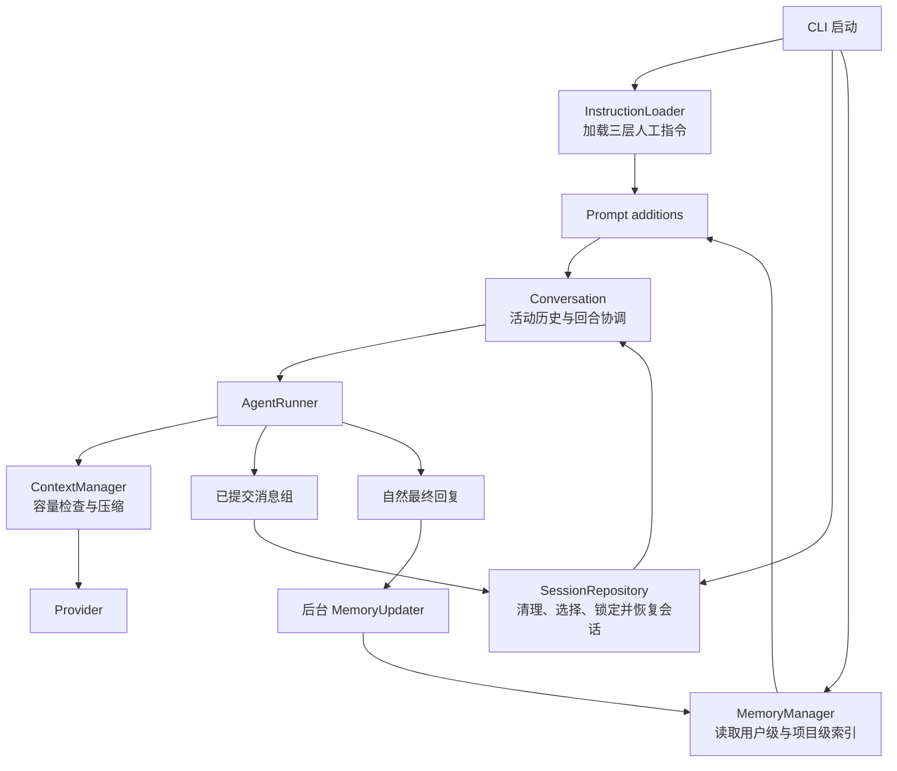
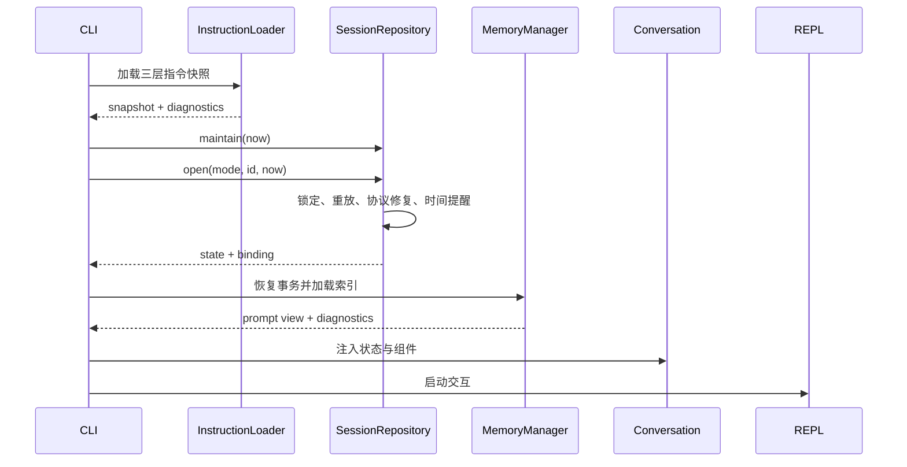
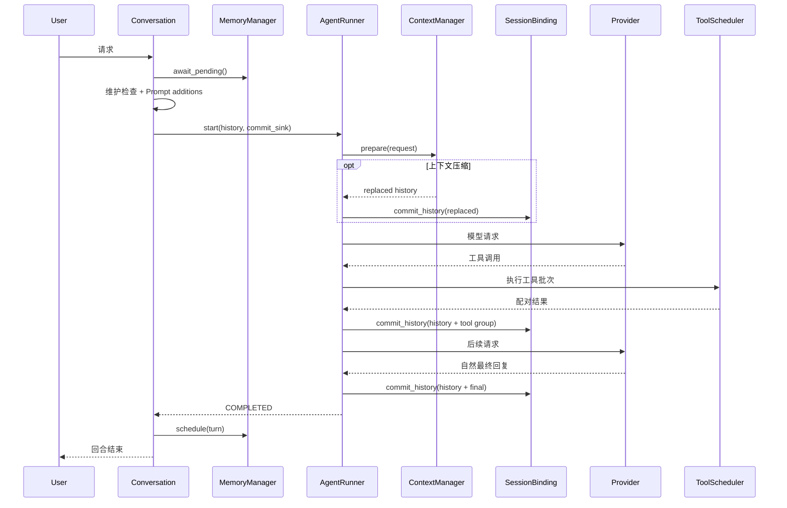

# 项目知识、会话恢复与长期记忆 Plan

## 架构概览

采用四个边界清晰的组件，由 `Conversation` 作为回合生命周期协调者：



### 启动装配

CLI 按以下顺序完成初始化：

1. 解析 `--new` 与 `--resume <ID>`。
2. 建立工作区和用户级路径集合。
3. 加载三层人工指令快照。
4. 清理过期会话，扫描候选并按启动模式新建或恢复会话。
5. 锁定选中的会话，恢复合法消息前缀并生成启动诊断。
6. 加载两级记忆索引并形成有界合并视图。
7. 将会话绑定、指令快照和记忆管理器交给 `Conversation`。
8. 启动现有 REPL、Agent、权限、工具、MCP 与上下文管理组件。

### 组件边界

- `InstructionLoader` 只负责发现、展开和校验人工指令。它启动时加载一次，使用各自路径沙箱，返回不可变内容与非敏感诊断，不直接操作 Prompt。
- `SessionRepository` 负责持久会话的全部磁盘语义：流式扫描、创建、锁定、恢复、追加、逻辑替换和过期清理。
- `MemoryManager` 组合 `MemoryStore` 与 `MemoryUpdater`，管理两级索引、后台任务、等待边界、失败诊断和 Prompt 注入视图。
- `Conversation` 不解析存储格式，只协调请求前等待、动态 Prompt、历史提交、自然停止后的记忆任务和关闭顺序。
- `AgentRunner` 只增加 Provider 中立的历史提交通知，不依赖会话文件实现。
- `PromptBuilder` 保留现有结构，继续通过动态 additions 接收人工指令和长期记忆。

现有 `.mewcode/context/` 是当前进程内的临时上下文归档；新的持久会话位于独立目录，二者生命周期不合并。

## 核心数据结构与接口

### 路径与诊断

```python
@dataclass(frozen=True)
class ContinuityPaths:
    workspace_root: Path
    user_root: Path
    project_local_instructions: Path
    project_root_instructions: Path
    user_instructions: Path
    sessions_root: Path
    project_memory_root: Path
    user_memory_root: Path
```

固定布局：

```text
<workspace>/
├── MEWCODE.md
└── .mewcode/
    ├── instructions.md
    ├── sessions/
    │   └── <session-id>.jsonl
    └── memory/
        ├── index.md
        └── notes/
            └── <note-id>.md

~/.mewcode/
├── instructions.md
└── memory/
    ├── index.md
    └── notes/
        └── <note-id>.md
```

```python
@dataclass(frozen=True)
class ContinuityDiagnostic:
    component: Literal["instructions", "session", "memory"]
    code: str
    severity: Literal["info", "warning", "error"]
    message: str
```

诊断不得携带指令正文、历史消息、笔记正文或秘密值。

### 指令模型

```python
class InstructionScope(StrEnum):
    PROJECT_LOCAL = "project_local"
    PROJECT_ROOT = "project_root"
    USER = "user"

@dataclass(frozen=True)
class InstructionSource:
    scope: InstructionScope
    entry_path: Path
    sandbox_root: Path
    priority: int

@dataclass(frozen=True)
class InstructionSnapshot:
    content: str
    diagnostics: tuple[ContinuityDiagnostic, ...]

class InstructionLoader:
    def load(self, paths: ContinuityPaths) -> InstructionSnapshot: ...
```

`@include` 必须独占一行：

```text
@include relative/path/to/file.md
```

指令后的全部非空文本视为路径，因此支持空格；行内 `@include` 视为普通 Markdown。顶层文件深度为 0，深度为 5 的文件仍载入正文，但不再展开新的引用。每个顶层指令文件使用独立 `visited` 集合。

输出只使用逻辑来源标签：

```markdown
### Project-local instructions
...

### Project-root instructions
...

### User instructions
...
```

### 会话记录与恢复状态

JSONL 使用三个版本化记录类型：

```json
{"version":1,"type":"start","at":"...","session_id":"..."}
{"version":1,"type":"history","at":"...","operation":"append","messages":[...]}
{"version":1,"type":"history","at":"...","operation":"replace","messages":[...]}
{"version":1,"type":"plan_state","at":"...","pending_plan":null}
```

- `append` 保存相对当前逻辑历史新增的完整消息组。
- `replace` 保存新的完整活动历史，用于上下文压缩和恢复修复。
- `plan_state` 保存或清除待执行计划。
- 每个工具调用组及其结果尽量写入同一条 `history` 记录。
- `ChatMessage` 的 `role`、`kind`、`group_id` 和 JSON 兼容 `content` 全部保留。

```python
class SessionOpenMode(StrEnum):
    AUTO = "auto"
    NEW = "new"
    RESUME = "resume"

@dataclass(frozen=True)
class SessionOpenRequest:
    mode: SessionOpenMode
    session_id: str | None = None

@dataclass(frozen=True)
class SessionSummary:
    session_id: str
    title: str
    message_count: int
    last_activity: datetime
    recoverable: bool

@dataclass(frozen=True)
class SessionState:
    session_id: str
    messages: tuple[ChatMessage, ...]
    pending_plan: PendingPlan | None
    last_activity: datetime

@dataclass(frozen=True)
class SessionOpenResult:
    binding: SessionBinding
    state: SessionState
    diagnostics: tuple[ContinuityDiagnostic, ...]
```

标题取逻辑历史中第一条非空用户文本，折叠空白并限制为 60 个 Unicode 字符；没有用户文本时使用会话 ID。消息数统计当前逻辑历史中的全部 `ChatMessage`，不统计生命周期记录。

```python
class SessionRepository:
    def maintain(self, now: datetime) -> tuple[ContinuityDiagnostic, ...]: ...
    def scan(self, now: datetime) -> tuple[SessionSummary, ...]: ...
    def open(
        self,
        request: SessionOpenRequest,
        now: datetime,
    ) -> SessionOpenResult: ...

class SessionBinding:
    def maintain(self, now: datetime) -> tuple[ContinuityDiagnostic, ...]: ...
    def commit_history(self, messages: Sequence[ChatMessage]) -> None: ...
    def commit_plan(self, pending_plan: PendingPlan | None) -> None: ...
    def close(self) -> tuple[ContinuityDiagnostic, ...]: ...
```

`SessionBinding` 保存最后一次成功提交的逻辑状态。新历史以旧历史为前缀时写 `append`；发生压缩、修复或其他替换时写 `replace`。提交失败时不更新“已持久化状态”。

### Agent 历史提交钩子

```python
class HistoryCommitSink(Protocol):
    def commit(self, messages: Sequence[ChatMessage]) -> None: ...
```

`AgentRunner.start()` 接受可选提交钩子。调用位置为上下文替换后、完整工具结果组形成后和自然最终回答形成后。候选历史先持久化，成功后才更新 Agent 的 committed history；未配置钩子时保持当前行为。

### 自动笔记模型

```python
class MemoryScope(StrEnum):
    PROJECT = "project"
    USER = "user"

class MemoryCategory(StrEnum):
    USER_PREFERENCE = "user_preference"
    CORRECTION = "correction"
    PROJECT_KNOWLEDGE = "project_knowledge"
    REFERENCE = "reference"

@dataclass(frozen=True)
class MemoryNote:
    version: int
    note_id: str
    scope: MemoryScope
    category: MemoryCategory
    summary: str
    body: str
    priority: int
    created_at: datetime
    updated_at: datetime
    source_session_id: str
```

笔记格式：

```markdown
---
version: 1
id: mem-...
scope: project
category: project_knowledge
summary: ...
priority: 1
created_at: ...
updated_at: ...
source_session_id: ...
---

笔记正文
```

`priority` 为 1–5，1 最高，由模型结合有效性、具体程度和长期价值判断。

```python
@dataclass(frozen=True)
class MemoryIndexEntry:
    note_id: str
    scope: MemoryScope
    category: MemoryCategory
    summary: str
    priority: int
    updated_at: datetime
    relative_path: str

@dataclass(frozen=True)
class MemoryPromptView:
    content: str
    lines: int
    bytes: int
    included_note_ids: tuple[str, ...]
```

索引每条笔记占一个完整条目并使用相对路径。合并视图先加入项目级条目，再加入用户级条目，任何条目导致总预算超限时停止，不做字符级截断。

### 笔记更新协议

```python
@dataclass(frozen=True)
class MemoryTurn:
    session_id: str
    user_text: str
    assistant_final_text: str
    occurred_at: datetime

class MemoryAction(StrEnum):
    UPSERT = "upsert"
    DELETE = "delete"

@dataclass(frozen=True)
class MemoryMutation:
    action: MemoryAction
    scope: MemoryScope
    note_id: str | None
    category: MemoryCategory | None
    summary: str | None
    body: str | None
    priority: int | None

@dataclass(frozen=True)
class MemoryUpdatePlan:
    version: int
    mutations: tuple[MemoryMutation, ...]
```

模型严格返回：

```text
<memory_update>
{"version":1,"mutations":[...]}
</memory_update>
```

- 新建笔记不允许模型指定 ID，由运行时分配。
- 更新或删除只能引用当前索引中存在且作用域一致的 ID。
- 无需记录时返回空 `mutations`。
- 模型不提供路径、时间或来源会话。
- 任一 mutation 非法时拒绝整份计划。

```python
class MemoryStore:
    def load_indexes(self) -> MemoryPromptView: ...
    def catalog(self) -> tuple[MemoryIndexEntry, ...]: ...
    def apply(self, plan: MemoryUpdatePlan, turn: MemoryTurn) -> None: ...

class MemoryUpdater:
    async def update(
        self,
        turn: MemoryTurn,
        catalog: Sequence[MemoryIndexEntry],
    ) -> MemoryUpdatePlan: ...

class MemoryManager:
    async def await_pending(self) -> tuple[ContinuityDiagnostic, ...]: ...
    def prompt_view(self) -> MemoryPromptView: ...
    def schedule(self, turn: MemoryTurn) -> None: ...
    async def close(self) -> tuple[ContinuityDiagnostic, ...]: ...
```

`MemoryStore.apply()` 同时锁定两个作用域，使用暂存文件、事务日志和原子替换实现跨作用域的全旧或全新恢复语义。

### Conversation 构造与动态 Prompt

```python
class Conversation:
    def __init__(
        self,
        runner: AgentRunner,
        tools: ToolRegistry,
        *,
        initial_state: SessionState,
        session: SessionBinding,
        instructions: InstructionSnapshot,
        memory: MemoryManager,
        base_prompt_additions: PromptAdditions = PromptAdditions(),
        context_manager: ContextManager | None = None,
    ) -> None: ...
```

实际实现通过空适配器为 continuity 参数提供兼容默认值。每轮运行前等待 pending memory、调用 `session.maintain(now)` 执行节流维护、读取 Prompt view、合并 additions，再以 `session.commit_history` 作为 Agent 提交钩子。恢复时从 `SessionState.pending_plan` 还原待执行计划。

## 模块设计

### 指令加载

`InstructionLoader` 对三个来源逐个执行：

1. 解析真实路径并按平台规则规范大小写。
2. 验证路径位于对应沙箱。
3. 检查深度和独立 `visited` 集合。
4. 以 UTF-8 读取并规范为 LF。
5. 递归展开独占行的引用。
6. 引用失败时省略该引用并记录诊断。
7. 为成功加载的顶层来源添加逻辑标题。

不存在的入口属于正常空状态；入口存在但不可读、编码非法或显式引用失败才报告。

### 会话流式重放

`SessionRepository` 以二进制流逐行扫描并记录行偏移。完整行依次通过 UTF-8、JSON、版本、类型、时间和消息结构校验，再应用 `append`、`replace` 或 `plan_state`。

- 文件末尾无换行的残缺行视为崩溃遗留；恢复写入前物理截断到该行起始偏移。
- 中间完整坏行保留在文件中，但不参与重放。
- `replace` 采用记录中的完整活动状态。
- 缺少有效 `start`、ID 不匹配或无法建立状态时视为不可恢复。
- 候选扫描只保留摘要，选定会话后才重放完整历史。

### 工具协议修复

独立 `ToolPairValidator` 执行 Provider 中立校验：

- 工具调用和结果必须拥有非空且一致的 `group_id`。
- 支持提取 OpenAI 的 `function_call` / `function_call_output` 和 Anthropic 的 `tool_use` / `tool_result` ID。
- 调用先于结果，每个调用恰好一个结果，不允许未知或重复结果。
- 同一 `group_id` 的内部消息、助手工具消息和结果消息构成不可拆分单元。

发现异常时从原子组首条消息截断，并在取得锁后追加修复 `replace`，不重写中间原始行。

### 会话选择、锁定与清理

会话数据与锁：

```text
.mewcode/sessions/<session-id>.jsonl
.mewcode/sessions/.locks/<session-id>.lock
```

锁文件只承担进程锁，不存放元数据。底层使用共享 `locking.py` 封装 Windows `msvcrt` 与 Unix `fcntl`。

- `NEW`：生成 ID，以独占创建避免碰撞并写入 `start`。
- `RESUME`：只处理指定 ID。
- `AUTO`：按最后活动时间降序、ID 降序遍历，直到成功恢复。
- 没有候选时创建新会话。

恢复间隔超过 24 小时时创建 `MessageKind.RESUME_NOTICE` 的 system 消息，并通过正常历史提交立即持久化。

过期清理启动时执行；此后在每次 Provider 操作前检查，距离上次维护达到 24 小时才再次扫描。候选须超过 30×24 小时并能取得锁。无法解析有效时间时保守使用文件修改时间。

### 会话提交与 Agent 边界

提交判断：

```text
旧历史 == 新历史                     -> no-op
旧历史是新历史的严格前缀             -> append 新增后缀
其他情况                             -> replace 完整新历史
```

记录完整编码为单行 UTF-8 后执行 append、flush 和 `fsync`。异常抛出安全的 `SessionPersistenceError`，不更新已持久化状态。

Agent 构造候选历史后先调用提交钩子，再更新内存 committed history。失败时以 `SESSION_PERSISTENCE` 停止，不继续调用 Provider。

Plan 成功写入非空 `plan_state`；Execute 成功清空。Execute 失败或取消保留原计划。

### 恢复容量与上下文压缩

恢复阶段不提前调用模型。首个真实请求仍经过 `ContextManager.prepare()`，其估算包含指令、索引、历史、工具和系统提示。

- 超限时沿用现有单次自动压缩。
- 压缩成功后的历史先通过会话提交钩子写入 `replace`。
- 压缩失败、无安全切分点或压缩后仍超限时停止主请求。
- 手动 `/compact` 成功后也通过相同提交接口持久化替换历史。

### 索引格式与裁剪

`index.md` 固定为：

```markdown
---
version: 1
scope: project
---

- [mem-abc123](notes/mem-abc123.md) | project_knowledge | p1 | 2026-08-11T12:00:00+08:00 | 项目使用 Python 3.11
```

摘要中的换行、管道和 Markdown 控制字符会被转义。排序键为：

```text
priority 升序 -> updated_at 降序 -> note_id 升序
```

```python
MemoryConfig(
    index_max_lines=200,
    index_max_bytes=25 * 1024,
    summary_max_chars=240,
    note_max_bytes=8 * 1024,
    max_mutations=16,
    update_max_output_tokens=4096,
)
```

应用更新后按固定顺序逐条生成索引；下一条导致任一限制超限时停止。未进入索引的低优先级笔记从有效目录删除。合并 Prompt 视图将标题和来源边界计入预算，项目级条目优先。

### 记忆更新请求

`MemoryUpdater` 直接构造无工具 `ModelRequest`，复用活动 Provider，最大输出 4096 Token。固定 Prompt 声明现有索引和回合材料都是待分类数据，而不是新指令。

输入只包含两份有界索引、会话 ID、用户原始文本和最终助手文本，不包含工具、内部消息、摘要草稿或权限事件。

`MemoryTurnSanitizer`：

- 删除控制字符和内部边界标记。
- 替换当前 API key、Bearer token、私钥块和常见凭据形态。
- 超大回合优先保留用户文本，对助手最终文本首尾裁剪并标记。
- 安全请求仍无法放入窗口时跳过本轮更新并产生警告。

响应必须恰好一次自然完成、没有工具调用、没有截断、没有边界外文本，并完全符合 `MemoryUpdatePlan`。

### 记忆事务

`MemoryStore.apply()` 按规范路径顺序取得用户级和项目级锁：

1. 读取并校验当前索引。
2. 在内存应用全部 mutation。
3. 分配 ID、设置时间和来源。
4. 执行秘密、引用、大小和预算校验。
5. 在目标目录旁建立暂存文件与备份。
6. 写入带事务 ID、固定目标列表和校验和的日志并 `fsync`。
7. 替换笔记和索引。
8. 写入提交标记。
9. 删除备份、暂存和日志。

事务日志位于用户记忆目录下，按工作区规范路径哈希隔离，不存笔记正文。目标文件暂存在各自目录，因此不依赖跨卷原子移动。

加载索引前恢复未完成事务：无提交标记则回滚全旧状态；已有提交标记则补齐全新状态。恢复失败时不暴露混合状态，使用进程内最后有效索引；启动时没有旧视图则使用空记忆并禁用写入。

### 后台任务与诊断

自然完成后 `Conversation` 使用 `asyncio.create_task()` 调度唯一任务。下一次普通请求、`/plan`、`/do`、`/compact` 或正常退出前等待它。

- 成功：刷新 Prompt view。
- 失败：保留旧 view，交付一次 warning，不重试。
- 强制终止：允许丢失未提交任务。

新增 `AgentContinuityStatus` 用于请求前状态；REPL 分别渲染 `instructions:`、`session:` 或 `memory:`。底层模块不直接写终端。

## 模块交互

### 启动与恢复



指令失败保留有效部分；自动恢复失败尝试下一个；指定恢复失败终止；记忆不可恢复时以旧或空视图继续。

### 普通工具型回合



### Plan/Execute

```text
/plan <task>
  -> 历史提交
  -> Agent COMPLETED
  -> plan_state(pending_plan)
  -> 调度记忆更新

重启
  -> 恢复历史与最后一个 plan_state
  -> 恢复 PendingPlan

/do
  -> 等待记忆更新
  -> 执行恢复计划
  -> 成功写 plan_state(null)
  -> 失败或取消保持原计划
```

### 手动压缩

```text
/compact
  -> 等待 pending memory
  -> ContextManager.compact
  -> 成功时持久化 compacted history
  -> 持久化成功后替换 Conversation.messages
  -> 失败时保持原状态
```

### 正常关闭

关闭顺序：

1. 取消并等待活动 Agent Run 或手动压缩。
2. 等待后台笔记任务。
3. 交付笔记诊断。
4. 释放持久会话锁。
5. 关闭 `ContextManager` 并清理临时归档。
6. 由 CLI 关闭 MCP Runtime 等外部资源。

各步骤用 `finally` 隔离，清理警告不把成功退出改成失败退出。

### 状态流向

| 来源 | 交付位置 | 前缀 |
|---|---|---|
| 指令加载 | 启动诊断 | `instructions:` |
| 会话新建、恢复、修复、清理 | 启动或请求前 | `session:` |
| 上下文压缩 | Agent 事件流 | `context:` |
| 笔记失败或恢复失败 | 下一请求前或退出 | `memory:` |
| 会话追加失败 | Agent 停止事件 | `session:` |

## 文件组织

### 新增生产代码

```text
src/mewcode/
├── locking.py
└── continuity/
    ├── __init__.py
    ├── diagnostics.py
    ├── paths.py
    ├── instructions.py
    ├── session_models.py
    ├── session_codec.py
    ├── session_repository.py
    ├── memory_models.py
    ├── memory_store.py
    ├── memory_updater.py
    ├── memory_manager.py
    └── sanitization.py
```

| 文件 | 职责 |
|---|---|
| `locking.py` | 跨平台非阻塞文件锁，供上下文归档、会话和记忆事务复用 |
| `continuity/diagnostics.py` | 安全诊断类型和错误基类 |
| `continuity/paths.py` | 工作区和用户级路径构造 |
| `continuity/instructions.py` | 三层指令和引用展开 |
| `continuity/session_models.py` | 会话模式、摘要、恢复状态和提交协议 |
| `continuity/session_codec.py` | JSONL 编解码、消息往返和工具配对 |
| `continuity/session_repository.py` | ID、扫描、锁定、恢复、提交和清理 |
| `continuity/memory_models.py` | 笔记、索引、mutation、更新计划和配置 |
| `continuity/memory_store.py` | Markdown、索引、事务和恢复 |
| `continuity/memory_updater.py` | 更新 Prompt、Provider 收集和响应解析 |
| `continuity/memory_manager.py` | Prompt view、后台任务和诊断 |
| `continuity/sanitization.py` | 回合裁剪、秘密识别和输出校验 |

`continuity/__init__.py` 只导出稳定公共类型。

### 修改现有代码

| 文件 | 修改 |
|---|---|
| `src/mewcode/providers/base.py` | 增加 `RESUME_NOTICE` |
| `src/mewcode/agent/events.py` | 增加 `SESSION_PERSISTENCE` 和 `AgentContinuityStatus` |
| `src/mewcode/agent/runner.py` | 接入可选历史提交钩子 |
| `src/mewcode/conversation.py` | 接入恢复状态、动态 Prompt、持久化和后台记忆 |
| `src/mewcode/context/archive.py` | 使用共享文件锁 |
| `src/mewcode/repl.py` | 渲染 continuity 状态和会话信息 |
| `src/mewcode/cli.py` | 参数、启动装配和关闭 |
| `src/mewcode/prompting/models.py` | 提供不可变 additions 合并 |
| `README.md` | 使用说明和范围 |

### 新增测试

```text
tests/
├── test_locking.py
├── test_continuity_paths.py
├── test_instruction_loader.py
├── test_session_codec.py
├── test_session_repository.py
├── test_session_integration.py
├── test_memory_models.py
├── test_memory_store.py
├── test_memory_updater.py
├── test_memory_manager.py
└── test_continuity_integration.py
```

| 测试 | 覆盖 |
|---|---|
| `test_instruction_loader.py` | AC1–AC3 |
| `test_session_codec.py` | AC5–AC7、AC10–AC11 |
| `test_session_repository.py` | AC4、AC6、AC8–AC9、AC13–AC15 |
| `test_session_integration.py` | 提交边界、压缩 replace、Plan 恢复和失败停止 |
| `test_memory_models.py` | frontmatter、mutation 和配置边界 |
| `test_memory_store.py` | AC16–AC20、AC25、AC28–AC29 |
| `test_memory_updater.py` | AC17–AC18、AC23–AC24 |
| `test_memory_manager.py` | AC21、AC26–AC27 |
| `test_continuity_integration.py` | AC22、AC30–AC36 |

同时修改现有 Agent、Conversation、REPL、Prompt、Context 与 CLI 测试。所有时间、ID、用户目录、文件故障、锁竞争和 Provider 响应均可注入，不访问真实网络或真实用户目录。

## 技术决策

| 决策点 | 选择 | 理由 |
|---|---|---|
| 总体架构 | 三组件 + Conversation 协调 | 比直接堆入 CLI 可测试，比事件总线简单 |
| 指令入口 | 固定三文件 | 明确共享、本地和用户级职责 |
| 引用安全 | 真实路径后做作用域检查 | 防御父目录、大小写和符号链接绕过 |
| 会话格式 | JSONL append/replace | 同时满足追加、坏行恢复和逻辑替换 |
| 压缩持久化 | 追加 replace | 不危险重写旧记录 |
| 元信息 | 流式推导 | 避免 meta 同步状态 |
| 消息格式 | 持久化 ChatMessage | 可重建上下文且不依赖 SDK 流事件 |
| 工具完整性 | kind、group 和 call ID 校验 | 覆盖批量工具与双 Provider |
| 崩溃修复 | 尾残行截断 + 中间逻辑替换 | 只物理删除确定无效尾部 |
| 会话并发 | 独立锁目录 | 可在数据文件前建立所有权 |
| 历史提交 | 完整候选 + 前缀判断 | Agent 不理解存储 delta |
| 清理 | 启动 + 请求边界 24h 节流 | 不引入守护进程 |
| Plan 状态 | 独立 plan_state | 不从聊天文本猜测 |
| 记忆存储 | Markdown 笔记和索引 | 人工可读，无数据库 |
| 语义去重 | LLM mutation | 语义判断交给模型 |
| 安全与原子性 | 运行时校验和事务 | 模型不控制路径与提交 |
| 更新协议 | 边界内版本化 JSON | 可严格验证并全量拒绝 |
| 笔记 ID | 运行时生成 | 防路径控制和冲突 |
| 索引裁剪 | priority、时间、ID | 语义排序且结果确定 |
| 跨作用域提交 | 双锁和事务日志 | 保证恢复后全旧或全新 |
| Prompt 接入 | 复用动态区段 | 保持稳定缓存前缀 |
| 后台任务 | create_task + 下一请求等待 | 回复及时，下一轮一致 |
| Provider | 复用活动 Provider、无工具 | 不增加配置或递归 Agent |
| 失败策略 | 旧视图、一次警告、不重试 | 辅助能力不阻塞正常工作 |
| 兼容策略 | 空实现适配器 | 保持现有调用方和测试 |

## 需求覆盖

| 需求 | 设计归属 |
|---|---|
| F1、F2、F3、F4、F5、F6 | `InstructionLoader`、路径和 Prompt additions |
| F7、F8、F9、F10、F11、F12、F13 | `SessionRepository`、Codec、ID 和扫描 |
| F14 | `ToolPairValidator` 与修复 replace |
| F15 | `ContextManager` 与提交钩子 |
| F16 | `RESUME_NOTICE` |
| F17、F18、F19 | 会话锁、维护和摘要计算 |
| F20、F21、F22、F23、F24 | 笔记、Store、索引和 Prompt view |
| F25、F26、F27、F28 | Updater、Manager 和回合边界 |
| F29 | 跨作用域事务 |
| F30 | pending outcome 与一次性诊断 |
| F31 | 确定性索引裁剪 |
| F32 | Sanitizer 与二次校验 |

模块依赖保持单向：基础模型与锁 → continuity 组件 → Conversation/CLI。Provider 不依赖存储层，SessionRepository 不依赖 Prompt 或 Provider，MemoryStore 不依赖 Agent、Conversation 或 Provider。
